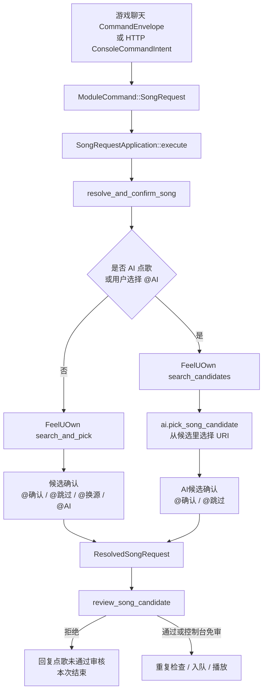

# AI 点歌与候选歌曲审核流程

本文专门梳理两套容易混淆的 AI 能力：

- `src/features/song_request/ai.rs`：点歌 AI Provider，用于识别/匹配点歌意图、从搜索候选里选择 URI、辅助确认当前播放是否同一首。
- `src/features/song_request/review.rs`：候选歌曲审核 Provider，用于在最终候选歌曲播放或入队前判断是否适合公开大厅播放；使用 OpenAI Responses API 的标准联网搜索能力。

## 核心结论

点歌 AI 和候选歌曲审核是两条独立链路。点歌 AI 解决“用户想点哪首歌”，候选歌曲审核解决“这首最终候选是否适合舒缓、轻松、不吵闹的房间氛围”。两者使用不同配置；点歌走标准 Chat Completions，审核走标准 Responses，并通过 `web_search` 工具联网。

候选歌曲审核只审核最终候选歌曲和 URI，不审核原始点歌文本。普通点歌、AI 点歌、换源后的点歌，都会先收敛成 `ResolvedSongRequest`，然后才进入 `review_song_candidate()`。

控制台来源最高权限免审，但它仍然进入待执行任务队列，仍然参与点歌互斥、当前歌曲保护和音乐播放队列规则。



## 相关文件

| 文件 | 职责 |
| --- | --- |
| `src/features/song_request/ai.rs` | 点歌 AI Provider、候选选择、同曲诊断和 Web AI 调试入口的核心实现。 |
| `src/features/song_request/review.rs` | 候选歌曲审核 Provider、审核提示词、重试、失败策略、JSON 解析。 |
| `src/features/song_request/application.rs` | 点歌候选解析、审核、去重和入队/播放决策。 |
| `src/composition/application/song_request_port.rs` | 搜索、聊天、决策、队列和播放器能力适配。 |
| `src/interfaces/http/mod.rs` | 远程点歌、远程 AI 点歌、Web AI 调试路由。 |
| `src/features/song_request/ai.rs`、`review.rs` | `ai` 和 `song_review` 模块配置结构与校验。 |
| `config.yaml` | 默认配置和中文注释。 |

## 点歌 AI Provider

`AiClient::enabled()` 只检查 `ai.api_key` 是否非空。启用后，点歌 AI 可以使用以下 Provider：

| Provider | 默认 endpoint | 默认 model | 鉴权方式 |
| --- | --- | --- | --- |
| `mimo` | `https://api.xiaomimimo.com/v1/chat/completions` | `mimo-v2.5` | `api-key` header |
| `openai` | `https://api.openai.com/v1/chat/completions` | `gpt-5.6-mini` | `Authorization: Bearer ...` |
| `deepseek` | `https://api.deepseek.com/chat/completions` | `deepseek-chat` | `Authorization: Bearer ...` |
| `custom` | 必须配置 | 必须配置 | `Authorization: Bearer ...` |

所有点歌 AI 请求都走 OpenAI Chat Completions 标准格式，要求模型返回 JSON object，并固定发送 `stream: false`。请求超时使用 `timing.external.ai_request_timeout_ms`。`ai.http_proxy` 可为点歌 AI 单独指定 HTTP(S) 代理，留空时沿用环境代理设置；歌曲审核使用自己的 `song_review.provider.http_proxy`，两者不会共享显式代理。`ai.extra_body` 只用于显式补充当前 Provider 的第三方兼容字段；默认是空对象，若与官方字段重名，代码生成的官方值优先。Web 调试接口通过 query 把 `provider` 改成与配置不同的 Provider 时会清空原 Provider 的 `extra_body`，避免把供应商私有字段带到另一家接口。

### 三种能力

`ai.rs` 里有三种能力，它们的使用位置不同：

| 能力 | 函数 | 使用场景 |
| --- | --- | --- |
| 文本识别测试 | `recognize_with_query()` | Web 调试接口 `/ai/recognize`，用于测试提示词，不参与主聊天 OCR。 |
| 同曲诊断 | `match_with_query()` / `judge_song_identity()` | Web 调试接口和 FeelUOwn 跨源自动换源确认共用同一套 Chat Completions 判断；播放确认仍优先要求稳定 URI。 |
| 候选选择 | `pick_song_candidate()` | AI 点歌时，从 FeelUOwn 搜索候选中选择一个 URI。 |

候选选择有两个硬约束：

- 候选会按来源截断，每个来源最多 5 个，总数最多 30 个。
- 模型返回的 `uri` 必须逐字等于候选列表里的某个 URI，否则直接视为失败。

## AI 点歌链路

AI 点歌可以来自游戏聊天，也可以来自远程指挥台。

游戏聊天解析层：

- 大厅蓝字 `@AI点歌` / `@AI搜索` 会先解析成 `SongSource::QqMusic`。
- 好友粉字 `@AI点歌` / `@AI搜索` 会解析成 `SongSource::All`。

执行层还有一次候选来源转换：

- 非好友来源会通过 `ai_candidate_source()` 搜索 `qqmusic,netease`。
- 好友来源使用命令里的 `song.source.as_str()`；好友 `SongSource::All` 的字符串为空，表示交给 FeelUOwn 做全来源搜索。

远程 `/ai/search` 直接构造 `ConsoleCommandIntent`，其中包装 `ModuleCommand::SongRequest` 并设置 `ai_assisted = true`。它保留控制台来源上下文，但不会伪造聊天文本或再次经过聊天解析器。它不是 Web 调试接口，而是远程 AI 点歌入口。

完整时序：

1. 正式任务把 `ModuleCommand::SongRequest` 交给 `SongRequestApplication::execute()`。
2. `resolve_and_confirm_song()` 进入候选解析。
3. 如果命令本身是 AI 点歌，或用户在普通点歌候选确认里选择 `@AI`，进入 AI 点歌路径。
4. 回复 `AI匹配中`。
5. `feeluown.search_candidates()` 搜索候选。
6. `ai.pick_song_candidate()` 返回 `{uri, score, reason}`。
7. 代码按 URI 回查候选列表，找不到则失败。
8. 回复 `AI匹配:候选,@确认@跳过`。
9. `@确认` 或超时接受；`@跳过` 取消。
10. 返回 `ResolvedSongRequest`，其中：
    - `keyword` 是最终候选文本。
    - `uri` 是最终候选 URI。
    - `ai_original_text` 是用户原始点歌意图。
    - 播放确认仍要求稳定观测到相同的非空 URI。

候选确认和 AI 候选确认期间，决策读者只接受基线之后的保留决策语法；共享聊天观察继续处理其他普通命令。一级使用命令屏幕锁，二级使用气泡序列/消息基线，正式任务队列负责最后的语义去重。

## 同曲判断

同曲判断不是候选搜索的一部分，它发生在实际播放确认阶段的跨源备用分支。

`PlayerController::verify_playback_started()` 会反复读取播放器状态。普通点歌仍优先要求观测到的非空 URI 与请求 URI 逐字相等；如果 FeelUOwn 已快速切换到不同音源，控制器会按 `timing.playback.fallback_identity_stable_samples` 连续确认备用 URI、歌名和歌手稳定，再直接调用 `MatchConfig::match_song_identity()` 做整段字段的归一化/包含匹配。这个本地判断不做逐字符编辑距离；歌曲名或歌手存在别名、合作艺人或版本差异时，才进入 `judge_song_identity()`。

AI 返回 `match=true` 且 `decision=match`、分数达到控制器阈值时，跨源备用 URI 才会被接受。AI 请求复用 `timing.external.ai_request_timeout_ms`，不会为这条低频分支增加更短的超时。AI 不可用、判断不匹配、URI 不稳定或仍缺少身份信息时，控制器返回 `MismatchedCandidate`，由主流程拒绝当前音源或换源重试。

跨源确认成功后，`ActivePlaybackRequest.requested_uri` 仍保留用户请求的 URI，`confirmed_uri` 保存实际播放 URI；`song_dedup` 也只记录实际确认的非空 URI。因此 AI 结果不会单独写入历史，也不会把未确认的相似候选当成已播放歌曲。

这个设计意味着：

- AI 同曲诊断接口可用于 Web 独立诊断，也可由播放器控制器在跨源备用确认时调用；它不会替代候选歌曲审核。
- AI 点歌和普通点歌使用同一套稳定 URI 播放确认规则。
- 普通点歌的播放确认优先依赖稳定 URI；只有跨源自动换源分支允许在稳定观测后使用本地 `MatchConfig` 和 AI 同曲判断。
- 同曲判断结果不会直接改播放器后端状态；最终仍由播放器控制器写入确认播放状态和活动播放请求。

## 候选歌曲审核 Provider

`SongReviewClient::enabled()` 只看 `song_review.enabled`。启用后，`review_song_candidate()` 在最终候选歌曲播放或入队前执行。

审核输入是 `SongReviewCandidate`：

| 字段 | 来源 |
| --- | --- |
| `source` | 最终候选来源。 |
| `title` | 从最终候选文本拆出的歌名。 |
| `artist` | 从最终候选文本拆出的歌手。 |
| `uri` | 最终候选 URI。 |
| `message_type` | 命令来源，例如大厅、私聊、控制台。 |
| `username` | 触发点歌的用户名；好友私聊优先使用好友名。 |

审核请求使用 OpenAI Responses API 的 `web_search` 工具，并固定发送官方 `tool_choice: "required"`，要求模型至少调用一次联网搜索；请求固定为 `stream: false`，并通过严格 JSON Schema 要求返回 `level`、`reason` 和 `tags`。Provider endpoint 必须是完整的 `/responses` 地址；`song_review.provider.http_proxy` 可单独指定 HTTP(S) 代理，留空时沿用环境代理设置。默认不发送 `enable_search`、`forced_search`、`enable_thinking` 等供应商私有字段。确有兼容需要时只能通过 `song_review.provider.extra_body` 显式补充；与 `tool_choice`、`stream` 等官方字段重名时官方值优先。审核模型应使用联网搜索得到的曲风标签、歌词摘要、歌曲介绍、版本说明和公开听感描述判断；联网信息不足时，再按候选歌曲名称、歌手、URI 和用户描述保守判断。

审核口径来自配置：

- `song_review.policy_prompt` 是主要审核条件，用于定义房间氛围、通过标准和拒绝标准。
- `song_review.custom_prompt` 会附加在主要审核条件后面，适合临时补充规则。
- JSON 输出结构、`level` 的 1-10 范围和联网搜索要求由代码固定，不应该写进配置里改成其他协议。

审核模型必须返回：

```json
{"level":4,"reason":"简短中文原因","tags":["calm","soft"]}
```

`level` 是 1 到 10 的打扰强度。程序只做本地阈值判断：

- `level <= song_review.max_allowed_level`：通过。
- `level > song_review.max_allowed_level`：审核硬拒绝。

审核强度不是推荐分、匹配分或好听程度，而是歌曲对当前房间氛围的打扰强度：1 表示很安静很舒缓，10 表示极端吵闹混乱。默认目标是通过整体听感偏舒缓、柔和、轻松、安静、治愈、抒情、慢节奏或中低强度的歌曲，拒绝明显炸场、吵闹、压迫感强、节奏过快、强烈电子噪音、重金属、硬核、鬼畜、洗脑循环、尖锐喊叫或强攻击性的歌曲。

## 审核重试和失败策略

一次审核最多请求 `retry_count + 1` 次。以下情况会进入重试：

- HTTP 请求失败或超时。
- Provider 返回非成功状态码。
- Responses 响应未完成、包含拒绝，或缺少 `output_text`。
- 模型内容不是合法 JSON object。
- JSON 缺少 1 到 10 的有效 `level`。

全部失败后按 `failure_policy` 处理：

- `reject`：拒绝本次点歌。
- `allow`：放行本次点歌，并记录 `failed_open=true` 的警告日志。

默认策略是 `reject`。

## 审核拒绝后的行为

审核拒绝发生在点歌播放决策之前。拒绝后会：

1. 写入执行日志，动作类似 `review-reject-level-7` 或 `review-reject-failed`。
2. 回复 `点歌未通过审核: ...`。
3. 直接结束本次点歌。

拒绝后不会检查队列重复，不会加入音乐播放队列，也不会调用 FeelUOwn 播放。

聊天中的拒绝原因会按 `song_review.reply_reason_max_chars` 截断；完整原因写入日志。

## 控制台免审边界

`review_song_candidate()` 里只有一个来源免审条件：`SongRequestContext.message_type == "控制台"`。这个上下文由类型化 HTTP 意图创建，不代表 HTTP 层伪造了聊天命令。

这意味着：

- `/searchPlay`、`/searchSource`、`/ai/search` 构造的远程点歌免审。
- Web 控制台发言本身不是点歌命令，不进入候选歌曲审核。
- `/queue/add` 直接写音乐播放队列，是更特殊的旁路接口，也不走候选歌曲审核。
- 控制台免审不等于直连播放；远程点歌仍然要进入待执行任务队列。

## Web 路由边界

| 路由 | 类型 | 行为 |
| --- | --- | --- |
| `/searchPlay` | 远程普通点歌 | 构造类型化 `SongCommand`，进入正式任务队列。 |
| `/searchSource` | 远程普通点歌 | 当前和 `/searchPlay` 一样提交类型化远程点歌。 |
| `/ai/search` | 远程 AI 点歌 | 构造 `ai_assisted=true` 的 `SongCommand`，进入正式任务队列。 |
| `/ai/recognize` | AI 调试 | 直接调用点歌 AI 文本识别测试，不入队。 |
| `/ai/match` | AI 调试 | 直接调用点歌 AI 同曲诊断测试，不入队。 |
| `/ai/pick` | AI 调试 | 直接调用点歌 AI 候选选择测试，不入队。 |
| `/queue/add` | 直接队列写入 | 直接追加音乐播放队列，不走候选解析和候选审核。 |

HTTP 层只验证协议并构造 `ConsoleCommandIntent`。真正搜索、确认、审核和播放保护都由正式任务中的 `SongRequestApplication` 完成。

## 关键日志

排查 AI 点歌时重点看：

- `AI点歌搜索候选失败`
- `AI点歌选择候选失败`
- `AI点歌返回未知候选`
- `AI点歌候选: raw=... pick=... uri=... score=... reason=...`
- `AI自动匹配通过`
- `AI判断不是同一首`
- `AI判断异常，回退到人工确认`

排查候选歌曲审核时重点看：

- `候选歌曲审核跳过: 控制台最高权限免审`
- `候选歌曲审核请求失败 attempt=...`
- `候选歌曲审核通过`
- `候选歌曲审核放行: failure_policy=allow`
- `候选歌曲审核拒绝`

排查“远程点歌为什么没审核”时，先确认命令日志里的 `message_type` 是否为 `控制台`。

## 阅读顺序建议

想看 AI 点歌：

1. `src/features/song_request/mod.rs` 与 `src/interfaces/chat/router.rs`：确认点歌 feature 如何认领并解析 `@AI点歌`。
2. `src/features/song_request/application.rs`：读候选确认和 AI 分支。
3. `src/features/song_request/ai.rs`：读 `pick_song_candidate()` 和候选 JSON 校验。
4. `src/composition/application/song_request_port.rs`：查看点歌应用服务如何连接播放器、队列、聊天和执行日志端口。

想看候选歌曲审核：

1. `src/features/song_request/application.rs`：读 `review_song_candidate()` 的调用位置和免审条件。
2. `src/features/song_request/review.rs`：读 `review()`、`review_once()`、`build_review_prompt()`。
3. `config.yaml`：读 `song_review` 默认配置。
4. `README.md`：读面向用户的审核配置说明。
