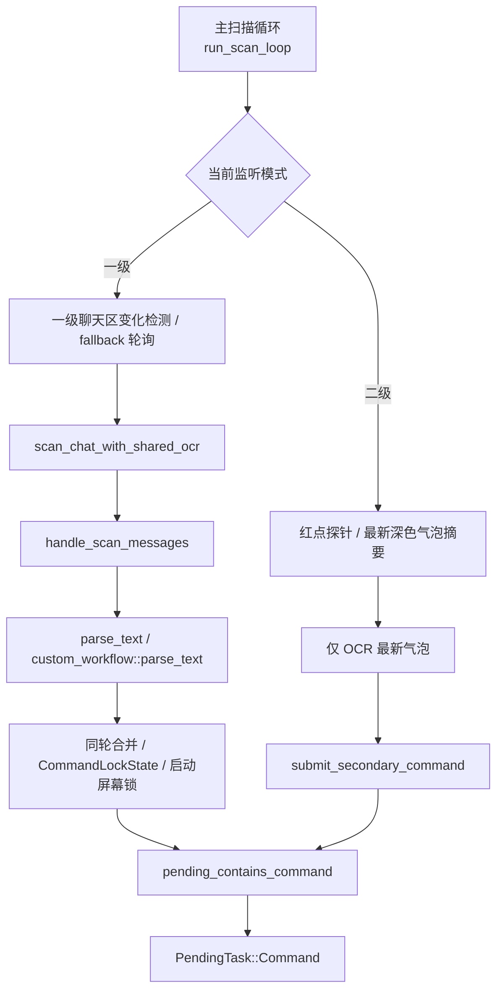

# 聊天扫描与命令入队梳理

本文梳理游戏聊天内容怎样从截图变成待执行任务。它回答几个常见问题：

- 什么时候会触发聊天 OCR。
- OCR 结果怎样切成蓝字、黄字、粉字消息。
- 哪些文本会被解析成命令。
- 命令屏幕锁怎样避免重复执行。
- 为什么程序启动时屏幕上已有命令不会立刻执行。
- 命令怎样最终进入待执行任务队列。

截图、UI 检测、聊天区变化指纹、OCR 切块和性能日志的细节见 `docs/ocr-ui-detection-flow.md`。

命令模型、同语义比较、启动屏幕锁和确认屏幕锁的代码级说明见 `docs/command-model-locks.md`。

## 总体链路



只有 `PendingTask::Command` 进入待执行任务队列后，命令执行线程才会真正执行业务。

## 扫描循环什么时候 OCR

主扫描循环在 `run_scan_loop()`。每轮先截图，再用 `detect_ui_state()` 判断当前界面。

一级监听只在一级界面扫描聊天：

- `primary:friend`：检测到左下角好友按钮模板。
- `primary:marker`：检测到聊天标记。

二级监听的扫描规则见 [二级聊天监听](secondary-chat-listener.md)：它不使用聊天标记切块，也不走一级 `CommandLockState`；红点消失和最新气泡图像摘要分别承担旧未读清场与变化判断。未知界面会回退一级监听。

进入一级界面后，扫描触发有三类：

| 触发原因 | 日志 reason | 说明 |
| --- | --- | --- |
| 刚进入一级界面 | `enter-primary` | 建立聊天区变化基线后，延迟 `chat_scan.change_debounce_ms` 扫一次。 |
| 聊天区变化 | `change` | 聊天区变化指纹超过阈值，延迟 debounce 后重新截图并 OCR。 |
| 定时兜底 | `poll` | 长时间没有变化也会按 `chat_scan.fallback_ms` OCR 一次。 |

如果变化发生在冷却期内，会安排一次 `delayed-change` 强制扫描，而不是立即 OCR。

## 聊天区变化指纹

变化检测在 `src/ui/change_detection.rs`：

1. 裁剪聊天区。
2. 缩放成 `104x36` 灰度图。
3. 和上一份指纹比较。
4. 计算平均像素差 `mean_abs_diff` 和变化像素比例 `changed_ratio`。

超过 `ocr.change_mean_threshold` 或 `ocr.change_pixel_threshold` 就认为聊天区有变化。

主循环不会每帧滚动更新基线。这样慢速聊天动画不会在达到阈值前被不断“吃掉”。

## OCR 切块流程

聊天扫描在 `src/observation/chat/scan.rs` 分两段：

### prepare_chat_scan

这一步不需要 OCR 引擎锁：

1. 裁剪 `screen.chat_rect`。
2. 在聊天区左侧窄区域匹配蓝、黄、粉三种聊天标记。
3. 对标记去重。
4. 根据当前标记和下一个标记的位置切出每条消息的 OCR block。

### recognize_prepared_chat

这一步需要 OCR 引擎：

1. 如果 `templates.batch_recognize=true`，把多个 block 拼成一张图识别，再按 y 偏移拆回消息。
2. 如果关闭 batch，则逐个 block OCR。
3. 生成 `ChatMessage { message_type, block, text }`。
4. 写入 `chat_scan_result` 日志、`timing` 耗时日志和监控快照。

当前 OCR 引擎由 `scan_chat_with_shared_ocr()` 获取。它先完成切块准备，再等待 OCR 锁，所以 OCR 全局互斥只串行化识别阶段，不串行化截图和模板切块。

## 命令解析

`handle_scan_messages()` 会遍历非空 OCR 文本，优先调用：

1. `command::parse_text()`
2. `custom_workflow::parse_text()`

普通命令解析规则：

- 蓝字：大厅命令，只接受 `@` 开头的内置命令。
- 粉字：好友私聊命令，支持点歌、邀请、管理、麦克风、启用/禁用、闲置退出等。
- 黄字：不作为内置命令入口。
- 机器人反馈文本会被过滤，避免把自己发出的回复重新解析成命令。

自定义工作流也走同一条入口，但只有 `custom_workflows.enabled=true` 且命令匹配配置时才会生成 `BusinessIntent::CustomWorkflow`。

## 命令识别禁用

`commands_enabled=false` 时，非粉色消息都会跳过。粉色私聊仍然允许进入解析链路，所以管理员可以通过粉字命令恢复或执行管理类动作。

海龟汤输入不属于 `ParsedCommand`。当前大厅蓝字正文以 `#` 开头时，会进入独立提问解析器：普通 `#问题` 直接进入 AI 队列，`##编号内容` 按昵称和编号暂存并发送短确认，`##提交` 校验连续编号后合并为一个问题。命令识别关闭时不接收新输入，但现有对局仍继续计时并可自动结算。

收到 `DisableCommands` / `EnableCommands` 后，扫描线程会立即更新 `commands_enabled`，同时命令本身仍会入队执行，以便发送游戏内反馈并写执行日志。

`IdleExit` 是例外：它在扫描线程内立即配置闲置退出并写日志，不进入待执行任务队列。

`@监听模式 一级/二级` 也是例外：它不作为普通业务命令执行，而是直接提交监听模式切换任务；`@监听模式 状态` 只记录当前模式和等待目标。

## 同轮合并

同一轮 OCR 里，如果多条消息解析成同语义命令，只保留第一条。

这层解决 OCR 或标记切块导致的同轮重复，而不是长期屏幕可见导致的重复。长期重复由命令屏幕锁处理。

## 命令屏幕锁

命令屏幕锁由 `CommandLockState` 维护。它不是 `Mutex`，也不是业务锁；它只是记录“屏幕上仍可见的已接受命令”。

海龟汤在一级监听下另有一套 OCR 稳定锁。它按消息槽位分别累计昵称和正文的连续一致次数，两项都达到配置值后才把 `#` 输入交给业务层；稳定后的规范化身份继续防止同一条可见提问被重复提交。输入类型和问题相同、规范化昵称最多相差一个字符时，会作为昵称 OCR 变体合并；明显不同昵称的相同问题不会合并。首次启动扫描只建立旧提问基线。二级监听依靠新增气泡序列定位消息，但海龟汤进行期间同样会重复 OCR 正文和昵称；未稳定时保留旧气泡基线等待下一轮。

每轮扫描时：

1. 先检查已有锁。
2. 如果同语义命令仍在屏幕内，锁保留。
3. 如果命令不再可见，且当前没有命令正在执行，解除锁。
4. 如果命令正在执行，即使命令暂时不可见，也暂不解除锁。
5. 对新解析出的命令，如果同语义命令已锁住，则跳过。
6. 否则插入锁，并返回 `PendingCommand`。

这保证同一条还停留在聊天区里的玩家命令不会每次 OCR 都重新入队。

## 同语义命令怎么判断

锁不是按 OCR 原文判断，而是按业务语义判断。

重要规则：

| 命令 | 同语义规则 |
| --- | --- |
| 点歌 | 好友来源、音源、伴奏优先和关键词都相同或足够近似。 |
| 邀请 | 只看邀请序号 `seq`。 |
| 拉黑/屏蔽 | 操作类型和 UID 相同。 |
| 麦克风 | 用户名相同。 |
| 禁用/启用命令 | 分别是全局同语义，不按用户名区分。 |
| 自定义工作流 | 工作流名和参数相同。 |
| 音量 | 音量参数相同。 |
| 队列删除 | 删除索引列表相同。 |
| 播放/继续 | 视为同一个 `play` 语义。 |

点歌关键词会先标准化：去掉空白和标点、统一大小写和全角字符。之后再判断完全相等、包含关系或短前缀编辑距离。

因此公共大厅里同一首歌的 `@点歌` 和 `@AI点歌` 在来源同为 QQ 音乐时会共享同一个执行边界；不同音源或不同好友来源不会混成同一个锁。

## 启动屏幕锁

程序启动后第一次成功扫描到的命令只会“记录为已锁定”，不会执行。

原因是程序刚启动时，聊天窗口里可能已经有旧命令。如果不做启动屏幕锁，机器人会把启动前的历史消息当成新命令执行。

当进入新大厅时，`on_entered_new_hall()` 会：

1. 重新启用命令识别。
2. 把 `screen_lock_primed=false`。
3. 请求重置命令屏幕锁。
4. 清理大厅倒计时缓存。

这样新大厅的第一批可见命令同样只用于建立屏幕锁，不会误执行上一轮残留内容。

## 邀请序号去重

邀请命令还有一层额外保护：`invite_executed_seqs`。

- 扫描阶段发现邀请序号已经执行过，会直接跳过。
- 执行阶段再次插入序号，如果已存在也会跳过。
- 邀请命令只接受一个数字参数：1-3 位数字是防冲突序号，例如 `@邀请2`；6 位数字是大厅密码，例如 `@邀请123456`，会在进入大厅最后一步使用键盘输入。

这层保护独立于命令屏幕锁，用于处理邀请命令在跨界面、跨聊天状态下重复出现的问题。

## 待执行队列去重

命令屏幕锁接受后，还会检查待执行任务队列：

```text
pending_contains_command(parsed)
```

如果队列里已经有同语义 `PendingTask::Command`，本轮跳过。这样即使命令还没开始执行，也不会重复排队。

通过所有过滤后，扫描线程才会：

1. 记录命令活动时间。
2. 写日志 `命令已加入待处理队列`。
3. `push_pending_task(PendingTask::Command(...))`。

## 确认屏幕锁

确认屏幕锁在 `src/observation/decision.rs`。它不参与普通命令入队，只用于 `wait_for_decision()`。

流程是：

1. 等待确认前，先扫描一次当前聊天。
2. 把已经存在的 `@确认`、`@跳过`、`@换源` 等决策消息记录下来。
3. 后续轮询中，如果同样文本的位置还在旧消息附近，就忽略。
4. 新出现的决策消息只接受一次。

这避免旧的确认消息影响新的候选确认、邀请确认或换源确认。

## 日志怎么看

关键日志：

| 日志 | 含义 |
| --- | --- |
| `触发聊天扫描: reason=...` | 本轮为什么 OCR。 |
| `聊天扫描结果: markers=... messages=...` | OCR 得到哪些消息。 |
| `聊天扫描耗时` | crop、marker、block、ocr 的阶段耗时。 |
| `OCR 锁等待耗时` | 等待共享 OCR 引擎的时间。 |
| `同轮重复识别命令，已合并` | 同一轮 OCR 内重复。 |
| `命令仍在屏幕内，本轮跳过` | 命令屏幕锁命中。 |
| `启动屏幕锁已记录当前可见命令，不执行` | 首次扫描只建锁。 |
| `命令已在待处理队列，本轮跳过` | 待执行队列里已有同语义命令。 |
| `命令已加入待处理队列` | 命令正式进入主业务队列。 |

## 关键边界

- OCR 扫描线程只负责识别和入队，不执行业务。
- 命令屏幕锁防重复入队，不保证业务互斥。
- 待执行任务队列负责业务串行，不等于命令屏幕锁。
- 确认屏幕锁只服务当前确认窗口，不影响普通命令。
- `message_type=控制台` 的远程命令不来自 OCR，因此不经过聊天扫描和命令屏幕锁，但会进入同一个待执行任务队列。
