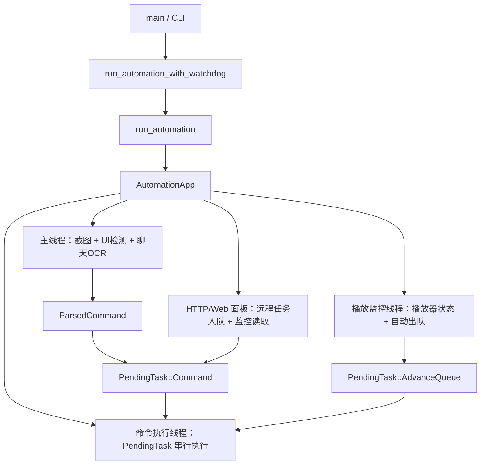

# 代码梳理

这份文档按运行路径梳理当前代码：程序如何启动、如何观察游戏聊天、如何把命令放入待执行任务队列、如何串行执行游戏操作，以及 Web 面板、点歌、审核、启动游戏和进入千星各自落在哪些模块。

## 一句话结构

项目是一个 Windows-only Rust 单二进制程序。主线程负责截图、检测 UI、扫描聊天；命令执行线程负责串行执行所有会操作游戏窗口的业务流程；播放监控线程负责观察播放器状态并在合适时机向同一条待执行任务队列塞入自动出队任务；HTTP/Web 面板只提交远程任务或读取监控状态，不直接做底层游戏输入。

## 入口层

`src/main.rs` 顶部用 `#[cfg(target_os = "windows")]` 把整个应用限制在 Windows。`main()` 只是调用 `app::run()`。

`app::run()` 做两类事情：

- 程序启动后固定进入常驻自动化模式。
- 不再提供命令行子命令；OCR、模板匹配和手动输入等诊断能力统一由 `/tools` Web 高级控制页提供。

常驻模式走 `run_automation_with_watchdog()`。外层父进程以 `MILIASTRA_WATCHDOG_CHILD=1` 环境变量启动同一个 EXE；子进程异常退出时，父进程按配置延迟后重启。真正业务在 `run_automation()`，并固定读取工作目录中的 `config.yaml`。

`run_automation()` 负责：

- 读取并必要时迁移 `config.yaml`。
- 启动 TUI 或普通日志。
- 初始化运行状态 `PersistentRuntimeState`、点歌队列 `PersistentQueue` 和长时间同歌去重历史 `PersistentSongDedupHistory`。
- 创建 `AutomationApp`。
- 调用 `AutomationApp::run()`。

## 配置层

`src/app/config.rs` 是配置结构的中心。`AppConfig` 聚合所有配置分组：

更完整的配置加载、自动迁移、日志分流和监控快照说明见 `docs/config-observability-flow.md`。

- `window`：目标进程、窗口尺寸、安全聚焦点。
- `screen`：聊天区、好友按钮模板区、大厅 OCR 区域等固定坐标。
- `timing`：按领域分组的延迟和超时。
- `ocr`：OCR 模型、后端优先级、聊天块切分参数。
- `templates`：聊天标记、好友按钮、邀请/管理按钮模板。
- `output`：游戏内发言点击点。
- `feeluown`：播放器 RPC 地址。
- `http` / `tui` / `logging`：监控和日志外壳。
- `state` / `queue`：持久状态和音乐播放队列。
- `song_dedup`：长时间同歌去重窗口、允许次数、控制台豁免和历史路径。
- `idiom_chain`：成语接龙词库、历史和超时。
- `undercover`：谁是卧底开关、词库、永久使用记录、人数和阶段计时。
- `turtle_soup`：海龟汤题库、永久使用记录、昵称与正文 OCR 稳定次数、批量答案段数、AI 并发、超时和独立 Provider。
- `ai`：点歌 AI Provider。
- `song_review`：候选歌曲审核 Provider。
- `startup`：启动游戏和进入千星配置。
- `custom_workflows`：自定义工作流配置。

`src/app/config_migration.rs` 负责配置迁移。启动时如果配置版本落后，会用当前发布包里的 `config.yaml` 作为模板，把旧字段迁移到新结构，并写 `.bak-*` 备份。

## 主对象 AutomationApp

`AutomationApp` 是运行时的组合根。它持有：

- 配置、运行状态、点歌队列和长时间同歌去重历史。
- 播放器控制器、当前 FeelUOwn 后端、点歌 AI 客户端、候选歌曲审核客户端。
- 游戏聊天输出器。
- 共享 OCR 引擎。
- 命令屏幕锁、待执行任务队列、窗口检测重置信号。
- 娱乐互斥、成语接龙状态、斗地主牌局、谁是卧底牌局、海龟汤会话、按昵称隔离的编号答案草稿和低优先级分段回复队列。
- 热键暂停/退出状态、命令执行状态、点歌执行状态。
- TUI/Web 监控共享状态。

`AutomationApp::run()` 依次启动：

- HTTP/Web 面板。
- 热键监听。
- 海龟汤 AI Worker。
- 命令执行线程。
- 延迟聊天发送线程。
- 启动配置任务入队。
- 播放监控线程。
- 主扫描循环。

延迟聊天发送线程会在正式任务空闲时处理普通娱乐回复和海龟汤分段批次。普通回复仍逐条发送；海龟汤会把全部剩余分段交给可中断批量接口，复用一次聊天打开和输入初始化。批量接口在每段之间检查正式任务、暂停状态、监听驻留和会话代数，必要时返回精确的已发送数量。发送线程先消费成功部分，再让未发送部分排回队首；失败只从第一条未发送消息重试，因此不会重复已经发出的汤面或汤底。

退出时保存音乐播放队列和运行状态。

## 主扫描循环

主扫描循环在 `AutomationApp::run_scan_loop()`。

更完整的截图、UI 检测、聊天区变化指纹、OCR 切块和性能日志说明见 `docs/ocr-ui-detection-flow.md`。

它每轮做：

1. 截取目标游戏窗口。
2. 检测当前 UI 状态。
3. 只有处于一级聊天界面时，才对聊天区域做变化检测。
4. 如果聊天区域像素变化超过阈值，等待 debounce 后重新截图并 OCR。
5. 如果长时间无变化，按 fallback 间隔做兜底 OCR。
6. OCR 到的聊天消息交给 `handle_scan_messages()`。
7. 当前大厅正文以 `#` 开头时，先分别等待昵称与正文连续 OCR 一致，再使用独立屏幕锁去重；普通问题直接投递海龟汤 AI 队列，`##编号内容` 暂存并短回复确认，`##提交` 校验并合并为一个问题后再投递。二级监听未确认稳定前不会推进新增气泡基线。

窗口丢失时不会忙等，而是按退避时间重试，同时中止旧大厅的娱乐会话。启动游戏任务、进入千星任务等会通过 `WindowDetectionSignal` 重置退避，让刚启动的窗口能更快被重新检测。

## 聊天扫描

`src/app/chat_scan.rs` 把聊天扫描拆成两段：

更完整的 OCR 和 UI 检测性能链路见 `docs/ocr-ui-detection-flow.md`；更完整的聊天消息到命令入队链路见 `docs/chat-command-ingestion.md`。

- `prepare_chat_scan()`：裁剪聊天区、匹配蓝/黄/粉聊天标记、按标记切出每条消息的 OCR block。
- `recognize_prepared_chat()`：对每个 block 做 OCR，并生成 `ChatMessage`。

聊天标记模板使用彩色 SAD 匹配，消息文本走 OCR。`batch_recognize` 可以把多个块批量识别，但当前实际性能上不一定更快。

扫描结果会同时写：

- `chat_scan_result` 日志：只保留扫描结果。
- `timing` 日志：记录 crop、marker、block、ocr 等阶段耗时。
- `MonitorShared`：供 TUI/Web 面板显示最新 OCR 内容。

## 命令解析和屏幕锁

`src/app/command.rs` 定义命令领域模型：

更完整的聊天扫描、命令屏幕锁和入队过滤链路见 `docs/chat-command-ingestion.md`。

更完整的命令模型、同语义比较、启动屏幕锁和确认屏幕锁说明见 `docs/command-model-locks.md`。

- `ParsedCommand`：OCR 文本解析后的统一命令。
- `UserCommand`：点歌、暂停、下一首、队列、邀请、拉黑/屏蔽、麦克风、娱乐和自定义工作流等业务命令。
- `CommandLockState`：屏幕锁。

命令来源：

- 蓝色聊天：大厅内普通命令。
- 粉色聊天：好友私聊命令。
- 控制台：Web 面板构造的远程命令。

屏幕锁的目标是防止同一条还停留在游戏屏幕上的命令被重复执行。它按命令语义生成 lock key，而不是简单按 OCR 原文。比如 `@点歌` 和 `@AI点歌` 在合适情况下共享点歌互斥语义。

主扫描循环只负责把解析出的命令交给 `CommandLockState`。普通命令和谁是卧底命令通过屏幕锁后进入待执行任务队列；成语接龙和海龟汤命令通常直接进入娱乐模块，只有需要稳定批量发送来源和解释的 `#解释` 会进入正式任务队列。海龟汤的普通 `#问题` 不构造 `ParsedCommand`，精确的 `#状态/#结束` 则先按控制命令处理。谁是卧底发词内容和私聊投票会在日志与监控 OCR 中隐藏，公屏描述只记录完成状态，不隐藏玩家原本可见的正文。

## 待执行任务队列

待执行任务队列在 `AutomationApp.pending`，类型是 `VecDeque<PendingTask>`。它不是音乐播放队列。

`PendingTask` 包括：

- `Command`：游戏内或控制台业务命令。
- `AdvanceQueue`：自动出队。
- `ConsoleChat`：Web 面板发出的控制台发言。
- `StartGame`：启动游戏任务。
- `EnterWonderland`：进入千星任务。
- `ModerationVoteResult`：后台投票结束后的管理动作。
- `UndercoverDelivery`：计时触发的谁是卧底阶段公告或结算。

命令执行线程运行 `run_pending_command_loop()`，一次只取一个任务执行。所有会操作游戏窗口的高层业务都经过这条串行通道，避免多个流程同时点击、按键、粘贴。

普通命令开始时只激活并聚焦游戏窗口，不再统一返回一级。每个动作阶段声明自己的目标界面：大厅 OCR、麦克风和管理面板要求一级；大厅回复要求当前监听驻留界面；好友回复要求二级好友会话。任务真正结束后再校验并恢复当前监听模式的驻留目标。

`prepare_command_ui()` 现在只是“确保一级界面”的状态转换，由确实依赖一级布局的动作调用。目标窗口不可用时立即中止当前业务，不继续按 `Esc` 或发送其他输入。

## 播放监控和自动出队

播放监控线程在 `run_playback_monitor_loop()`。

更完整的音乐播放队列、播放器控制器、临近结束暂停和自动出队链路见 `docs/playback-queue-flow.md`。

它定期查询播放器状态，并调用 `PlayerController::maybe_advance_queue()`。核心策略：

- 如果用户主动暂停，则不自动处理。
- 如果当前歌曲即将结束且有待执行点歌或队列，先暂停播放，避免当前歌结束后播放器自己继续。
- 如果队列非空且没有命令正在执行，把 `PendingTask::AdvanceQueue` 放入待执行任务队列。
- 如果之前因为待执行播放而暂停，但后来没有任务了，只有暂停原因仍是系统等待队列时才恢复播放。

自动出队真正播放前仍会检查长时间同歌去重。近期已播放过的队首会被移除并在大厅回复“已跳过”，然后继续尝试下一项。

自动出队最终仍由命令执行线程执行 `consume_queue()`，不是播放监控线程直接播放。

## 点歌流程

点歌命令进入 `execute_command()` 的 `UserCommand::Song` 分支。

更完整的端到端链路见 `docs/song-request-flow.md`。

流程是：

1. `resolve_song_request()` 解析普通点歌或 AI 点歌。
2. `resolve_and_confirm_song()` 搜索候选，需要时向聊天发确认提示。
3. 得到最终候选歌曲和 URI 后，执行候选歌曲审核。
4. 控制台来源最高权限免审；游戏内大厅和好友私聊会审核。
5. 检查队列重复和当前播放状态。
6. 如果队列已有歌、当前歌受保护、状态未知或即将结束，则入音乐播放队列。
7. 否则直接播放。

`ResolvedSongRequest` 是执行前的统一候选歌曲结构，包含 keyword、source、uri、是否伴奏、AI 原始文本、好友来源等。

## 候选歌曲审核

`src/app/song_review.rs` 是独立的审核 Provider。

更完整的 AI 点歌、同曲判断和候选歌曲审核链路见 `docs/ai-song-review-flow.md`。

它审核的是最终候选歌曲，不审核原始点歌意图。请求内容包括：

- 音源。
- 歌名。
- 歌手。
- URI。
- 消息类型。
- 用户名。

审核模型必须返回 JSON，包含 1-10 的 `level`、`reason` 和 `tags`。程序用本地 `max_allowed_level` 判断是否通过。

审核失败会按 `retry_count` 重试；仍失败后按 `failure_policy` 决定拒绝或放行。放行会写警告日志。

## FeelUOwn 和点歌 AI

`src/app/feeluown.rs` 封装 FeelUOwn TCP RPC：

更完整的点歌 AI Provider、远程 AI 点歌和 Web AI 调试接口说明见 `docs/ai-song-review-flow.md`。

- 播放 URI、暂停、上一首、下一首、音量。
- 查询播放状态。
- 搜索候选，并按当前后端规则挑选候选。

`src/app/player_controller.rs` 包装当前 FeelUOwn 后端，负责确认播放状态、活动播放请求、暂停原因、播放确认和队列推进决策。点歌流程不再直接把一次 FeelUOwn 状态读取当作业务事实。

`src/app/ai.rs` 是点歌 AI Provider：

- 判断当前播放是否和请求相同。
- 从候选列表里选择最符合原始点歌意图的 URI。
- 给 Web 面板提供 AI 测试路由。

审核 AI 和点歌 AI 是两套配置，避免把点歌推荐和内容风控绑死。

## 聊天输出和输入安全

`src/app/chat_output.rs` 负责游戏内回复。它会：

- 限制聊天消息长度。
- 为海龟汤汤面和汤底按实际显示宽度生成完整编号分段，不截断原文。
- 用 Enter 打开聊天。
- 点击配置的聊天输入点。
- 粘贴或逐字输入文本。
- 发送后关闭聊天。

`src/app/input_actions.rs` 是底层输入包装：

- 点击游戏点。
- 激活游戏窗口。
- 聚焦游戏窗口。
- 粘贴文本。
- 按键。

`src/app/window.rs` 是 Windows 窗口边界：

- 按目标进程找游戏窗口。
- 把 1920x1080 逻辑坐标映射到实际客户区。
- 截图客户区。
- 激活窗口，并用 `AttachThreadInput` 兜底提高拿焦点成功率。
- 点击前校验目标点确实属于游戏窗口。
- 按键/粘贴前校验前台窗口属于目标进程。
- 用 `TargetWindowUnavailable` 表达“目标窗口不可用”的可分类错误。

`src/app/clipboard.rs` 实现文本剪贴板临时占用：写入文本前读取原文本，粘贴结束后尽量恢复；如果原来没有文本则清空。

## 原子动作和自定义工作流

`src/app/workflow_actions.rs` 是原子动作层：

更完整的 UI 自动化层说明见 `docs/ui-automation-atoms.md`。
自定义工作流、邀请、好友反馈和管理投票的业务层说明见 `docs/custom-workflow-moderation-flow.md`。

- `wait`
- `press_key_text`
- `activate`
- `focus`
- `click_point`
- `paste`
- `wait_pixels_stable`
- `wait_or_click_template`
- `wait_or_click_text`

原子动作只做机械操作和耗时日志，不承载业务含义。

`src/app/custom_workflow.rs` 把配置里的工作流步骤映射到原子动作。它还承载几个内建业务流程：

- 邀请用户。
- 好友消息反馈。
- 拉黑/屏蔽投票与执行。

邀请流程会先判断是否公共大厅；非公共大厅会在大厅聊天里发起确认/拒绝提示，再根据结果给好友发反馈。

管理流程会先发起投票，后台线程只等待投票结果，真正的 UI 操作结果仍回到待执行任务队列处理。

## 启动游戏任务

`src/app/game_startup.rs` 是启动游戏任务状态机：

更完整的启动和进入千星状态机见 `docs/startup-wonderland-flow.md`。

1. `EnsureGameWindow`：查找游戏窗口；找不到且允许启动时启动配置的 exe。
2. `FocusGameWindow`：聚焦游戏。
3. `ClickEnterGameText`：在配置区域 OCR “点击进入”，点击文本框中心。
4. `WaitEnterGameTextGone`：如果文字仍存在就继续点击，直到文字消失。
5. `WaitPaimonMenuTemplate`：等待派蒙菜单模板出现，认为开门完成。

启动路径优先使用 `startup.exe_path`；如果为空，会尝试从官服/国际服启动器注册表里找安装路径。窗口和候选 exe 同时考虑 `YuanShen.exe` 与 `GenshinImpact.exe`。

## 进入千星任务

`src/app/startup_flow.rs` 是进入千星任务状态机：

1. `OpenWonderlandHome`：按阶段重试配置按 F6，等待右上角千星关闭按钮模板稳定出现。
2. `ClickWonderlandCard`：按阶段重试配置点击千星卡片点，在 `(1400,850,360,150)` 快速匹配“前往大厅”按钮后只点击一次。
3. `WaitConfirmGone`：继续快速轮询同一区域；模板消失且区域像素稳定后认为进入千星。

任务成功后由调用方执行返回一级界面。它不会清空后续待执行任务；返回一级后队列继续执行。

## Web 面板

`src/app/http_server.rs` 启动一个 axum HTTP 服务，`page.html` 内嵌为静态页面。

更完整的 Web 面板、HTTP API 和监控状态说明见 `docs/web-monitor-api.md`。

路由集中在 `ROUTES` 表里，每个路由标记：

- 是否 JSON 响应。
- 是否 mutating，mutating 路由必须用 POST。
- handler 函数。

重要边界：

- `/play`、`/pause`、`/skip-next`、`/skip-prev`、`/volume` 会构造控制台命令进入待执行任务队列。
- `/searchPlay`、`/searchSource`、`/ai/search` 会构造控制台点歌命令进入待执行任务队列。
- `/chat/send` 会构造 `PendingTask::ConsoleChat`，最终在游戏聊天里发送文本；默认带 `[控制台]: ` 前缀，控制面板可以关闭或自定义前缀。
- `/startup/game` 入队启动游戏任务。
- `/startup/enter-wonderland` 入队进入千星任务。
- `/startup/wonderland` 按顺序入队启动游戏任务和进入千星任务。
- `/queue/add` 是控制台最高权限直接写音乐播放队列，不走审核。
- `/monitor` 读取 `MonitorShared`。
- `/turtle-soup/start` 和 `/turtle-soup/end` 直接更新共享海龟汤服务；实际游戏回复仍等待延迟发送线程。
- `/screenshot` 手动截一次游戏图并返回 JPEG，不常驻推流。

HTTP 层只负责验证参数、入队或读取状态。除少数只读/播放器调试接口外，不应该直接做游戏窗口输入。

## UI 检测和模板匹配

`src/app/ui_state.rs` 根据模板和聊天标记判断当前界面状态，例如一级聊天界面、二级大厅、未知界面。

更完整的 UI 状态检测顺序、模板匹配缓存和耗时日志说明见 `docs/ocr-ui-detection-flow.md`。

`src/app/template_match.rs` 提供两类模板匹配：

- 彩色 SAD 匹配，用于聊天标记等彩色小模板。
- 灰度 SAD 匹配，用于小区域 best hit，并缓存灰度模板，避免反复初始化重型匹配器。

`src/app/ui_locator.rs` 把截图、区域裁剪、模板等待、OCR 文本点击、像素稳定等待封成可复用定位器。启动游戏、进入千星和自定义工作流都复用它。

## 持久化和监控

`src/app/queue.rs` 持久化音乐播放队列，写入时使用临时文件替换。

`src/app/turtle_soup.rs` 把选中的题目 ID 原子写入独立使用记录。正式题库只读，会话不持久化，程序重启不会续局。

更完整的配置迁移、运行日志、性能日志、TUI 和 Web 监控外壳见 `docs/config-observability-flow.md`。
调试子命令、热键、图像坐标支撑、OCR 底层、Monitor、TUI 和持久化小模块见 `docs/supporting-runtime-modules.md`。

`src/app/runtime_state.rs` 持久化运行状态：

- `playback.state`：确认播放状态。
- `playback.pauseReason`：暂停原因。
- `playback.activeRequest`：当前确认中的活动播放请求。
- `playback.lastObservation`：最近一次播放器观测和可靠性。
- 大厅剩余时间缓存。

`src/app/monitor.rs` 是 TUI/Web 共用的内存快照：

- 最近日志。
- 最新 OCR 扫描摘要。
- 当前音乐播放队列。
- 最近执行命令。
- 程序状态。
- 播放器控制器快照。

`src/app/tui.rs` 从 `MonitorShared` 渲染本地终端面板；Web 面板通过 `/monitor` 渲染远程监控。

## 当前主设计边界

- 聊天扫描和业务执行分离：主线程只观察和入队，命令执行线程才操作游戏。
- 待执行任务队列和音乐播放队列分离：一个是业务任务，一个是歌曲列表。
- 控制台是最高权限来源：仍进主业务队列和点歌互斥，但无视候选歌曲审核。
- 播放器后端状态只是观测：播放确认、暂停原因和队列推进都通过播放器控制器收敛。
- 原子动作不自动聚焦：业务流程负责聚焦前置条件，原子动作负责机械操作和校验。
- 点击前做归属校验，按键/粘贴前做前台校验。
- 启动游戏任务和进入千星任务拆分；组合 API 只负责顺序入队。
