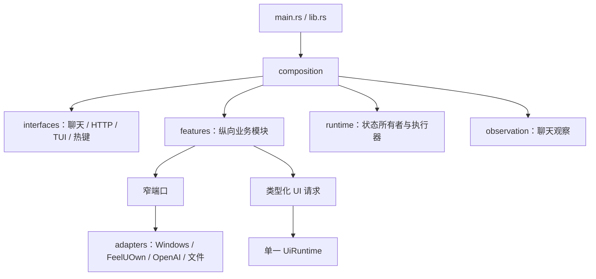

# 当前代码导航

本文按运行路径说明迁移后的代码结构。更细的协议和业务流程以各专题文档及 `docs/adr/` 为准。

## 总体结构

项目是 Windows-only Rust 单二进制程序。入口、组合、业务、运行时、观察、UI 和适配器之间的依赖方向如下：



关键所有权：

- `BusinessRuntime` 独占正式调度器、娱乐状态、播放/大厅状态、播放队列、监听状态和延迟发送队列。
- `FormalTaskExecutionRuntime` 独占一个 `ApplicationRuntime`，顺序执行应用服务。
- `UiRuntime` 独占游戏输入设备。
- `OcrRuntime` 独占 OCR 引擎。
- `PlayerRuntime` 独占播放器连接与 I/O。
- `OpenAiRuntime` 执行统一 OpenAI 协议请求。

## 入口与组合

`src/main.rs` 负责 watchdog，子进程调用 `src/lib.rs::run()`。`src/composition.rs`：

1. 从工作目录读取 `config.yaml`。
2. 完整反序列化并执行根配置和各 feature 的 fail-fast 校验。
3. 加载播放状态、大厅状态、播放队列、去重历史和词库等持久数据。
4. 构造 Windows、文件、播放器、AI、OCR 与 UI 适配器。
5. 按依赖顺序启动各 runtime、HTTP/TUI/热键和观察循环。
6. 关闭时有序停止线程并保存持久状态。

组合层可以连接端口，但不能重新实现 feature 规则。

## 配置

`src/config/mod.rs` 聚合共享配置和 feature 自有配置。配置只接受当前结构，不迁移旧字段；未知字段、空必填值、零超时、非法阈值、无效区域和不支持的工作流步骤在启动线程前失败。

UI/OCR 构造器接收经过解析的窄配置，而不是在执行期间读取完整 `AppConfig`。测试中的 `from_app` 辅助方法仅用于构造 fixture。

持久状态路径明确分开：

- `state.playback_state_path`
- `state.hall_state_path`
- `queue.path`
- 各娱乐模块自己的历史或永久使用记录路径

HTTP `/state` 会把多个内部状态投影组合成兼容的外部 JSON，但内部不再让 Hall 状态寄生于 Playback。

## 命令模型

命令类型位于 `src/features/command.rs`：

- `CommandEnvelope`：原文、命令正文、昵称、来源、前缀、权限和观察身份。
- `ModuleCommand`：只按模块分支的小型顶层枚举，每个变体包装模块自己的命令类型。
- `RoutedCommand`：命令信封元数据加已解析模块命令。

聊天入口位于 `src/interfaces/chat.rs`，静态路由器位于 `src/interfaces/chat/router.rs`：

```text
聊天观察
→ parse_command_envelope
→ ChatCommandRouter 选择唯一 feature
→ feature::claims_chat / parse_chat
→ RoutedCommand
```

中央聊天层不解析所有业务参数。点歌、播放、大厅、管理、邀请、自定义工作流和娱乐玩法分别拥有自己的语法。

HTTP 不拼接伪聊天文本。远程播放和点歌构造 `ConsoleCommandIntent`；其他路由调用各自的类型化任务、查询或业务变更端口。

## 聊天观察

一级和二级聊天观察位于：

- `src/composition/application/listener.rs`
- `src/composition/application/secondary_chat.rs`
- `src/observation/chat/`

一级路径使用聊天区变化摘要、debounce 和 fallback 触发 OCR。`prepare_chat_scan()` 先做模板切块，`recognize_prepared_chat()` 再向共享 OCR runtime 提交识别。

二级路径使用未读红点、最新气泡身份和受控好友会话事务。它直接用结构化昵称、消息来源和正文创建 `CommandEnvelope`，不再格式化成伪聊天行再解析。

`CommandObservation` 保存帧号、捕获时间和消息身份。`CommandLockState` 只防止仍在画面中的同语义命令重复入队；它不是业务互斥锁。

## 模板与 OCR 关联

模板检测和 OCR 是两种观察能力：

- `src/ui/template.rs` 负责彩色/灰度模板匹配及模板缓存。
- `src/ui/state.rs` 使用可靠锚点判断一级、二级和未知界面。
- `src/runtime/ocr/batch.rs` 用调用方 ID 保持拼接 OCR block 与结果的稳定关联。
- `src/runtime/ocr/engine.rs` 拥有 Paddle OCR 模型与后端选择。

当前真实 1920×1080 fixture `tests/fixtures/ui/secondary-chat-scrolled-1920x1080.jpg` 覆盖：

- 好友列表滚动后大厅行消失，但左上返回模板仍能判定二级界面；
- 标题和严格好友列表区域的真实 OCR；
- 批量 OCR 后标题/好友行 ID 不串位；
- 严格区域内唯一好友行连续稳定定位；
- 标题优先确认、聊天内容区完整昵称兜底，以及缺失好友在真实画面上的有界滚动停止。

坐标只用于项目规定的 1920×1080 逻辑画布；测试不会把比例错误的历史截图当成分辨率依据。

## 正式任务

`src/runtime/business.rs` 中的 `FormalScheduler` 负责排序、去重、活动车道、取消和历史。组合层通过 `FormalTaskClient` 提交私有 `PendingTask`：

- feature 命令
- 自动出队
- 控制台发言
- 启动任务
- 管理投票结果
- 监听模式/二级未读事务
- 牌局和谁是卧底效果

正式任务的执行路径见 `docs/executor-flow.md`。重要边界是：正式任务负责业务顺序，但真正游戏输入仍必须提交给 `UiRuntime`。

## UI runtime

`src/runtime/ui.rs` 定义密封 `UiRoutine`、类型化 `UiOperation`、进度事件和输入确定性。只有 runtime 内的 `UiRoutineContext` 能取得 `UiDevice`。

业务级例程位于 `src/ui/routines/`：

- `hall.rs`：大厅发送、批量发送、驻留和麦克风。
- `friend_delivery.rs`：唯一好友识别、目标验证、投递与驻留恢复。
- `secondary_unread.rs`：未读好友处理。
- `invite.rs`：邀请事务。
- `moderation.rs`：管理事务。
- `startup.rs`：启动与进入千星事务。
- `custom_action.rs`：自定义工作流机械动作计划。

`src/ui/atoms.rs::GameUi` 是兼容观察/简单操作的门面，其生产实现同样把每次操作提交给 UI runtime；它不是第二个输入所有者。`src/ui/locator.rs` 目前只保留无 I/O 的大厅信息解析与区域计算。

## 好友投递和邀请

好友投递使用一个完整 `SendFriendDeliveries` 事务：

1. 识别或打开二级聊天。
2. 优先校验标题，未命中才 OCR 严格好友列表区域。
3. 唯一命中后点击目标行。
4. 再用标题或聊天内容验证目标，避免点击自己或错误会话。
5. 发送消息并恢复请求指定的监听驻留。

邀请模块先由 `InviteService` 处理公共大厅判断和成员决策，再提交 `ExecuteInvite`。邀请结果、好友通知结果和最终驻留分别报告；已确认进入新大厅后不得因收尾失败重放。

## 娱乐模块

成语接龙、斗地主/跑得快、谁是卧底和海龟汤均为纵向模块，状态由 `BusinessRuntime` 串行拥有，并通过共享娱乐协调器互斥。

- 即时聊天输入只更新业务状态或产生效果，不直接操作 UI。
- 短回复进入 `DeferredChatQueue`。
- 牌局与谁是卧底的阶段效果进入正式任务。
- 海龟汤 AI worker 只调用模型并回传带会话代数的结果；业务 runtime 决定是否仍可应用。
- 娱乐期限使用共享 `Clock`/deadline 语义，测试通过 `ManualClock` 推进，不依赖真实睡眠。

## 播放器与点歌

`src/runtime/player.rs` 和 `src/runtime/player_io.rs` 拥有播放器 I/O 调度；`src/adapters/feeluown.rs` 实现 TCP RPC；`src/adapters/player.rs` 提供窄适配边界。

`src/features/playback/` 拥有：

- `PlaybackApplication`：播放业务用例。
- `PlayerController`：稳定 URI 观察、播放确认和暂停原因。
- `PersistentQueue`：待播放歌曲。
- `PersistentPlaybackState`：确认播放状态。
- 去重、匹配和格式化规则。

`src/features/hall/state.rs` 独立拥有大厅名称与剩余时间状态。

点歌由 `src/features/song_request/application.rs::SongRequestApplication` 执行：候选搜索、确认、AI 选择、审核、去重、入队或直接播放都通过窄端口完成。播放成功的唯一稳定身份是非空 URI 精确一致；歌名、歌手或 AI 判断不能替代 URI。

## OpenAI 能力

所有 AI 调用通过 `OpenAiRuntime` 和标准 OpenAI 请求格式：

- 点歌 AI 使用 Chat Completions。
- 歌曲审核使用 Responses API 与官方 `web_search` 工具。
- 海龟汤使用独立 Provider 配置。
- 云崽插件也使用 OpenAI 标准字段。

代码生成的官方字段优先；第三方私有字段只能通过显式 `extra_body` 兼容。密钥只从配置读取，不能写入源码、测试 fixture 或提交历史。

## HTTP 和监控

`src/interfaces/http/mod.rs` 是协议适配器。它依赖窄端口：

- `HttpTaskPort`：任务、取消和决策。
- `HttpQueryPort`：业务快照。
- `HttpPlayerPort`：播放器查询/调试。
- `HttpAiPort`：AI 调试能力。

HTTP 测试使用记录型窄端口，验证鉴权、方法、参数、外部 JSON 和类型化提交，不启动真实业务、播放器或 OpenAI runtime。

`src/runtime/monitor.rs` 汇总日志、OCR、调度、播放和程序状态供 TUI/Web 读取。HTTP 协议尽量保持兼容，但内部类型、旧配置和旧命令实现不作为兼容面。

## 持久化

持久数据由 feature 自己拥有结构，由文件适配器执行原子写入：

- 播放队列和播放状态
- 大厅状态
- 长时间同歌去重历史
- 成语历史
- 谁是卧底永久词组使用记录
- 海龟汤永久题目使用记录

海龟汤和谁是卧底的活动会话不跨进程恢复，永久排除记录会保留。

## 失败语义

外部动作不能只用 `Result<()>` 表示全部事实。UI 结果区分：

- 输入前失败；
- 已确认没有生效；
- 输入后结果未知；
- 业务效果已发生但最终驻留恢复失败。

只有确认未执行的动作才可能按配置重试。结果未知、已发送、已邀请进入或已应用管理动作都禁止自动重放。

## 当前主边界

- feature 拥有语法、规则和状态转换；组合层只连接端口。
- HTTP 和聊天是适配器，不实现业务规则。
- `BusinessRuntime` 是业务状态唯一所有者。
- `FormalTaskExecutionRuntime` 是应用服务顺序执行边界。
- `UiRuntime` 是游戏输入唯一所有者。
- `OcrRuntime`、`PlayerRuntime` 和 `OpenAiRuntime` 分别拥有重型或外部 I/O 能力。
- 内部旧配置和旧命令不兼容；对外 HTTP 契约通过协议测试维持。
