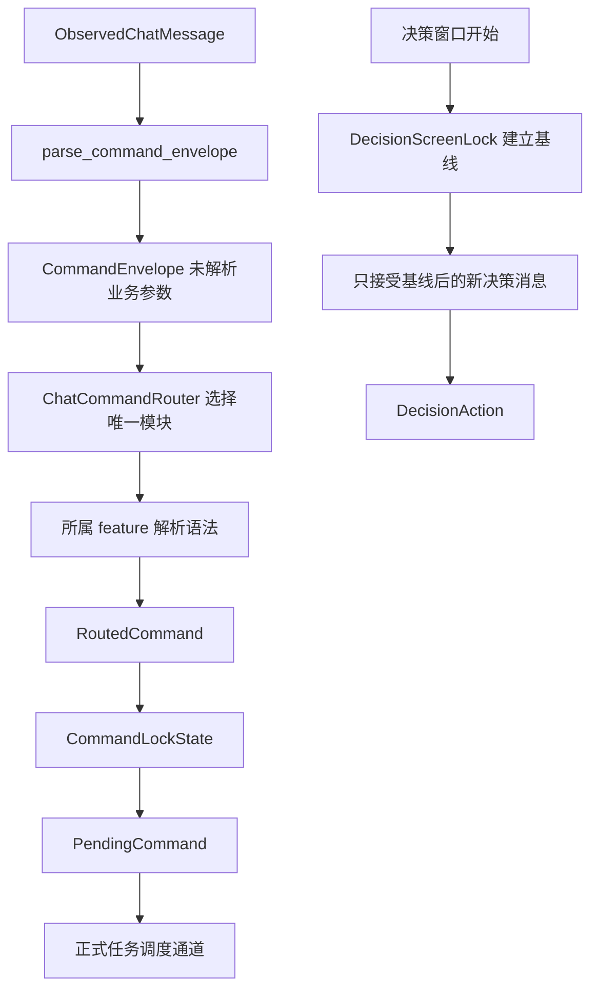

# 命令信封、屏幕锁与决策锁

本文说明聊天观察如何变成模块自有命令，以及视觉重复、待执行重复和确认窗口旧消息如何分别处理。

扫描和 OCR 细节见 `docs/ocr-ui-detection-flow.md`；调度过程见 `docs/chat-command-ingestion.md` 和 `docs/executor-flow.md`。

## 核心链路

## 相关文件

| 文件 | 职责 |
| --- | --- |
| `src/features/command.rs` | 命令信封、观察上下文、模块路由结果和小型顶层 `ModuleCommand`。 |
| `src/interfaces/chat.rs` | 从观察文本构造信封、控制台命令边界和命令屏幕锁。 |
| `src/interfaces/chat/router.rs` | 静态选择唯一纵向模块；不解析业务参数。 |
| `src/features/*` | 每个业务模块自己声明命令、解析参数、生成锁键并判断同语义请求。 |
| `src/observation/decision.rs` | 决策屏幕锁。 |
| `src/runtime/decision.rs` | 决策会话和类型化 `DecisionAction`。 |
| `src/composition/application/listener.rs` | 消费共享观察流、应用屏幕锁并提交正式任务。 |

## 命令信封

`parse_command_envelope()` 只提取公共上下文：

- 原始观察文本。
- 用户名。
- 蓝字大厅或粉字好友来源。
- `@` 或 `#` 前缀。
- 前缀后的原始命令正文。
- 观察帧、捕获时间和稳定消息标识。

此时没有点歌、邀请、娱乐或管理等业务类型，也没有中央参数解析。反馈文本和明显的机器人播放反馈会在信封入口前过滤。

控制台不伪造 OCR 文本。HTTP 适配器直接创建 `ConsoleCommandIntent`，显式携带一个模块命令，再在控制台边界转换为 `PendingCommand`；它没有聊天观察标识，也不经过视觉屏幕锁。

## 静态模块路由

`ChatCommandRouter` 根据来源权限、`@/#` 前缀和当前娱乐互斥所有者选择一个模块：

- `@` 命令在点歌、播放、大厅、管理、邀请、审核和自定义工作流等模块中静态选择。
- 无活动娱乐玩法时，`#` 只接受明确的开局或帮助语法。
- 有活动娱乐玩法时，普通 `#` 输入只交给当前唯一玩法。

路由器只询问模块是否声明该语法。选中后，仅调用该模块的 `parse_chat()`、`parse_start_chat()` 或 `parse_active_chat()`。解析结果被包装成小型 `ModuleCommand`，中央枚举只随模块数量增长，不展开模块内部参数。

## 路由结果与观察证据

`RoutedCommand` 保存：

- 匹配入口和规范化显示文本。
- 用户原始命令。
- 来源与用户名。
- 模块自有命令。
- `CommandObservation`。

`CommandObservation` 中的 `captured_at` 是期限判断的观察时间；不能用较晚的 OCR 完成时间替代。`message_id` 用于关联同一视觉消息的 OCR 修订，不承担业务去重。

## 三种不同的去重

### 观察消息标识

观察模块按视觉会话、聊天身份和气泡顺序分配消息标识。它解决“这是屏幕上的哪条消息”，不判断两条命令业务含义是否相同。

### 命令屏幕锁

`CommandLockState` 防止同一条仍可见命令反复入队：

1. 每轮接收当前可见的 `RoutedCommand`。
2. 模块命令通过 `lock_key()` 和 `same_request()` 定义同语义。
3. 需要按玩家隔离的命令再附加规范化用户名。
4. 命令仍可见时保留锁。
5. 命令不可见但当前仍在执行时也保留锁。
6. 不可见且没有执行时解除锁。

同语义由所属模块定义，例如点歌比较来源、伴奏和规范化关键词；管理比较动作与 UID；娱乐提交通常按玩家和会话语义隔离。中央锁不再枚举所有业务字段。

### 待执行范围去重

正式任务调度器再次根据 `PendingCommand.lock_key` 拒绝尚未开始的重复任务。它防止不同观察轮次在任务等待期间重复提交，与视觉屏幕锁和业务互斥是不同边界。

## 启动屏幕锁

程序启动或聊天上下文失效后，`screen_lock_primed=false`。第一轮稳定可见命令只进入 `CommandLockState` 建立基线，不执行；之后新出现或已离屏再出现的命令才可提交。

进入新大厅、启动游戏或切换导致视觉上下文失效时会重新建立这条基线，避免把切换前残留内容当成新输入。

## 一级与二级监听

- 一级监听按当前可见命令更新命令屏幕锁。
- 二级当前大厅通过气泡序列最长重叠确定新增消息；找不到可靠重叠时只重建基线。
- 二级好友未读只处理刚打开会话的最下方新气泡。
- 二级消息锁解决会话切换和历史气泡重复，之后仍会经过模块路由和待执行范围去重。

## 决策屏幕锁

候选确认、换源、AI 选择和管理投票开始前，`DecisionScreenLock` 先记录当前已经可见的决策消息。等待期间只接受：

- 不属于开始前基线的消息。
- 当前决策窗口尚未消费过的消息。
- 当前会话允许的 `DecisionAction`。

文本位置允许少量像素抖动，以容忍 OCR 框变化。决策锁只服务当前确认窗口，不影响普通命令锁。

常用决策包括：

- `@确认`
- `@跳过`
- `@换源`
- `@AI`

是否允许换源、AI 和超时默认确认由创建决策会话的业务模块决定。

## 关键不变量

- 聊天入口只构造命令信封，不拥有任何业务参数语法。
- 静态路由器只选择模块，业务模块自己解析命令。
- 观察消息标识、命令屏幕锁、待执行去重和娱乐互斥不可互相替代。
- 控制台直接提交类型化模块意图，不伪造聊天文本。
- 决策屏幕锁只隔离当前确认窗口中的旧消息和重复消息。
