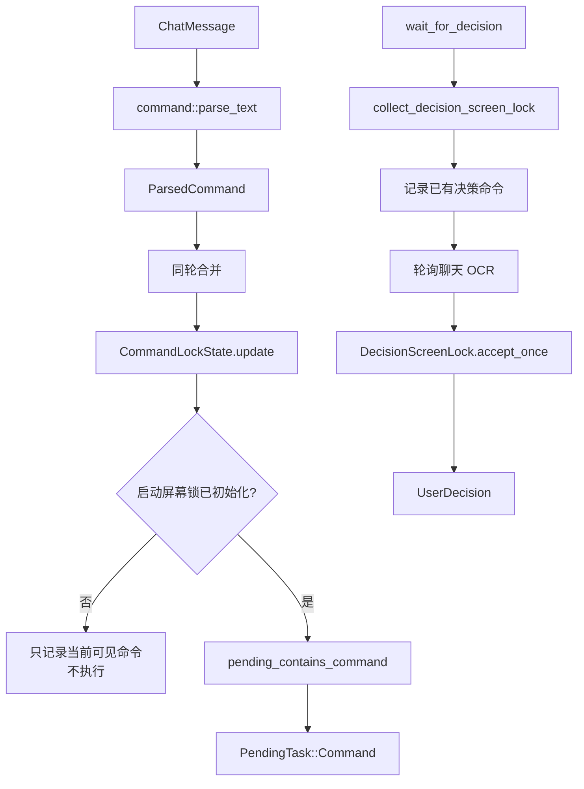

# 命令模型、屏幕锁与确认锁

本文专门梳理 `src/app/command.rs` 和 `src/app/decision_lock.rs`：OCR 文本怎样被解析成 `ParsedCommand`，命令屏幕锁怎样判断“同一条命令”，以及等待确认时怎样避免旧的 `@确认` 污染新的确认窗口。

如果想看扫描触发和 OCR 切块，见 `docs/ocr-ui-detection-flow.md`。如果想看命令最终怎样进入待执行任务队列，见 `docs/chat-command-ingestion.md` 和 `docs/executor-flow.md`。

## 核心结论

项目里有两套屏幕相关的去重机制：

- 命令屏幕锁：服务普通命令入队，防止屏幕上仍可见的同语义命令重复进入待执行任务队列。
- 确认屏幕锁：服务 `wait_for_decision()`，防止等待窗口开始前已经可见的 `@确认/@跳过/@换源/@AI` 被误用。

它们都不是业务互斥锁，也不替代待执行任务队列。

二级聊天监听不复用这两套普通命令屏幕锁：好友红点被首次进入时的未读清场消除，之后只 OCR 最下方最新深色气泡；当前气泡图像摘要只决定是否需要 OCR。二级命令仍会检查待执行任务队列，防止相同任务尚未执行时重复排队。具体扫描和恢复规则见 [二级聊天监听](secondary-chat-listener.md)。



## 相关文件

| 文件 | 职责 |
| --- | --- |
| `src/app/command.rs` | 命令领域模型、蓝字/粉字解析、命令屏幕锁、同语义比较。 |
| `src/app/decision_lock.rs` | 确认屏幕锁，按文本和位置过滤旧确认。 |
| `src/main.rs` | `handle_scan_messages()`、`wait_for_decision()`、入队过滤和确认轮询。 |
| `src/app/custom_workflow.rs` | 自定义工作流命令解析，和内置命令共用扫描入口。 |

## 命令领域模型

`ParsedCommand` 是 OCR 命令解析后的统一结构：

- `matched`：匹配到的命令前缀。
- `raw`：规范化后的业务命令文本，主要用于日志。
- `user_command`：用户原始命令文本。
- `message_type`：消息来源颜色或控制台来源。
- `username`：大厅用户名、好友名或控制台。
- `command`：真正的 `UserCommand`。

`UserCommand` 覆盖当前所有内置业务：

- 点歌、暂停、继续、播放、上一首、下一首、音量、状态、歌词、队列。
- 大厅检测、大厅时间、帮助。
- 邀请。
- 拉黑/屏蔽 UID。
- 麦克风、禁用命令、启用命令、闲置退出。
- 监听模式切换与状态查询。
- 自定义工作流。

解析层只负责把文本变成结构，不执行任何业务。

## 蓝字命令

蓝字来自大厅聊天，只处理 `message_type == "blue"`。

蓝字解析规则：

1. 文本必须包含用户名分隔符，例如 `：`、`:`、`]`、`】`。
2. 分隔符后必须以 `@` 开头。
3. 命令前缀必须在 `COMMANDS` 列表中。
4. 不允许 `/` 紧跟命令前缀，避免误收其他格式。
5. 不支持参数的命令后面如果还有文本，直接拒绝。
6. 机器人反馈文本会被过滤。

蓝字支持的点歌来源：

- `@点歌` / `@搜索`：QQ 音乐。
- `@QQ点歌` / `@QQ搜索`：QQ 音乐。
- `@网易点歌` / `@网易搜索`：网易云。
- `@AI点歌` / `@AI搜索`：AI 辅助点歌，解析层来源为 QQ 音乐。

蓝字不支持 B 站点歌。

## 粉字命令

粉字来自好友私聊，先从 `[]` 或 `【】` 中提取好友名。

粉字支持更多管理入口：

- 好友点歌。
- 好友 B 站点歌。
- 邀请序号，例如 `@邀请2`。
- 拉黑/屏蔽 UID。
- 麦克风。
- 禁用/启用命令识别。
- 闲置退出。

粉字 `@AI点歌` 会解析成 `SongSource::All`，后续执行层交给 FeelUOwn 做全来源候选搜索。

粉字命令在 `commands_enabled=false` 时仍然可以进入解析链路。这样管理员可以通过私聊恢复命令识别或执行管理动作。

## 点歌命令解析

点歌解析会额外处理 `伴奏`：

1. 只要关键词里包含 `伴奏`，就设置 `prefer_accompaniment = true`。
2. 从关键词中移除 `伴奏`。
3. 去掉多余空白。
4. 关键词为空则拒绝。

`SongCommand` 保存：

- `keyword`
- `source`
- `prefix`
- `prefer_accompaniment`
- `ai_assisted`
- `friend_username`

注意：大厅 AI 点歌解析层来源是 QQ 音乐，但执行层会通过 `ai_candidate_source()` 搜索 QQ 音乐和网易云候选。这是解析默认值和执行策略的分层，不是矛盾。

## 反馈文本过滤

`FEEDBACK_TEXT_PATTERNS` 用于避免把机器人自己发出的回复重新解析成命令。它会过滤：

- 搜索和匹配反馈。
- 播放、暂停、音量、队列反馈。
- AI 点歌反馈。
- 邀请、麦克风、管理员启用/禁用反馈。
- 大厅时间和到期提醒。

这层过滤在蓝字和粉字解析前都会生效。

## 同语义命令

命令屏幕锁比较的是同语义命令，不是 OCR 原文。

`same_lock_command()` 最终比较 `UserCommand`：

| 命令 | 同语义判断 |
| --- | --- |
| 点歌 | 好友来源、音源、伴奏标记相同，关键词相同或足够接近。 |
| 邀请 | 邀请序号相同。 |
| 拉黑/屏蔽 | 操作类型和 UID 相同。 |
| 麦克风 | 用户名相同。 |
| 禁用/启用 | 各自是全局命令，不按用户名区分。 |
| 闲置退出 | 分钟数相同。 |
| 自定义工作流 | 工作流名和参数相同。 |
| 音量 | 音量参数相同。 |
| 队列删除 | 删除索引列表相同。 |
| 播放/继续 | 统一成 `play`。 |

关键词比较会先标准化：

- 去掉空白。
- 去掉常见标点。
- 全角字符转半角。
- 大小写归一。

之后允许完全相等、包含关系，以及足够长前缀的小编辑距离差异。

## 命令屏幕锁生命周期

`CommandLockState` 内部保存 `lock_key -> CommandLock`。

每轮扫描调用 `update(visible_commands, command_executing)`：

1. 对已有锁，检查同语义命令是否仍可见。
2. 如果仍可见，保留锁。
3. 如果不可见但当前命令正在执行，仍保留锁。
4. 如果不可见且没有命令执行，解除锁。
5. 对本轮可见命令，如果同语义锁已存在，加入 skipped。
6. 否则插入新锁，并返回 `PendingCommand`。

解除锁会写：

```text
解锁: ...
```

锁命中会写：

```text
命令仍在屏幕内，本轮跳过: ...
```

## 启动屏幕锁

`screen_lock_primed` 用来处理程序刚启动或进入新视觉会话时屏幕上已有命令的问题。

第一次成功解析到可见命令时：

- 命令会进入 `CommandLockState`。
- 但不会入队执行。
- 日志写 `启动屏幕锁已记录当前可见命令，不执行`。

进入新大厅时，程序会重置命令屏幕锁并把 `screen_lock_primed=false`。这样新大厅里第一批可见命令同样只会建立锁，不会误执行残留内容。

## 入队前过滤顺序

`handle_scan_messages()` 的顺序是：

1. 如有请求，重置命令屏幕锁。
2. 空扫描结果直接返回，不更新锁。
3. 逐条非空文本解析内置命令或自定义工作流命令。
4. 命令识别禁用时，非粉字命令跳过。
5. 邀请序号已经执行过时跳过。
6. 同一轮 OCR 内的同语义重复命令合并。
7. 调用 `CommandLockState.update()`。
8. 启动屏幕锁未初始化时，只建锁不入队。
9. 检查待执行任务队列里是否已有同语义命令。
10. 禁用/启用命令会立即更新 `commands_enabled`。
11. 闲置退出直接配置并写执行日志，不进入待执行任务队列。
12. 其他命令进入 `PendingTask::Command`。

这一层保证扫描线程只负责观察和入队，不直接执行业务。

## 确认屏幕锁

确认屏幕锁只服务 `wait_for_decision()`。

等待确认前先调用 `collect_decision_screen_lock()`：

1. 截图。
2. 扫描聊天。
3. 找出当前已经存在的蓝字决策命令。
4. 记录每条决策命令的文本和 block bottom。

后续轮询中，`DecisionScreenLock::accept_once()` 会拒绝两类消息：

- 等待开始前已经存在的决策命令。
- 当前等待窗口里已经消费过的同一条决策命令。

位置比较用 bottom 坐标，允许 8px 抖动。这是为了适配 OCR 或切块位置的小偏移。

## 决策命令

`parse_decision_command()` 接受：

- `@确认`
- `@跳过`
- `@换源`
- `@AI`

这些命令可以带用户名分隔符，也可以是裸文本。命令后必须是边界字符，例如空白、标点或行尾。

`wait_for_decision()` 还会过滤机器人反馈文本，例如：

- `匹配失败`
- `AI自动匹配`
- `换源结果`
- `搜索到:`
- `AI匹配:`
- `命令已超时`

`@换源` 只有 `allow_switch_source=true` 时有效，`@AI` 只有 `allow_ai=true` 时有效。超时后是否默认确认由调用方传入的 `timeout_confirms` 决定。

## 关键边界

- 命令屏幕锁用于普通命令入队去重。
- 确认屏幕锁用于当前确认窗口去重。
- 两套锁都不代表业务互斥。
- 控制台命令不是 OCR 消息，不经过命令屏幕锁。
- `PendingTask` 队列还会做一次同语义去重，防止已入队但未执行的命令重复排队。
- 闲置退出是扫描线程内立即处理的少数例外，不进入待执行任务队列。
