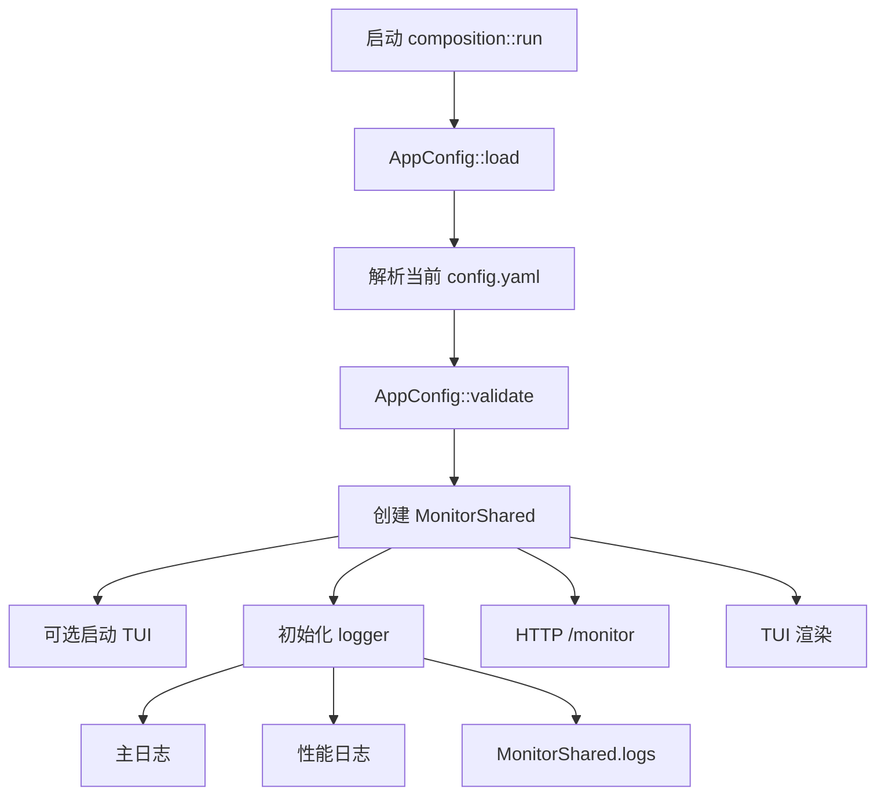

# 配置加载、日志与监控外壳

本文梳理程序启动时如何加载并校验当前配置，以及日志、TUI、Web 面板共享的监控快照如何流动。

## 核心结论

配置只接受当前 `AppConfig` 结构。程序不会迁移、改写或备份旧配置；文件不存在、当前模板中的区块或字段缺失、字段未知或类型不匹配时，启动会直接失败。只有类型本身明确为 `Option` 的工作流步骤参数可以省略。

日志分成三类：

- 常规日志：写入主日志文件，也会进入 TUI/Web 的事件日志栏。
- 性能日志：`target = "timing"`，只写入单独的 timing 日志文件。
- 聊天扫描结果：`target = "chat_scan_result"`，写入主日志文件，但不进入 TUI/Web 事件日志栏，避免和 OCR 专门展示区重复。

TUI 和 Web 面板读取的是同一个 `MonitorShared` 内存快照。它不是持久状态，也不是日志文件。



## 相关文件

| 文件 | 职责 |
| --- | --- |
| `src/config/mod.rs` | 根配置组合、配置加载和跨模块启动校验。 |
| `src/features/*` | 各纵向模块自己的配置结构和模块校验；业务测试仍可使用模块 `Default`，配置反序列化不会隐式调用它。 |
| `src/adapters/logging.rs` | 主日志、性能日志、监控日志分流。 |
| `src/runtime/monitor.rs` | TUI/Web 共用的内存监控快照。 |
| `src/interfaces/tui.rs` | 本地终端监控界面。 |
| `src/interfaces/http/mod.rs` | Web `/monitor` 和远程监控接口。 |
| `src/composition.rs` | 启动顺序、日志初始化、运行状态和队列加载。 |

## 启动初始化顺序

常驻模式进入 `composition::run()` 后按顺序执行：

1. `AppConfig::load(config_path)` 读取当前配置。
2. 调用 `AppConfig::validate()`，确认播放器运行时、队列容量、阈值、HTTP 监听和启用模块的必要配置有效。
3. 创建 `MonitorShared`，日志容量来自 `tui.log_lines`，最低保留 20 行。
4. 如果 `tui.enabled = true` 且 stdout 是交互终端，启动 TUI。
5. 初始化 logger，并把 `monitor.log_sink()` 传进去。
6. 写启动日志：主日志路径、性能日志路径、配置路径、HTTP 面板、FeelUOwn 地址。
7. 在启动任何运行时线程前构造 OCR 设备，并加载成语词库、`PersistentPlaybackState`、`PersistentHallState`、`PersistentQueue` 和 `PersistentSongDedupHistory`。
8. 解析各纵向模块的不可变配置，创建尚未依赖运行时句柄的应用服务。
9. 按依赖顺序启动计时、OCR、播放器、UI、OpenAI 和业务运行时。
10. 组装点歌、牌局、卧底、管理和自定义工作流的窄能力端口。
11. 创建 `ApplicationRuntime` 并进入主运行逻辑；HTTP 和热键只在运行阶段启动。

如果 TUI 启动失败或当前不是交互终端，程序会回退到普通 stderr 日志输出。

## 配置加载和校验

`AppConfig::load()` 只读取指定路径并反序列化当前结构。根配置组合共享基础配置和各 feature 自己定义的模块配置；结构统一使用 `deny_unknown_fields`。解析成功后，`AppConfig::validate()` 调用模块校验并检查跨模块约束；OCR 设备和必需持久文件也会在首个运行时线程启动前完成构造或加载。

## 日志分流

`logger::init()` 默认按自然日打开两个文件：

- `miliastra-wonderland-music-YYYY-MM-DD.log`
- `miliastra-wonderland-music-timing-YYYY-MM-DD.log`

`logging.rotate_daily` 默认开启，跨日时自动切到新文件；`logging.retain_days` 默认是 `7`，表示保留当天在内最近七个自然日的按日日志。设为 `0` 可以关闭自动清理。日志目录读取、轮转或清理失败只会写入警告，当前监听继续运行。

每条日志先按 target 过滤：

- `target == "timing"`：写入 timing 日志文件后直接返回。
- `target == "chat_scan_result"`：写入主日志，但不推入 `MonitorShared.logs`。
- 其他常规日志：推入 `MonitorShared.logs`，必要时写 stderr，同时写主日志。

`wgpu` 和 `naga` 的日志会被限制到 warn 级别，避免模板匹配或图形后端输出刷屏。

日志前缀使用北京时间格式，形如：

```text
[07-07 04:24:34][INFO ] :
```

## 性能日志

性能日志只收集 `target = "timing"` 的阶段耗时，例如：

- OCR 引擎重建耗时。
- OCR 锁等待耗时。
- 聊天扫描端到端耗时。
- 主循环阶段耗时。
- UI 状态检测耗时。
- 命令执行耗时。

设计目标是让普通日志保留“发生了什么”，把“每个阶段花了多久”放到独立文件里，避免 TUI/Web 事件日志被耗时统计淹没。

## 聊天 OCR 快照

聊天扫描结果会走两条路径：

- `chat_scan_result` 日志：写入主日志文件，保留完整扫描结果。
- `MonitorShared.ocr`：作为结构化 OCR 快照供 TUI/Web 展示。

`MonitorShared.ocr` 包含：

- `markers`：识别到的聊天标记数量。
- `messages`：最新聊天内容。
- `marker_ms`：标记匹配耗时。
- `ocr_ms`：OCR 耗时。
- `total_ms`：扫描总耗时。

因为 OCR 内容已经有专门区域展示，所以 `chat_scan_result` 不会进入 TUI/Web 的事件日志栏。

## 监控快照

`MonitorShared` 是监控投影的只读/发布句柄。生产代码只提交类型化的 `MonitorEvent`，由独立
监控投影线程顺序调用 `MonitorProjection::apply`；TUI/Web 的 `snapshot()` 请求也经过同一通道，不能直接修改投影。
投影包含：

- `logs`：最近事件日志。
- `ocr`：最新 OCR 快照。
- `queue`：音乐播放队列摘要。
- `commands`：最近执行命令，最多 20 条。
- `status`：程序状态，例如启动中、运行中、已退出。
- `turtleSoup`：业务运行时发布的海龟汤公开快照，不包含汤底或裁决备注。
- `undercover`：业务运行时发布的谁是卧底公开快照。

写入点主要有：

- logger 提交 `MonitorEvent::Log`。
- 聊天扫描提交 `MonitorEvent::Ocr`。
- 队列变化后提交 `MonitorEvent::Queue`。
- `log_executed_command()` 提交 `MonitorEvent::Command`。
- 应用启动和退出时提交 `MonitorEvent::Status`。
- 业务运行时通过窄状态端口提交 `MonitorEvent::TurtleSoup` 和 `MonitorEvent::Undercover`。

Web `/monitor` 和 TUI 都只读取这个快照。监控投影线程收到停止消息后会被显式等待，不能脱离应用生命周期运行。

## TUI 布局

TUI 启动时会关闭 Windows 控制台 Quick Edit 和 Insert 模式，退出时恢复原模式，避免鼠标选中文本导致程序暂停。

默认布局：

- 底部状态栏固定 3 行。
- 事件日志高度按终端高度约 35% 计算，限制在 8 到 18 行，并保证上方仪表盘有最小空间。
- 宽度大于等于 72 时，OCR 和队列左右排列，命令列表在下方。
- 窄屏时，OCR、队列、命令上下排列。
- OCR 最新聊天最多显示 5 条。
- 队列最多显示 5 项。

TUI 只是监控视图，不承担命令输入。远程操作入口在 Web 面板。

## 执行命令日志

`log_executed_command()` 同时做两件事：

1. 提交 `MonitorEvent::Command`，由投影保留 `用户命令 -> 最终动作`。
2. 向 `state.executed_commands_log_path` 追加一行持久日志。

持久日志字段大致是：

```text
时间-位置-用户名-用户命令-最终动作
```

点歌重复、入队、播放、审核拒绝等最终动作都会通过这里留下记录。

## 阅读顺序建议

想看配置加载：

1. `src/config/mod.rs`：读 `AppConfig::load()` 和 `AppConfig::validate()`。
2. `config.yaml`：对照当前结构和中文注释。

想看日志和监控：

1. `src/adapters/logging.rs`：读日志 target 分流。
2. `src/runtime/monitor.rs`：读监控快照结构。
3. `src/interfaces/tui.rs`：读本地面板布局。
4. `src/interfaces/http/mod.rs`：读 `/monitor` 输出。
