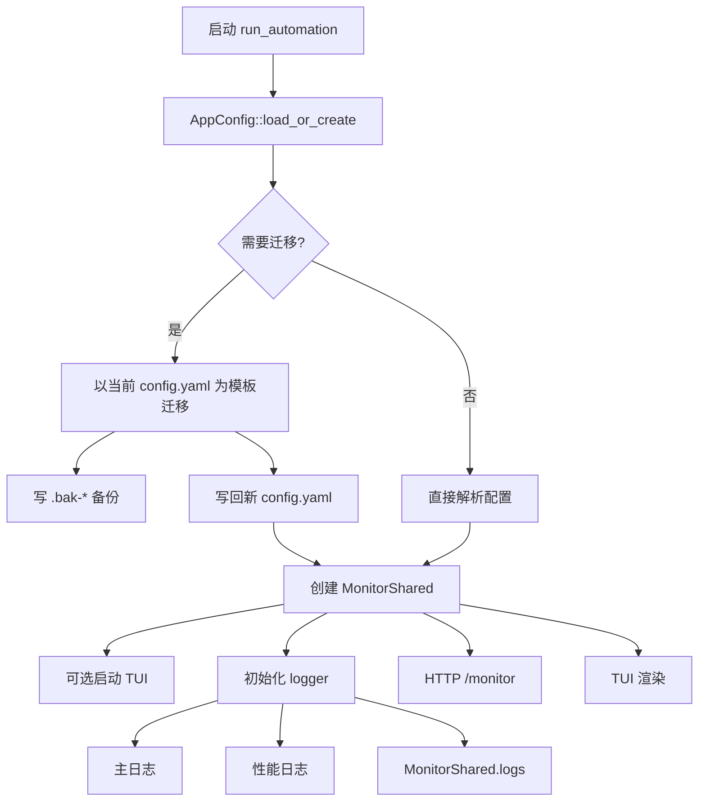

# 配置迁移、日志与监控外壳

本文梳理程序启动时如何加载配置、如何自动迁移旧配置，以及日志、TUI、Web 面板共享的监控快照如何流动。

## 核心结论

配置迁移以当前发布包里的 `config.yaml` 为模板，把旧配置里能确认的值迁移回新模板。这样能保留新版本中文注释和配置结构，不会把旧 YAML 直接原地改成一团无注释字段。

日志分成三类：

- 常规日志：写入主日志文件，也会进入 TUI/Web 的事件日志栏。
- 性能日志：`target = "timing"`，只写入单独的 timing 日志文件。
- 聊天扫描结果：`target = "chat_scan_result"`，写入主日志文件，但不进入 TUI/Web 事件日志栏，避免和 OCR 专门展示区重复。

TUI 和 Web 面板读取的是同一个 `MonitorShared` 内存快照。它不是持久状态，也不是日志文件。



## 相关文件

| 文件 | 职责 |
| --- | --- |
| `src/app/config.rs` | 配置结构、配置加载、迁移调用、默认配置内嵌。 |
| `src/app/config_migration.rs` | 配置迁移规则、字段移动、默认值变更、渲染和未迁移字段注释。 |
| `src/app/logger.rs` | 主日志、性能日志、监控日志分流。 |
| `src/app/monitor.rs` | TUI/Web 共用的内存监控快照。 |
| `src/app/tui.rs` | 本地终端监控界面。 |
| `src/app/http_server.rs` | Web `/monitor` 和远程监控接口。 |
| `src/main.rs` | 启动顺序、日志初始化、运行状态和队列加载。 |

## 启动初始化顺序

常驻模式进入 `run_automation()` 后按顺序执行：

1. `AppConfig::load_or_create(config_path)` 读取配置。
2. 创建 `MonitorShared`，日志容量来自 `tui.log_lines`，最低保留 20 行。
3. 如果 `tui.enabled = true` 且 stdout 是交互终端，启动 TUI。
4. 初始化 logger，并把 `monitor.log_sink()` 传进去。
5. 写启动日志：主日志路径、性能日志路径、配置路径、HTTP 面板、FeelUOwn 地址。
6. 加载 `PersistentRuntimeState`。
7. 启动时清理上次运行的大厅倒计时缓存。
8. 加载 `PersistentQueue`。
9. 加载 `PersistentSongDedupHistory`。
10. 创建默认空闲的娱乐协调器、斗地主/谁是卧底状态和海龟汤服务；题库直到实际开局才读取。
11. 创建 `AutomationApp` 并进入主运行逻辑。

如果 TUI 启动失败或当前不是交互终端，程序会回退到普通 stderr 日志输出。

## 配置加载和自动迁移

`AppConfig::load_or_create()` 的名字里有 `create`，但当前行为是：配置文件不存在时直接报错，提示用户把发布包里的 `config.yaml` 放到工作目录。

配置存在时流程是：

1. 读取旧配置文本。
2. 调用 `migrate_config_text(old_text, default_config_yaml())`。
3. 如果不需要迁移，直接 `serde_yaml::from_str()` 解析旧文本。
4. 如果需要迁移，先用迁移后的文本解析成 `AppConfig` 做校验。
5. 写入 `.bak-时间戳` 备份。
6. 把迁移后的文本写回原配置路径。
7. 用 `eprintln!` 输出迁移摘要和未迁移字段。

迁移校验在写回前完成，因此迁移结果如果不能反序列化成当前配置结构，不会覆盖原配置。

## 迁移规则

当前配置版本由 `CURRENT_CONFIG_VERSION` 控制。迁移函数会先判断：

- 旧版本号大于当前版本：不迁移。
- 旧版本号等于当前版本，且不存在旧字段来源：不迁移。
- 版本缺失、版本落后，或当前版本里仍包含旧路径字段：执行迁移。

如果新增配置段或字段具备完整 `serde(default)` 默认值，且没有移动或改变旧字段语义，可以保持配置版本不变。`turtle_soup` 初次加入时采用这种方式；当前缺少 `nickname_stable_count` 或 `content_stable_count` 时使用局部继承值 `0`，再由 `stability.default_count` 解析连续次数。版本 27 会把旧默认值 `2` 迁移为 `0`，用户显式设置的大于 1 的局部覆盖保持不变。

迁移以当前默认配置为 `new_value` 基底，然后分几步填充：

1. `copy_common_fields()`：同名且类型兼容的字段复制到新结构。
2. `migrate_moved_fields()`：把旧路径迁移到新路径，例如扁平 `timing.*` 迁到分组后的 `timing.chat_scan.*`、`timing.input.*`、`timing.playback.*`。
3. `migrate_changed_default_fields()`：对历史版本里仍保持旧默认值的字段，更新成当前默认值。
4. `normalize_custom_workflows()`：补齐自定义工作流缺失的默认字段。
5. 设置 `config_version = CURRENT_CONFIG_VERSION`。
6. `collect_unmigrated_fields()`：收集当前版本没有对应项或类型不兼容的旧字段。

最后不是直接序列化 `new_value`，而是在默认 `config.yaml` 文本里替换实际有差异的配置值。这样能保留默认配置里的中文注释和字段顺序。

未迁移字段会以注释形式追加到配置末尾：

- 不影响运行。
- 给用户保留手动确认线索。
- 不会静默丢掉未知旧配置。

## 日志分流

`logger::init()` 默认按自然日打开两个文件：

- `miliastra-wonderland-music-YYYY-MM-DD.log`
- `miliastra-wonderland-music-timing-YYYY-MM-DD.log`

`logging.rotate_daily` 默认开启，跨日时自动切到新文件；`logging.retain_days` 默认是 `7`，表示保留当天在内最近七个自然日的按日日志。设为 `0` 可以关闭自动清理。日志目录读取、轮转或清理失败只会写入警告，当前监听继续运行。

每条日志先按 target 过滤：

- `target == "timing"`：写入 timing 日志文件后直接返回。
- `target == "chat_scan_result"`：写入主日志，但不推入 `MonitorShared.logs`。
- 其他常规日志：推入 `MonitorShared.logs`，必要时写 stderr，同时写主日志。

`wgpu` 和 `naga` 的日志会被限制到 warn 级别，避免模板匹配或图形后端输出刷屏。

日志前缀使用北京时间格式，形如：

```text
[07-07 04:24:34][INFO ] :
```

## 性能日志

性能日志只收集 `target = "timing"` 的阶段耗时，例如：

- OCR 引擎重建耗时。
- OCR 锁等待耗时。
- 聊天扫描端到端耗时。
- 主循环阶段耗时。
- UI 状态检测耗时。
- 命令执行耗时。

设计目标是让普通日志保留“发生了什么”，把“每个阶段花了多久”放到独立文件里，避免 TUI/Web 事件日志被耗时统计淹没。

## 聊天 OCR 快照

聊天扫描结果会走两条路径：

- `chat_scan_result` 日志：写入主日志文件，保留完整扫描结果。
- `MonitorShared.ocr`：作为结构化 OCR 快照供 TUI/Web 展示。

`MonitorShared.ocr` 包含：

- `markers`：识别到的聊天标记数量。
- `messages`：最新聊天内容。
- `marker_ms`：标记匹配耗时。
- `ocr_ms`：OCR 耗时。
- `total_ms`：扫描总耗时。

因为 OCR 内容已经有专门区域展示，所以 `chat_scan_result` 不会进入 TUI/Web 的事件日志栏。

## 监控快照

`MonitorShared` 内部是一个 `Mutex<MonitorState>`，包含：

- `logs`：最近事件日志。
- `ocr`：最新 OCR 快照。
- `queue`：音乐播放队列摘要。
- `commands`：最近执行命令，最多 20 条。
- `status`：程序状态，例如启动中、运行中、已退出。

写入点主要有：

- logger 推入常规日志。
- 聊天扫描推入 OCR 快照。
- 队列变化后调用 `update_monitor_queue_snapshot()`。
- `log_executed_command()` 推入最近执行命令。
- 应用启动和退出时设置 status。

Web `/monitor` 和 TUI 都只读取这个快照。

## TUI 布局

TUI 启动时会关闭 Windows 控制台 Quick Edit 和 Insert 模式，退出时恢复原模式，避免鼠标选中文本导致程序暂停。

默认布局：

- 底部状态栏固定 3 行。
- 事件日志高度按终端高度约 35% 计算，限制在 8 到 18 行，并保证上方仪表盘有最小空间。
- 宽度大于等于 72 时，OCR 和队列左右排列，命令列表在下方。
- 窄屏时，OCR、队列、命令上下排列。
- OCR 最新聊天最多显示 5 条。
- 队列最多显示 5 项。

TUI 只是监控视图，不承担命令输入。远程操作入口在 Web 面板。

## 执行命令日志

`log_executed_command()` 同时做两件事：

1. 向 `MonitorShared.commands` 推入 `用户命令 -> 最终动作`。
2. 向 `state.executed_commands_log_path` 追加一行持久日志。

持久日志字段大致是：

```text
时间-位置-用户名-用户命令-最终动作
```

点歌重复、入队、播放、审核拒绝等最终动作都会通过这里留下记录。

## 阅读顺序建议

想看配置迁移：

1. `src/app/config.rs`：读 `AppConfig::load_or_create()`。
2. `src/app/config_migration.rs`：读 `migrate_config_text()`。
3. `config.yaml`：对照当前默认模板和中文注释。

想看日志和监控：

1. `src/app/logger.rs`：读日志 target 分流。
2. `src/app/monitor.rs`：读监控快照结构。
3. `src/app/tui.rs`：读本地面板布局。
4. `src/app/http_server.rs`：读 `/monitor` 输出。
