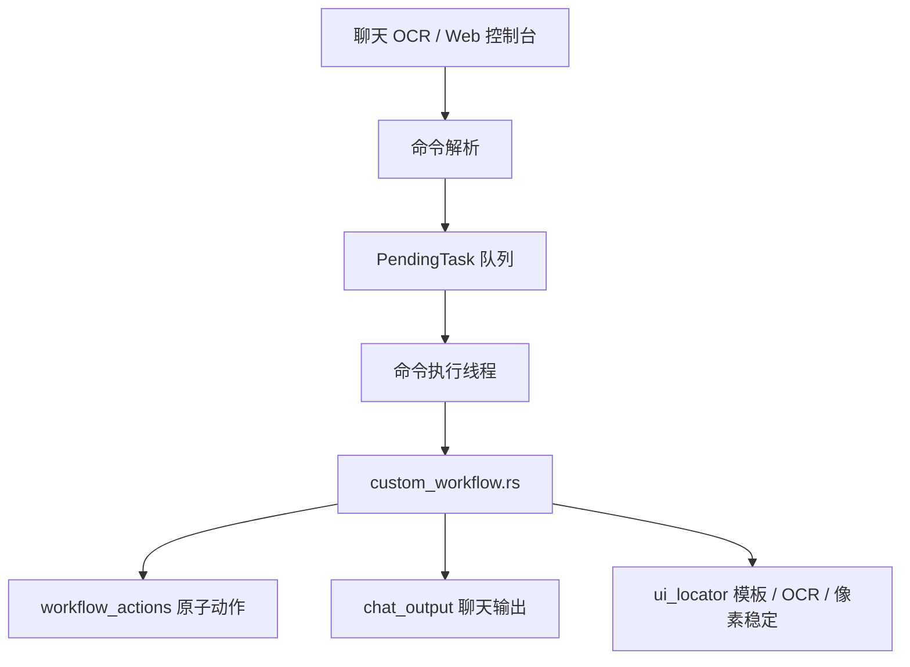

# 自定义工作流、邀请与管理流程梳理

本文梳理 `src/app/custom_workflow.rs` 这一层。它不是单纯的原子动作文件，而是把聊天命令、自定义配置步骤、邀请确认、好友反馈和拉黑/屏蔽投票连接起来的业务流程层。

相关底层 UI 自动化动作见 `docs/ui-automation-atoms.md`。本文只描述业务流程如何组合这些动作。

## 核心结论

`custom_workflow.rs` 同时承担两类职责：

- 自定义工作流解释器：把配置中的 `custom_workflows.workflows` 解析成可执行步骤，并提供变量渲染、确认窗口和成功反馈。
- 内建社交流程：邀请用户、向好友发反馈、拉黑/屏蔽投票和最终 UI 执行。

这些流程最终仍要经过待执行任务队列串行执行。后台线程可以等待投票结果，但不能直接操作游戏 UI；真正会点击、按键、粘贴的部分仍回到主业务队列。



## 文件职责

| 文件 | 职责 |
| --- | --- |
| `src/app/custom_workflow.rs` | 自定义工作流解释器；邀请、好友发言、管理投票和管理执行。 |
| `src/app/workflow_actions.rs` | 原子动作：等待、按键、点击、粘贴、模板等待、OCR 点击、像素稳定。 |
| `src/app/ui_locator.rs` | 截图定位、模板匹配、OCR 文本定位和区域稳定等待。 |
| `src/app/chat_output.rs` | 游戏内大厅聊天和当前聊天框发送。 |
| `src/app/decision_lock.rs` | 确认窗口开始前收集已存在决策，避免旧消息误触发。 |
| `src/app/command.rs` | `CustomWorkflowCommand`、`ModerationCommand` 等命令模型。 |
| `src/main.rs` | 把解析出的命令和投票结果接入待执行任务队列。 |
| `src/app/config.rs` | `CustomWorkflowConfig`、`CustomWorkflowDefinition`、`CustomWorkflowStep` 配置结构。 |

## 自定义命令解析

入口是 `custom_workflow::parse_text(config, text, message_type)`。主命令解析没有命中时，会尝试这里的自定义工作流解析。

解析规则：

- `custom_workflows.enabled = false` 时直接忽略。
- 只接受能拆出用户名和命令体的聊天文本。
- 按 `workflows` 顺序查找已启用的工作流。
- `message_types` 限制来源，例如大厅蓝字或好友粉字。
- `commands` 是触发词，配置里可以写带 `@` 或不带 `@` 的形式。
- `allow_args = false` 时，触发词后不能附带参数。
- `allow_args = true` 时，支持空格参数、紧贴参数和冒号参数。

匹配成功后生成 `UserCommand::CustomWorkflow(CustomWorkflowCommand)`，包含：

- `name`：实际匹配到的命令名。
- `workflow`：要执行的工作流名。
- `args`：原始参数字符串。

这里仍只是命令解析，不执行任何 UI 操作。真正执行发生在命令执行线程。

## 工作流上下文

`WorkflowContext` 是自定义步骤渲染变量时使用的上下文。它来自当前 `CustomWorkflowCommand` 和 `ParsedCommand`。

可用变量：

| 变量 | 含义 |
| --- | --- |
| `{{workflow}}` / `{{workflow_name}}` | 当前工作流名。 |
| `{{command}}` / `{{command_name}}` | 用户触发的命令名。 |
| `{{args}}` / `{{param}}` / `{{params}}` | 完整参数字符串。 |
| `{{arg1}}`, `{{arg2}}` | 按空白切分后的第 N 个参数。 |
| `{{username}}` / `{{user}}` | 触发命令的用户名。 |
| `{{message_type}}` | 消息来源类型。 |
| `{{user_command}}` | 用户原始命令文本。 |

未知变量会原样保留，避免配置写错时静默变成空字符串。

## 自定义工作流执行

入口是 `AutomationApp::execute_custom_workflow(command, parsed)`。

执行顺序：

1. 按 `command.workflow` 找到启用的工作流。
2. 校验 `steps` 非空。
3. 创建 `WorkflowContext`。
4. 如果 `confirm_before_run = true`，先进入自定义确认窗口。
5. 逐个执行 `steps`。
6. 步骤结束后按 `timing.workflow.default_step_wait_ms` 或步骤自己的 `wait_ms` 等待。
7. 如果配置了 `success_message`，执行完成后向大厅回复成功消息。

有些步骤本身已经消费等待时间，因此不会再追加默认步骤等待：

- `sleep` / `wait`
- `wait_template_absent` 且启用了消失后稳定等待
- `wait_stable` / `wait_pixels_stable`

## 步骤到动作的映射

| 步骤类型 | 落地行为 |
| --- | --- |
| `sleep` / `wait` | 固定等待。 |
| `key` / `press_key` | 发送键盘按键。 |
| `hold_key` | 在限定秒数内按住键盘按键。 |
| `activate_game` | 激活游戏窗口。 |
| `focus_game` | 激活并点击安全聚焦点。 |
| `click` | 点击固定坐标。 |
| `wait_template` | 等待模板出现。 |
| `click_template` | 等待模板出现并点击中心，可加偏移。 |
| `wait_template_absent` | 等待模板消失，可继续等待区域像素稳定。 |
| `wait_stable` / `wait_pixels_stable` | 等待指定区域像素稳定。 |
| `wait_text` | OCR 等待文本出现。 |
| `click_text` | OCR 找到文本后点击文本框中心，可加偏移。 |
| `paste` / `paste_text` | 临时占用文本剪贴板并粘贴。 |
| `send_chat` / `reply` | 发送大厅聊天回复。 |
| `send_current_chat` | 假设当前聊天框已打开，直接发送当前聊天。 |
| `send_friend_message` / `friend_reply` | 打开好友聊天并发送反馈。 |
| `invite_user` / `invite_current_user` | 执行邀请流程。 |
| `ensure_primary` / `return_primary` | 检测并到达一级界面；已在一级时不发送 `Esc`。 |
| `ensure_current_hall` | 检测并到达二级当前大厅。 |

需要注意：配置步骤不全是原子动作。`send_friend_message`、`invite_user`、`return_primary` 这些是业务组合流程。

默认按键工作流包括 `@W/@S/@A/@D`、`@F` 和 `@X`，仅接受粉色好友私聊。`@X` 的步骤是先确保一级界面，再单击一次 `X`，不接受参数；命令结束后由统一执行器恢复监听驻留界面。

## 自定义确认窗口

工作流可以设置 `confirm_before_run = true`。执行前会先向大厅发送确认提示。

默认提示是：

```text
{username} 请求执行 {command},@确认@跳过
```

确认等待使用通用 `wait_for_chat_decision()`：

1. 仅接受大厅消息且处于二级监听时，记录当前大厅现有深色气泡序列。
2. 允许粉色好友消息时，临时进入一级界面并用 `DecisionScreenLock` 记录已有确认。
3. 在超时时间内循环读取所选消息来源。
4. 只接受 `confirm_message_types` 允许的消息来源。
5. 新出现的 `@确认` 返回通过，新出现的 `@跳过` 返回取消。
6. 超时后发送“自定义流程确认超时,已取消”。

这里的屏幕锁只保护当前确认窗口，不会影响普通命令入队。

## 好友发言

标准好友发言入口是 `send_friend_message(username, message)`。它用于拒绝邀请反馈，也可以被自定义工作流步骤调用。

流程：

1. 检测当前界面；已在二级聊天时不发送 `Esc` 或 `Enter`。
2. 如果顶部标题已经是目标好友，直接复用当前会话。
3. 否则打开二级聊天，在好友列表区域 OCR 查找并点击目标用户名。
4. 等待输入框接管焦点。
5. 调用 `chat_output.send_current_chat(message)` 发送当前聊天。
6. 普通好友反馈结束后恢复当前监听驻留界面；邀请同意反馈可以保留好友会话供下一阶段复用。

这个流程要求游戏窗口已经处于可输入状态。它不会把好友反馈伪装成玩家命令，也不参与普通聊天命令解析。邀请同意和默认同意使用内部的保留会话变体：私聊反馈成功后不返回一级，立即复用同一好友会话继续邀请；私聊失败时回退到上述标准流程。

## 邀请流程

入口是 `execute_invite_with_announce(username, password)`。

整体规则：

- 如果当前已经是公共大厅，直接通知好友“已同意加入大厅,请等待BOT进入大厅并发送就绪信息后再开启麦克风”，然后执行邀请。
- 如果不是公共大厅，先在大厅聊天发起确认公告。
- 公告后等待大厅成员回复 `@邀请确认` 或 `@邀请拒绝`。
- 超时默认同意。
- 拒绝时只给好友反馈“大厅成员已拒绝邀请”，不执行邀请 UI。

非公共大厅公告格式：

```text
{username}邀请BOT前往大厅,30s内@邀请确认@邀请拒绝,默认通过
```

决策命令支持：

| 文本 | 结果 |
| --- | --- |
| `@邀请确认` | 同意邀请。 |
| `@同意邀请` | 同意邀请。 |
| `@邀请拒绝` | 拒绝邀请。 |
| `@拒绝邀请` | 拒绝邀请。 |

等待邀请决策同样使用 `DecisionScreenLock`，不会吃到等待开始前已经存在的旧确认或旧拒绝。

## 邀请 UI 执行

真正邀请用户的流程在 `execute_invite(username, password, friend_chat_open)` 和 `execute_invite_steps(username, password, friend_chat_open)`。

同意或默认同意的私聊反馈发送成功时，`friend_chat_open` 为真：流程直接复用当前目标好友会话。其余情况也只保证二级聊天已打开，不再固定先回一级。点击邀请入口时优先查找最下方深色好友会话框；未找到时才回退 OCR 查找目标用户名。若邀请命令带有 6 位密码，会在点击“进入大厅”后等待一次邀请步骤延迟，然后逐位键盘输入密码。公共大厅检测的 `F2` 动作仍显式要求一级界面；邀请成功后的加载收尾也会先确认一级，再按监听模式发送就绪信息并恢复驻留界面。

邀请流程的重点边界是：

- 先做公共大厅判断，避免重复询问。
- 同意反馈发送成功时只复用该次已打开的目标好友会话；反馈失败不会阻塞邀请，会按普通路径重新打开好友聊天。
- 拒绝分支不会执行邀请 UI。

## 管理投票

管理命令包括拉黑和屏蔽聊天。它们先进入投票流程，再根据投票结果决定是否执行 UI 操作。

入口是 `execute_moderation_with_vote(command)`。

流程：

1. 为当前动作和 UID 生成管理工作流 key。
2. 如果同一个动作和 UID 已经在投票或执行中，直接跳过。
3. 发送投票公告。
4. 建立可嵌套的“临时一级阶段”，后台线程等待好友私聊投票。
5. 投票结束后把 `PendingTask::ModerationVoteResult` 放回待执行任务队列。
6. 命令执行线程取到投票结果后，再执行或拒绝管理动作，并释放该次临时一级阶段。
7. 最后一个并行投票结束后，二级监听才恢复当前大厅。

`moderation_workflows` 是防并发集合。`ModerationWorkflowRelease` 用 RAII 在流程结束时释放 key，避免异常返回后永久锁住同一个 UID。

## 投票统计规则

投票只接受粉色好友私聊消息。

`parse_friend_moderation_vote()` 识别好友发来的同意或不同意。为了降低 OCR 抖动影响，同一用户同一投票方向需要达到 `stable_vote_samples` 次采样，才进入稳定投票集合。

通过条件：

- 同意数减去不同意数达到 `required_vote_margin`，立即通过。
- 超时后如果没有任何不同意票，则按通过处理。
- 超时后存在不同意票且未达到目标差值，则按未通过处理。
- 程序停止时按未通过处理。

这套规则表达的是“无反对默认通过”，不是简单多数票。

## 管理执行状态机

投票通过后，最终 UI 执行在 `execute_moderation_steps_inner(command)`，状态机是 `ModerationUiState`。

| 状态 | 行为 |
| --- | --- |
| `OpenFriendPanel` | 按键打开好友面板，并等待好友界面模板。 |
| `OpenSearchPanel` | 打开 UID 搜索面板，并等待搜索界面模板。 |
| `EnterUid` | 点击 UID 输入框，粘贴 UID，点击搜索。 |
| `WaitSearchResult` | 等待并点击更多设置模板。 |
| `ClickAction` | 根据动作点击拉黑或屏蔽聊天按钮。 |
| `ConfirmAction` | 点击确认按钮。 |
| `WaitActionApplied` | 等待确认按钮消失或结果生效。 |
| `Done` | 执行完成。 |

打开好友管理面板这一动作会显式确保一级界面，其余状态依赖前一状态的模板成功。状态机失败时返回未执行；结束后先释放临时一级阶段，再按监听驻留目标发送反馈。

## 关键日志

常见日志可以按这些前缀理解：

| 日志 | 含义 |
| --- | --- |
| `执行自定义流程` | 自定义工作流开始执行。 |
| `自定义流程步骤` | 当前执行到哪个配置步骤。 |
| `自定义流程确认` | 正在等待 `@确认` 或 `@跳过`。 |
| `好友发言` | 准备向某个好友发送反馈。 |
| `邀请: 先检测是否公共大厅` | 邀请流程进入前置大厅判断。 |
| `收到邀请拒绝，取消邀请` | 邀请确认窗口收到拒绝。 |
| `投票` | 管理投票统计进度。 |
| `开始执行拉黑/屏蔽聊天` | 投票结果已回到主业务队列并开始 UI 操作。 |

## 设计边界

- 自定义工作流是业务层解释器，不是新增原子动作的地方。
- 原子动作默认游戏已经聚焦；自定义流程通过显式界面步骤建立页面前置条件。
- 后台投票线程只等待和入队，不直接操作游戏窗口。
- 标准好友发言复用当前二级界面；只有当前不在二级聊天时才打开，邀请同意反馈成功后可继续复用目标好友会话。
- 邀请拒绝分支只反馈好友，不继续执行邀请 UI。
- 控制台命令和 OCR 命令入口不同，但会游戏输入的任务最终都进待执行任务队列串行执行。
