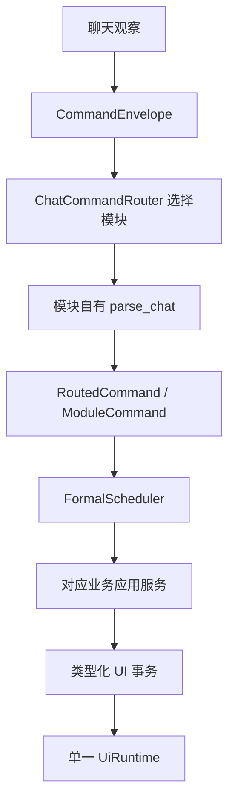

# 自定义工作流、邀请与管理流程

本文说明三个相邻但彼此独立的纵向模块：自定义工作流、邀请和管理投票。它们共享聊天观察、好友投递和单一 UI runtime，但各自拥有命令语法、业务状态与类型化 UI 事务。

相关底层 UI 边界见 `docs/ui-automation-atoms.md`。

## 总体边界

- 聊天入口只创建 `CommandEnvelope`，不解释所有业务参数。
- `ChatCommandRouter` 只选择一个模块；被选中的 feature 自己解析语法。
- `FormalScheduler` 保证需要游戏输入的正式任务有序执行。
- 自定义机械步骤会合并成 `CustomActionPlan`；邀请、好友投递和管理动作使用各自的类型化 UI 事务。
- 只有 `UiRuntime` 可以执行截图、点击、按键和粘贴。

## 文件职责

| 文件 | 职责 |
| --- | --- |
| `src/features/custom_workflow.rs` | 自定义命令匹配、变量渲染、步骤编译、确认规则和执行顺序。 |
| `src/features/invite.rs` | 邀请命令、确认决策和邀请业务规则。 |
| `src/features/moderation.rs` | 管理命令、投票策略、流程租约和结果执行规则。 |
| `src/composition/application/custom_workflow.rs` | 为工作流和邀请实现聊天、决策、好友投递与 UI 能力端口。 |
| `src/composition/application/moderation.rs` | 连接管理投票观察、正式任务队列和管理 UI 事务。 |
| `src/ui/routines/custom_action.rs` | 顺序执行一组机械 `WorkflowOperation`。 |
| `src/ui/routines/friend_delivery.rs` | 唯一好友定位、消息投递及最终监听驻留恢复。 |
| `src/ui/routines/invite.rs` | 在一个不可交错事务内完成邀请导航和结果确认。 |
| `src/ui/routines/moderation.rs` | 在一个不可交错事务内完成 UID 搜索和管理动作。 |
| `src/runtime/ui.rs` | 串行执行所有类型化 UI 事务。 |

## 自定义命令解析

`CustomWorkflowService::claims_chat()` 判断当前命令信封是否属于自定义工作流；路由选中后，`parse_chat()` 生成 `CustomWorkflowCommand`。解析规则包括：

- `custom_workflows.enabled = false` 时不认领命令。
- 按配置顺序匹配已启用工作流。
- `message_types` 限制允许的聊天来源。
- `commands` 定义触发词，可写带或不带 `@` 的形式。
- `commands = []` 时没有聊天入口，但仍可按工作流 `name` 从 Web 执行。
- `allow_args = false` 时触发词后不能带参数。
- `allow_args = true` 时接受空格、紧贴或冒号参数。

解析结果由 `ModuleCommand::CustomWorkflow` 包装。中央路由不读取工作流参数，也不执行 UI。

## 工作流上下文

组合层用 `CustomWorkflowCommand` 和 `RoutedCommand` 创建 `CustomWorkflowInvocation`。`WorkflowContext` 从该调用对象派生，支持：

| 变量 | 含义 |
| --- | --- |
| `{{workflow}}` / `{{workflow_name}}` | 工作流名。 |
| `{{command}}` / `{{command_name}}` | 实际触发命令。 |
| `{{args}}` / `{{param}}` / `{{params}}` | 完整参数。 |
| `{{arg1}}`, `{{arg2}}` | 按空白拆分后的第 N 个参数。 |
| `{{username}}` / `{{user}}` | 触发者昵称。 |
| `{{message_type}}` | 消息来源。 |
| `{{user_command}}` | 原始命令正文。 |

未知变量保持原样，防止配置错误被静默替换为空字符串。

## 工作流执行

`CustomWorkflowService::execute()` 的顺序为：

1. 校验并编译目标工作流。
2. 如配置 `confirm_before_run`，建立新消息基线并等待确认。
3. 把连续机械步骤编译成一个 `CustomActionPlan`，一次提交给 UI runtime。
4. 遇到业务能力步骤时，调用 `WorkflowCapability` 对应端口。
5. 所有步骤成功后发送可选的 `success_message`。

机械动作与业务能力分开，避免自定义工作流通过公共接口任意组合邀请或好友投递内部步骤。

### 机械步骤

| 配置步骤 | `WorkflowOperation` 行为 |
| --- | --- |
| `sleep` / `wait` | 固定等待。 |
| `key` / `press_key` | 按键。 |
| `hold_key` | 限时按住按键。 |
| `mouse_button` | 在当前鼠标位置点击受限的左、中或右键；输入前确认目标游戏仍在前台且鼠标位于游戏窗口内。 |
| `activate_game` | 激活游戏窗口。 |
| `focus_game` | 激活并聚焦游戏。 |
| `click` | 点击固定坐标。 |
| `wait_template` | 等待模板出现。 |
| `click_template` | 等待并点击模板中心。 |
| `wait_template_absent` | 等待模板消失，可继续等待像素稳定。 |
| `wait_stable` / `wait_pixels_stable` | 等待区域像素稳定。 |
| `wait_text` / `click_text` | 使用 OCR 等待或点击文本。 |
| `paste` / `paste_text` | 粘贴文本。 |
| `ensure_primary` | 到达一级监听驻留。 |
| `return_primary` | 按当前监听模式恢复驻留：一级监听回一级，二级监听回当前大厅。 |
| `ensure_current_hall` | 到达当前大厅二级监听驻留。 |

### 业务能力步骤

| 配置步骤 | `WorkflowCapability` |
| --- | --- |
| `send_chat` / `reply` | `SendHall`。 |
| `send_current_chat` | `SendCurrentChat`。 |
| `send_friend_message` / `friend_reply` | `SendFriendMessage`。 |
| `invite_user` / `invite_current_user` | `InviteUser`，进入邀请业务服务。 |

配置加载时会拒绝未知步骤、缺失坐标或区域、空按键、空文本、非法阈值和零秒按键等错误，不把这些问题推迟到运行时。

## 自定义确认窗口

确认窗口使用独占决策读者建立自己的消息基线，只接受开始等待之后出现的新消息；它不会暂停共享聊天命令流：

1. 根据 `confirm_message_types` 决定只观察当前大厅，还是观察多个好友会话。
2. 记录等待开始前已经存在的消息。
3. 在超时前轮询新观察结果。
4. `@确认` 继续，`@跳过` 或超时取消。

等待期间出现的其他普通命令仍由一级/二级监听按观察顺序解析：一级经过命令屏幕锁，二级经过气泡序列基线，再统一经过待执行范围去重后进入正式队列。确认、跳过、换源、邀请和投票回复是路由器保留的决策语法，不会被自定义工作流再次认领。

确认读取不会直接操作游戏输入；需要切换观察界面时仍通过受控的驻留协调完成。

## 好友投递

`SendFriendDeliveries` 是完整的类型化 UI 事务，而不是“先定位、再由业务层点击”的松散步骤：

1. 从当前已知驻留界面开始。
2. 打开或复用二级聊天界面。
3. 先识别标题；未命中时在严格好友列表区域 OCR 查找唯一昵称。
4. 点击目标行后再次用标题或聊天区域内容验证目标。
5. 发送该好友的全部消息。
6. 恢复事务请求指定的最终监听驻留。

结果区分“确认未发送”和“发送结果未知”。只有确认未发送的消息可以由上层安全重试；结果未知时禁止自动重放，避免重复发送。

## 邀请流程

`InviteService` 先处理业务决策，再把一次完整邀请交给 `ExecuteInvite`：

1. 检查是否已经位于公共大厅。
2. 必要时向大厅发起 `@邀请确认` / `@邀请拒绝` 决策窗口；超时按配置的默认规则处理。
3. 将对好友的通知文本、目标昵称、可选密码和最终驻留目标一起提交给邀请 UI 事务。
4. 邀请 UI 事务定位唯一好友、发送通知、进入大厅并确认结果。
5. 确认进入新大厅后，业务层重置命令观察状态、娱乐上下文和大厅倒计时缓存。

`ExecuteInviteOutcome` 分别报告邀请效果、好友通知结果和最终驻留结果。已确认进入大厅后，即使驻留恢复失败也不会重放邀请。

## 管理投票

拉黑和屏蔽聊天由 `ModerationService` 管理。每个“动作 + UID”拥有唯一流程租约，重复命令不会开启第二场投票。

1. 正式任务发送投票公告并建立临时一级监听驻留。
2. 专用投票工作线程取得独占决策读取范围，只读取符合投票条件的粉色好友消息；共享聊天观察仍继续发布普通命令，它不会操作游戏输入。
3. `DecisionScreenLock` 排除投票开始前已经存在的旧消息。
4. 同一用户同一方向达到 `stable_vote_samples` 后才计票。
5. 投票线程把 `ModerationResultTask` 放回正式任务队列。
6. 正式任务根据结果发送拒绝反馈，或提交 `ExecuteModeration` UI 事务。
7. 流程租约和临时驻留租约通过所有成功、失败和停止路径释放。

投票等待结束不会向共享命令订阅者制造 `ExclusiveSession` 缺口；普通命令和投票回复分别由普通命令路由、命令去重和决策屏幕锁处理。

通过规则保持为：

- 同意数减不同意数达到 `required_vote_margin` 时立即通过。
- 超时且没有反对票时通过。
- 超时存在反对票且差值不足时拒绝。
- 程序停止时拒绝。

## 管理 UI 事务

`ExecuteModeration` 在单一 UI runtime 中连续完成：

1. 验证当前处于稳定一级界面。
2. 打开好友面板并等待模板。
3. 打开 UID 搜索面板并等待模板。
4. 输入 UID、搜索并等待更多设置模板。
5. 点击拉黑或屏蔽聊天模板。
6. 点击确认并等待确认模板稳定消失。
7. 有界恢复一级监听驻留。

结果同时包含 `ModerationEffect` 与 `UiResidencyOutcome`。动作已确认应用但驻留恢复失败时只记录故障，不得重放管理动作；输入前失败或确认未执行可以报告失败；输入后的未知结果禁止自动重试。

## 不变量

- feature 拥有命令语法和业务状态，中央层只路由模块。
- 等待线程可以观察和提交结果，不能点击、按键或粘贴。
- 所有游戏输入只能由单一 UI runtime 串行执行。
- 好友投递、邀请和管理动作均返回“效果 + 最终驻留”，不能用流程函数正常返回推断成功。
- 结果未知的外部动作禁止自动重放。
- 自定义工作流只能组合公开机械动作和类型化业务能力，不能绕过业务模块内部规则。
