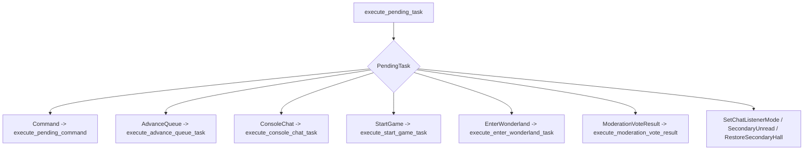
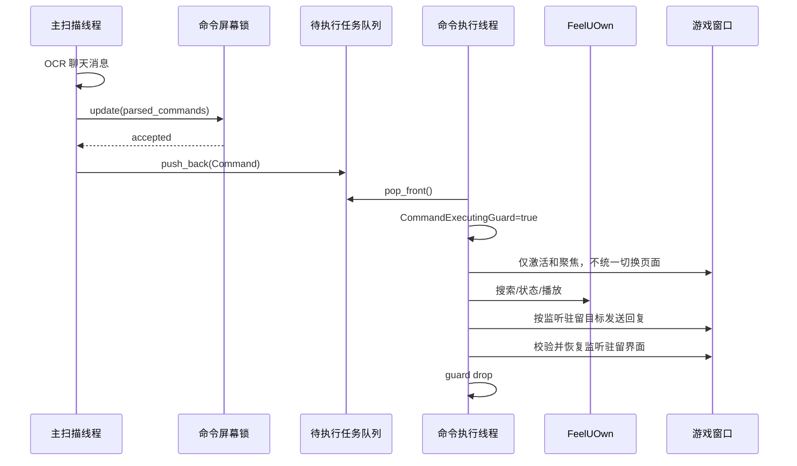
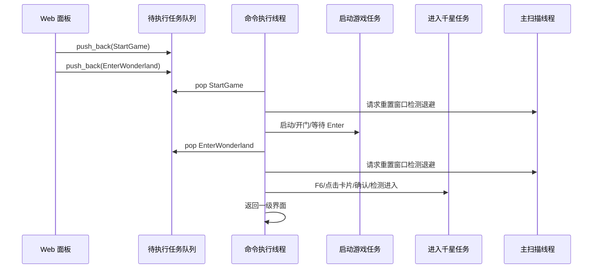

# 主执行器梳理

本文专门梳理 `AutomationApp` 和待执行任务队列。它回答一个核心问题：这个程序里谁可以操作游戏窗口，什么时候操作，怎样避免多个业务流程互相打架。

## 核心结论

`PendingTask` 是普通高层业务流程进入游戏窗口操作层的统一入口。主扫描线程、Web 面板、播放监控线程和后台投票线程都可以提交任务，但只有命令执行线程会消费这些任务并真正操作游戏窗口。

成语接龙是刻意保留的低优先级例外：聊天扫描线程直接更新接龙状态，只把回复文本和当前聊天目标放入独立发送队列，不创建 `PendingTask`，不占用任务追踪、命令活动或已执行命令日志。

```mermaid
flowchart TD
    A["主扫描线程<br/>聊天OCR"] -->|普通 ParsedCommand| P["待执行任务队列<br/>VecDeque<PendingTask>"]
    A -->|@接龙| J["接龙状态 + 延迟回复队列"]
    B["HTTP/Web 面板"] -->|远程任务| P
    C["播放监控线程"] -->|AdvanceQueue| P
    D["管理投票后台线程"] -->|ModerationVoteResult| P
    E["启动配置"] -->|StartGame / EnterWonderland| P
    P --> F["命令执行线程"]
    F --> G["execute_pending_task"]
    G --> H["动作阶段界面协调"]
    H --> I["游戏窗口输入 / FeelUOwn / 队列 / 聊天回复"]
    J --> S["低优先级聊天发送线程"]
    S --> I
```

## PendingTask 是什么

`PendingTask` 是待执行任务队列里的元素，代表“一个还没开始执行的高层业务任务”。它和音乐播放队列不是一个东西。

当前任务类型：

| 任务类型 | 来源 | 语义 |
| --- | --- | --- |
| `Command(Box<PendingCommand>)` | 游戏聊天 OCR、Web 远程播放控制、Web 远程点歌 | 执行业务命令 |
| `AdvanceQueue` | 播放监控线程 | 从音乐播放队列取下一首 |
| `ConsoleChat` | Web 聊天发送框 | 向当前游戏聊天发送文本，前缀由控制面板决定 |
| `StartGame` | 启动配置、Web 面板 | 启动游戏并完成开门 |
| `EnterWonderland` | 启动配置、Web 面板 | 从主界面进入千星 |
| `ModerationVoteResult` | 管理投票后台线程 | 投票结束后执行或拒绝拉黑/屏蔽 |
| `SetChatListenerMode` | 好友私聊、Web 面板 | 切换一级或二级聊天监听。 |
| `SecondaryUnread` | 二级扫描线程 | 点击好友未读红点，按需 OCR 最新私聊，再回当前大厅。 |
| `RestoreSecondaryHall` | 二级扫描线程 | 公开频道出现时恢复当前大厅；失败则回退一级监听。 |

`PendingTask::label()` 用于日志和 Web 监控面板显示。`same_lock_command()` 用于判断新的命令是否已经在待执行任务队列里，避免重复入队。

## 队列本体

队列字段在 `AutomationApp`：

```rust
pending: Arc<(Mutex<VecDeque<PendingTask>>, Condvar)>
```

它有三个重要性质：

1. `VecDeque` 表示先进先出。
2. `Mutex` 允许多个线程安全提交任务。
3. `Condvar` 让命令执行线程在队列为空时睡眠，有新任务时被唤醒。

任务提交有两种方向：

- `push_pending_task()`：追加到队尾，正常排队。
- `push_pending_task_front()`：放回队首，用于“这次没准备好界面，稍后原任务优先重试”。

## 成语接龙延迟回复队列

`DeferredChatQueue` 是一个独立的有界 FIFO（32 条）。`@接龙` 通过屏幕锁或二级大厅气泡去重后立即更新 `IdiomChainGame`，只把 `outcome.reply` 和目标聊天上下文放入这个队列。它不会调用 `pending_contains_command()`、`push_pending_task()`、`record_command_activity()` 或 `log_executed_command()`。

延迟聊天发送线程只在以下条件同时满足时取一条回复：主 `pending` 队列为空、没有命令或屏幕独占 Web 工具正在执行、未暂停，并且队列记录的聊天目标正处于当前监听驻留。它在持有 `pending` 互斥锁时取得一次 `CommandExecutingGuard`，一级目标使用 `ChatOutput::send()`，二级当前大厅目标使用 `ChatOutput::send_current_chat()`。未开始发送的接龙回复永远让位给主命令，也不会占用主命令队列。

若队首回复属于当前未激活的监听目标，发送器会把它移到队尾，让当前目标的后续回复继续发送；队列满时则丢弃这条无法发送的旧回复，而不是阻塞其他回复。

游戏输入无法安全地在一条粘贴/回车序列中被抢占。因此，命令若恰好在发送已开始后到达，会等待这条短发送完成；发送器随后立即释放 guard 并唤醒命令执行线程。

## 谁会提交任务

### 主扫描线程

主扫描线程在 `run_scan_loop()` 里截图、检测 UI、扫描聊天。普通命令会在 `handle_scan_messages()` 或二级大厅提交路径里进入待执行任务队列；成语接龙是例外，会直接更新纯内存游戏状态并进入延迟回复队列。

入队前有几层过滤：

1. 空 OCR 结果不处理。
2. `command::parse_text()` 或 `custom_workflow::parse_text()` 必须能解析成命令。
3. 命令识别被禁用时，非粉色私聊命令跳过。
4. 已执行过的邀请序号跳过。
5. 同一轮 OCR 里重复识别的同语义命令合并。
6. `CommandLockState` 检查该命令是否仍停留在屏幕中。
7. 程序刚启动时，第一批可见命令只用于初始化屏幕锁，不执行。
8. 如果同语义命令已经在待执行任务队列中，跳过。

普通命令通过后才变成 `PendingTask::Command`。接龙则在第 7 步之后被分流，不参与第 8 步或主命令队列。

### HTTP/Web 面板

Web 面板有两类行为：

- 控制台命令：例如 `/play`、`/pause`、`/skip-next`、`/volume`、`/searchPlay`、`/ai/search`，会构造 `ParsedCommand { message_type: "控制台" }`，再入队为 `PendingTask::Command`。
- 直接任务：例如 `/chat/send`、`/startup/game`、`/startup/enter-wonderland`、`/chat-listener/mode`，直接入队为对应 `PendingTask`。

`/startup/wonderland` 不是一个单独大任务，而是顺序入队两个任务：

1. `PendingTask::StartGame`
2. `PendingTask::EnterWonderland`

Web 面板提交任务后只返回入队位置，不等待实际执行完成。

### 播放监控线程

播放监控线程不直接播放队列歌曲。它只在以下条件满足时提交 `PendingTask::AdvanceQueue`：

- FeelUOwn 当前停止，而音乐播放队列非空，且没有其他业务任务正在执行。
- 当前歌曲暂停且剩余时间接近结束，音乐播放队列非空，且没有其他业务任务正在执行。
- 当前歌曲正在播放且接近结束，并且有待执行播放相关工作；此时它可能先暂停播放器，再在空闲时提交自动出队任务。

这保证了自动出队也走同一套聊天反馈、驻留恢复和串行保护。播放器与队列操作本身不再为了回复而先切到一级界面。

### 管理投票后台线程

拉黑/屏蔽请求先发起投票。等待投票本身可以在后台线程里做，因为它只观察聊天确认，不直接操作复杂 UI。投票结束后，后台线程把 `PendingTask::ModerationVoteResult` 放回主队列，由命令执行线程串行执行最终 UI 操作。

### 启动配置

程序启动后，如果 `startup.enabled` 打开，会按配置把启动任务入队：

- `launch_game || enter_game` 为真时入队 `StartGame`。
- `enter_wonderland` 为真时入队 `EnterWonderland`。

所以自动启动和手动 Web 启动走同一条执行通道。

## 命令执行线程

命令执行线程入口是 `run_pending_command_loop()`。

循环逻辑：

1. 如果程序暂停，短暂 sleep。
2. 调用 `wait_for_pending_task()` 等待任务。
3. 拿到任务后创建 `CommandExecutingGuard`，把 `command_executing=true`。
4. 如果拿到任务后发现程序暂停，把任务放回队首。
5. 调用 `execute_pending_task()`。
6. 成功且返回 `Ok(true)` 时，按 `post_settle_ms` 等待界面沉降。
7. 任务失败只记录错误；队列继续处理后续任务。

`CommandExecutingGuard` 的作用是告诉其他线程“当前有业务命令正在执行”。它用 RAII 在任务结束时自动恢复 `command_executing=false` 并唤醒等待者。低优先级接龙发送器也会短暂取得同一个 guard，以确保不会和命令并发操作游戏输入。

如果任务是点歌命令，还会创建 `SongCommandExecutingGuard`，把 `song_command_executing=true`。播放监控线程用这个标志避免在点歌过程中误触发自动出队。

## 任务分发

`execute_pending_task()` 按任务类型分发：



不同任务虽然执行内容不同，但不会统一先切到一级界面。命令入口只负责激活和聚焦一次游戏窗口，具体动作在需要时调用界面协调器。

任务结束时读取此刻有效的监听驻留目标：一级监听恢复一级界面，二级监听恢复“二级当前大厅”。管理投票等待期间会对二级监听施加可嵌套的临时一级阶段，所以其他任务结束后仍保持一级；最后一个投票结果任务释放临时阶段后，才恢复二级当前大厅。

## 动作阶段界面协调

界面协调使用两个明确目标：`Primary` 和 `SecondaryCurrentHall`。目标由当前动作决定，不由命令来源决定。

- 普通命令开始时只保证游戏窗口已激活和聚焦，不改变当前游戏页面。
- `reply()` 根据当前监听驻留目标选择一级发送或二级当前大厅发送。
- 大厅 OCR、麦克风、管理面板等动作在自身开始前要求 `Primary`。
- 好友回复先确保二级聊天已打开；已经在目标好友会话时直接复用。
- 自定义工作流通过 `ensure_primary`、`ensure_current_hall` 或自身模板步骤显式组合前置界面。
- 任务成功和普通业务失败都会恢复当前有效驻留目标。

`prepare_command_ui()` 仍保留为“到达一级界面”的状态转换，只由确实要求一级的动作调用：

1. `ensure_game_ready_for_input()`：激活并聚焦目标游戏窗口。
2. 截图并 `detect_ui_state()`。
3. 如果已是一级界面，返回 `Ok(true)`。
4. 如果不是一级界面，按 ESC 返回上一级。
5. 在 `ui_timeout_ms` 内循环。
6. 超时返回 `Ok(false)`。
7. 目标窗口不可用或截图/检测失败则返回错误。

一级动作调用方处理结果：

- `Ok(true)`：继续执行任务。
- `Ok(false)`：任务放回队首，稍后重试。
- `Err(TargetWindowUnavailable)`：中止当前任务，写明确错误，不再返回一级界面。
- 其他 `Err`：通常保留任务或命令失败后尝试返回一级界面。

## 为什么窗口不可用要特殊处理

窗口被关闭、隐藏、最小化、前台不属于游戏进程、点击点被其他窗口遮挡时，`window.rs` 会生成 `TargetWindowUnavailable`。

这个错误表示继续按 ESC、点击或粘贴都不安全，所以执行器不会再尝试返回一级界面。它直接中止当前业务流程，并让主扫描循环按窗口缺失退避等待窗口恢复。

## 失败和重试

执行器里有两类“重试”：

### 准备阶段重试

确实要求一级的长流程如果暂时没能到达目标页面，可以把尚未产生业务副作用的任务放回队首。

这种重试用于处理临时 UI 过渡：比如某个弹窗正在关闭、加载动画未结束、ESC 后界面还没稳定。

### 业务失败后的收尾

任务已经开始执行，过程中失败：

- 如果目标窗口不可用：跳过返回一级界面。
- 普通任务的其他错误：恢复当前有效监听驻留目标，而不是固定返回一级。
- 自己管理完整界面生命周期的特殊任务：由业务状态机执行专用收尾。

返回一级界面本身用 `return_to_primary_by_escape()`，如果连续失败超过阈值，等待时间会逐步增加，超过 5 次后固定到 2000ms。

## 三个队列/锁不要混淆

### 待执行任务队列

`pending: VecDeque<PendingTask>`。负责业务流程排队。

### 音乐播放队列

`PersistentQueue`。只保存待播放歌曲。它不直接操作游戏；播放监控线程会在合适时机把它转换成 `AdvanceQueue` 任务。

### 命令屏幕锁

`CommandLockState`。它不是任务队列，也不是互斥锁。它只解决“同一条 OCR 可见命令不要重复执行”的问题。

## 控制台最高权限如何落地

Web 远程点歌会构造成 `message_type = "控制台"` 的 `ParsedCommand`，并进入 `PendingTask::Command`。因此它仍然：

- 进入待执行任务队列。
- 参与点歌互斥。
- 走播放保护。
- 走游戏内反馈。

但在候选歌曲审核处，`message_type == "控制台"` 会直接跳过审核。

`/queue/add` 更直接：它作为控制台最高权限接口，直接写音乐播放队列，不进入候选歌曲审核。

## 一个典型游戏内点歌时序



## 一个远程启动并进入千星时序



## 设计上最重要的边界

- 观察线程不直接操作游戏。
- HTTP 线程不直接操作游戏。
- 播放监控线程不直接播放队列歌曲。
- 后台投票线程不直接执行管理 UI 操作。
- 只有命令执行线程消费 `PendingTask` 并执行普通游戏业务。
- 成语接龙状态不属于业务任务；它的独立发送线程只发送已排队回复，并且只在主命令完全空闲时取得游戏输入。

这个边界是当前项目稳定性的核心。后续如果增加新功能，优先判断它应该提交哪种 `PendingTask`，而不是从新线程里直接点击或按键。
