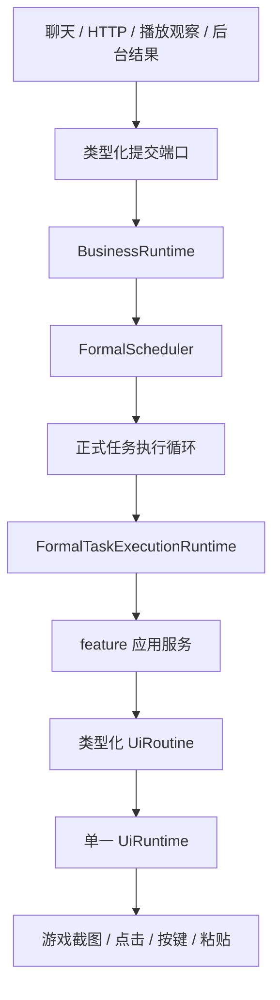
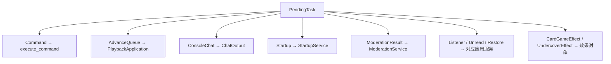
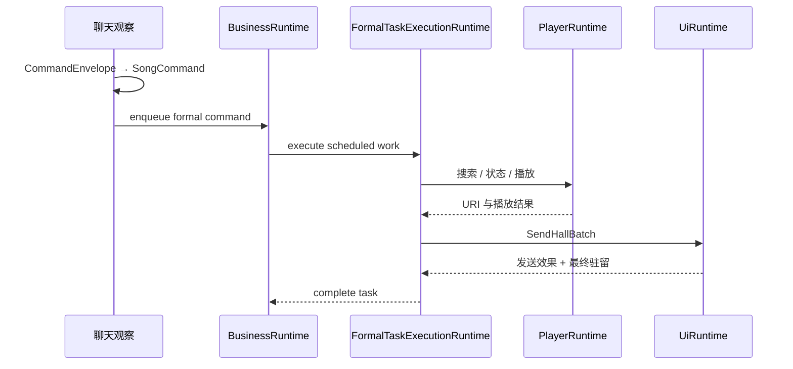

# 正式调度、应用执行与 UI runtime

本文说明业务状态、正式任务和游戏输入怎样分层。核心原则是：多个生产者可以提交意图，但只有单一 UI runtime 可以截图并操作游戏窗口。

## 三个所有者



| 所有者 | 独占状态 | 不负责 |
| --- | --- | --- |
| `BusinessRuntime` | `FormalScheduler`、娱乐状态、播放队列、播放状态、大厅状态、监听状态、延迟发送队列和监控投影。 | 不执行 UI、OCR、HTTP 或播放器 I/O。 |
| `FormalTaskExecutionRuntime` | 一个 `ApplicationRuntime` 实例，顺序调用 feature 应用服务和外部端口。 | 不决定调度顺序，也不能绕过 UI runtime 直接输入。 |
| `UiRuntime` | 唯一 `UiDevice`，顺序执行密封的类型化 `UiRoutine`。 | 不拥有业务状态，不解析聊天命令。 |

OCR 由独立 `OcrRuntime` 串行拥有。模板定位属于 UI 观察，但文字识别请求通过 OCR runtime；它不会获得输入设备。

完整 `ApplicationRuntime` 只复制给能够分发全部纵向模块的正式任务执行器。正式调度、延迟发送、诊断、播放监控、即时管理、成语、海龟汤、大厅检测和管理投票均使用各自的窄工作上下文，不复制无关 UI、播放器或业务能力。

## 正式任务边界

`PendingTask` 是组合层私有的任务载荷。聊天和 HTTP 适配器不能直接依赖这个枚举，只能通过 `FormalTaskClient` 或窄的 `HttpTaskPort` 提交类型化请求。

当前载荷包括：

| `PendingTask` | 来源与语义 |
| --- | --- |
| `Command(PendingCommand)` | 执行已路由的 feature 命令。 |
| `AdvanceQueue` | 播放观察产生的自动出队请求。 |
| `ConsoleChat` | HTTP 控制台发言。 |
| `Startup(StartupTask)` | 启动游戏或进入千星。 |
| `ClearIdleExit` | 清除闲置退出设置。 |
| `ModerationResult` | 管理投票结束后的执行或拒绝。 |
| `SetChatListenerMode` | 切换一级/二级监听。 |
| `SecondaryUnread` | 处理一个二级好友未读事务。 |
| `RestoreSecondaryHall` | 恢复二级当前大厅。 |
| `CardGameEffect` | 牌局定时或状态变化产生的正式发送效果。 |
| `UndercoverEffect` | 谁是卧底状态变化产生的正式发送效果。 |

每个任务被包装成 `FormalTaskSubmission`，包含标签、可选去重键、是否与播放相关以及可取消的工作对象。HTTP 只获得任务编号和调度投影，不获得内部任务对象。

## 调度和执行

正式任务的完整路径是：

1. 生产者调用类型化提交方法。
2. `BusinessRuntime` 在线程内让 `FormalScheduler` 分配任务编号、检查去重并排队。
3. 正式任务循环调用 `take_next_formal_task()` 取得调度 lease。
4. lease 的 `FormalTaskWork::execute()` 把私有载荷交给 `FormalTaskExecutionRuntime`。
5. 该 runtime 的单一 `ApplicationRuntime` 调用对应 feature 应用服务。
6. 任务返回后，正式任务循环向 `BusinessRuntime` 报告成功或失败。
7. 调度器释放活动车道并更新任务历史和 HTTP 监控投影。

暂停发生在取得任务前时，lease 会通过 `restore_formal_task()` 恢复，保持原顺序。任务开始后不会把已经产生外部副作用的工作重新排队。

## 命令入口

游戏聊天路径是：

```text
OCR 观察
→ CommandEnvelope
→ ChatCommandRouter 选择模块
→ feature 自有 parse_chat
→ RoutedCommand / ModuleCommand
→ PendingCommand
→ FormalTaskClient::enqueue_command
```

命令屏幕锁、启动基线和正式任务去重发生在入队前。它们防止同一条可见 OCR 消息重复排队，但不承担业务互斥。

部分娱乐输入允许立即更新 `BusinessRuntime` 内的状态；它们不能直接发送游戏输入。需要发送的结果会成为延迟聊天项、`CardGameEffect` 或 `UndercoverEffect`，再取得调度和 UI 顺位。

HTTP 不伪造聊天文本：

- 播放和点歌路由构造 `ConsoleCommandIntent`，其中包装具体 `ModuleCommand`。
- 启动、控制台发言、监听模式和清除闲置退出调用各自的类型化端口。
- `/startup/wonderland` 依次提交“启动游戏”和“进入千星”两个 `StartupTask`。
- `/queue/add` 等纯业务状态修改通过 `BusinessMutationIntent` 交给业务 runtime，不经过 UI。

## 应用分发

`ApplicationRuntime::execute_pending_task()` 只做顶层载荷分发：



`execute_command()` 再按小型 `ModuleCommand` 顶层枚举选择 feature 应用服务。中央分发器不解析参数，也不实现模块规则。

## UI 事务

应用服务不能持有输入设备。它只能向具体门面提交密封的请求，例如：

- `SendHallBatch`
- `SendFriendDeliveries`
- `ExecuteInvite`
- `ExecuteModeration`
- `ExecuteStartup`
- `EstablishResidency`
- `CustomActionPlan`

`UiRuntimeHandle::submit()` 返回带类型的 `UiOperation<Output>`。调用方等待明确结果，而不是用“函数正常返回”推断点击成功。

一项 UI 事务开始后不会被另一项事务插入。这保证粘贴与回车、好友定位与验证、邀请导航、管理确认和批量发送等不可分割序列不会交错。

## 监听驻留

监听驻留只有两个业务目标：

- `Primary`
- `SecondaryCurrentHall`

二级监听遇到管理投票等需要一级观察的阶段时，可以建立可嵌套的临时一级租约。实际驻留目标由“监听模式 + 临时一级状态”计算，不由命令来源决定。

类型化 UI 事务通常同时返回：

- 业务效果是否发生；
- 最终驻留是否确认。

这两个结果必须分开处理。例如邀请已经进入大厅、管理动作已经应用或聊天内容已经全部发送后，即使驻留恢复失败，也不能重放外部动作。

## 延迟聊天队列

`DeferredChatQueue` 独立于正式任务载荷，但仍由 `BusinessRuntime` 和调度车道控制：

- 普通短回复按低优先级 FIFO 排队。
- 海龟汤汤面、重发和结算使用带会话身份与发送进度的批次。
- 发送线程只有取得 `SchedulerLaneLease` 后才能提交 `SendHallBatch`。
- 已开始的批量 UI 事务不可中断。
- 部分发送失败时只从首条确认未发送的消息继续；全部内容已发出但收尾失败时不重发。

因此“延迟”只表示调度优先级较低，不表示它可以绕过 UI runtime。

## 播放观察

播放观察只读取播放器状态并决定是否提交 `AdvanceQueue`。它不能直接消费持久播放队列，也不能为了发送反馈操作游戏窗口。实际出队、播放确认、URI 校验、状态落盘和聊天反馈均在对应应用服务中完成。

## 管理投票

管理投票工作线程可以取得聊天观察独占权并等待稳定粉字投票，但不能操作 UI。它结束后提交 `ModerationResultTask`；正式任务再调用 `ExecuteModeration`。流程租约和临时一级租约负责防重复与最终释放。

## 启动流程

配置和 HTTP 使用相同的 `StartupTask`：

- `StartupTask::start_game` 由 `StartupService` 调用启动 UI 事务，完成证据是稳定的派蒙菜单模板。
- `StartupTask::enter_wonderland` 调用进入千星 UI 事务，必须同时确认进入效果和一级驻留。

启动任务不通过旧的字符串命令入口，也不与其他启动步骤合并成不可观察的大任务。

## 失败、重试和取消

### 输入确定性

UI 失败使用明确确定性：

- `BeforeInput`：尚未发生外部输入，可以安全报告未执行。
- `ConfirmedFailure`：已确认目标效果没有发生，可按业务策略重试。
- `AfterInputUnknown`：输入已经发生但效果未知，禁止自动重放。

自动重试由业务配置和结果确定性共同决定，不能只因为函数返回错误就重试。

### 正式任务取消

排队中的任务可以按任务编号取消。取消钩子必须释放监听模式请求、未读任务占用、管理流程租约或娱乐效果租约。已经开始执行的外部动作不通过 HTTP 强行中断。

### 窗口不可用

目标窗口关闭、隐藏、最小化或输入归属不安全时，UI 事务返回明确失败。上层不会盲目发送 `Esc` 或点击，也不会把结果未知的任务重新排队。

## 三类状态不要混淆

| 状态 | 用途 |
| --- | --- |
| `FormalScheduler` | 正式任务排序、活动车道、去重、取消和历史。 |
| `PlaybackQueue` | 持久保存待播放歌曲。 |
| `CommandLockState` | 防止仍在 OCR 画面中的同一命令重复入队。 |

它们不共享所有权，也不能互相替代。

## 典型点歌时序



## 不变量

- 观察线程、HTTP 线程、播放器观察线程和投票线程都不能直接操作游戏。
- `BusinessRuntime` 是业务状态唯一所有者，但不执行外部 I/O。
- `FormalTaskExecutionRuntime` 是应用服务顺序执行边界。
- `UiRuntime` 是游戏输入唯一所有者。
- 长等待可以在不持有 UI 事务时让出调度；已经开始的批量发送或其他不可分事务不能被插入。
- 新功能应先定义 feature 意图和窄端口，再决定它使用正式任务、延迟发送还是纯业务状态变更；不得从新线程直接点击或按键。
