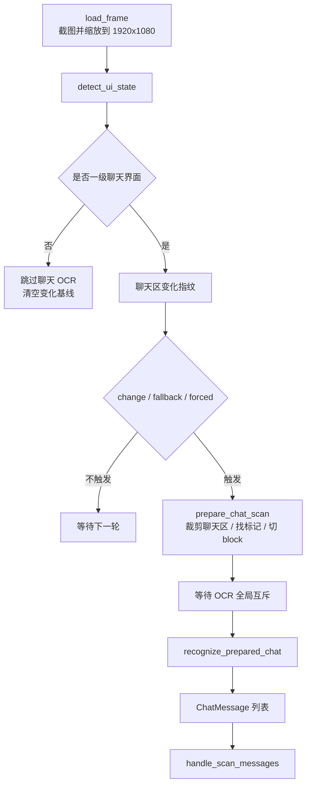

# OCR、聊天扫描与 UI 检测管线

本文从性能和图像处理角度梳理主扫描循环：一帧截图怎样经过 UI 状态检测、聊天区变化检测、聊天标记切块、OCR 识别，最终变成聊天消息。

如果想看“聊天消息怎样变成命令并入队”，见 `docs/chat-command-ingestion.md`。本文只讲截图到 `ChatMessage` 的前半段。

## 核心结论

主循环每轮都会截图和检测 UI，但只有一级聊天界面才会进入聊天 OCR。聊天 OCR 不是每帧都跑，而是由聊天区变化指纹和兜底扫描共同触发。

OCR 全局互斥只保护真正调用 OCR 引擎的阶段。裁剪、聊天标记匹配和消息块计算都在拿 OCR 锁之前完成，所以“等待 OCR 锁”不会把整条截图/模板检测管线都串行化。



## 相关文件

| 文件 | 职责 |
| --- | --- |
| `src/main.rs` | 主扫描循环、OCR 引擎共享锁、触发策略、耗时日志。 |
| `src/app/frame_source.rs` | 截图来源、尺寸缩放、截图加载耗时。 |
| `src/app/ui_state.rs` | 一级/二级/未知界面检测。 |
| `src/app/change_detection.rs` | 聊天区变化指纹和像素差统计。 |
| `src/app/chat_scan.rs` | 聊天标记匹配、消息块切分、OCR 调用和扫描结果日志。 |
| `src/app/ocr.rs` | OCR 引擎初始化、后端选择、文本识别、行合并。 |
| `src/app/ocr_batch.rs` | 实验性批量拼接 OCR。 |
| `src/app/template_match.rs` | 彩色/灰度 SAD 模板匹配和模板缓存。 |

## 截图加载

`load_frame()` 支持两种输入：

- 调试命令传入图片路径。
- 常驻模式从游戏窗口截图。

常驻模式截图时会先拿 `WINDOW_CAPTURE_LOCK`，避免多个线程同时截图目标窗口。截图后如果尺寸不是 `screen.expected_width x screen.expected_height`，会按配置缩放到统一画布。当前默认是 `1920x1080`。

每次截图都会写性能日志：

```text
截图加载耗时: ... source=... output=... resize=...
```

坐标体系始终按配置画布理解。也就是说，后续模板区域、聊天区域和 OCR 区域都基于缩放后的 `1920x1080` 图。

## UI 状态检测

`detect_ui_state()` 按短路顺序检测：

1. 在 `screen.enter_rect` 里找 Enter 模板。
2. 在 `screen.secondary_hall_rect` 里找二级大厅/面板模板。
3. 在 `screen.chat_rect` 里数蓝/黄/粉聊天标记。

返回三类状态：

- `primary:enter`：左下角 Enter 模板可见，认为在一级聊天界面。
- `primary:marker`：聊天标记可见，也认为在一级聊天界面。
- `secondary:hall`：二级大厅/面板模板可见。
- `unknown`：以上都没有命中。

检测顺序有性能含义：

- Enter 和二级大厅都走小区域灰度 best hit。
- 只有前两者都没命中时，才在聊天区找彩色标记。
- 彩色标记只搜索聊天区左侧窄条，不扫整块聊天区。

每轮都会写：

```text
UI 状态检测耗时: total=... enter=... hall=... marker=... state=...
```

这个日志是定位 UI 检测瓶颈的主入口。

## 模板匹配

`template_match.rs` 里有两类匹配：

### 灰度 best hit

`best_template_hit()` 用于 Enter、二级大厅等小区域“是否出现”的检测。

特点：

- 模板转灰度后缓存到 `GRAY_TEMPLATE_CACHE`。
- haystack 每次从当前截图裁剪并转灰度。
- CPU SAD 滑窗，记录最小 SAD。
- 使用 early exit：当前 SAD 超过已知最佳值就提前结束。
- 分数按 `1.0 - sad / (width * height * 255)` 归一化。

它避免了每帧初始化重型模板匹配器，适合小区域高频 UI 检测。

### 彩色多命中

`find_color_template_hits()` 用于聊天标记这类颜色信息很关键的小模板。

特点：

- RGB 模板缓存到 `RGB_TEMPLATE_CACHE`。
- CPU RGB SAD 滑窗。
- 根据阈值计算 `max_allowed_sad` 并 early exit。
- 返回所有超过阈值的命中，再按位置去重。

聊天标记依赖蓝/黄/粉颜色区分，所以这里不用灰度匹配。

## 聊天区变化指纹

`change_detection.rs` 用很小的灰度缩略图判断聊天区有没有变化：

1. 裁剪 `screen.chat_rect`。
2. 缩放到 `104x36`。
3. 转灰度并保存为 `ChangeFingerprint`。
4. 和上一份指纹比较。

比较结果有两个指标：

- `mean_abs_diff`：平均像素差。
- `changed_ratio`：像素差大于等于 12 的像素比例。

超过任一阈值就认为聊天区变化：

- `ocr.change_mean_threshold`
- `ocr.change_pixel_threshold`

主循环不会每帧滚动更新基线。这样做是为了避免慢速聊天动画不断刷新“上一帧”，导致变化还没超过阈值就被吃掉。

## 聊天扫描触发

一级界面下有四类扫描触发：

| reason | 来源 | 行为 |
| --- | --- | --- |
| `enter-primary` | 刚进入一级界面 | 建立变化基线后，延迟 `chat_scan.change_debounce_ms` 扫一次。 |
| `change` | 聊天区变化超过阈值且冷却结束 | 等待 debounce 后重新截图，再 OCR。 |
| `delayed-change` | 变化发生在冷却期或抑制期内 | 安排到可扫描时间点再强制扫。 |
| `poll` | 长时间没有变化 | 按 `chat_scan.fallback_ms` 兜底 OCR。 |

变化触发会重新截图。原因是检测到变化后要等待 `change_debounce_ms`，让聊天动画和文本稳定，再用新的截图做 OCR。

命令执行或大厅到期提醒会设置 `suppress_change_until`，短时间抑制变化触发，避免机器人自己的回复立刻引发无意义复扫。

## OCR 切块

`prepare_chat_scan()` 是 OCR 前的切块阶段，不需要 OCR 引擎：

1. 裁剪聊天区。
2. 在聊天区左侧 `60px` 内找蓝/黄/粉标记。
3. 按得分和位置去重。
4. 每个标记生成一个消息块。

消息块的边界来自：

- 顶部：标记 y 减 `block_top_padding`。
- 底部：下一条标记 y 减 `block_bottom_padding`，但不超过 `max_block_height`。
- 左侧：标记右侧加 `text_left_gap`。
- 右侧：聊天区宽度减 `right_padding`。

这一步的目标是只把真正的文本区域送进 OCR，避免整块聊天区 OCR 带来额外耗时和噪声。

## OCR 识别

`recognize_prepared_chat()` 负责调用 OCR：

- `batch_recognize=false`：逐个消息块裁剪并调用 `merged_ocr_text()`。
- `batch_recognize=true`：把多个消息块用灰色间隔拼成一张图，OCR 一次后按 y 偏移拆回各块。

当前默认关闭 batch。代码保留它是为了实验，但在实际项目经验里，批量拼接不一定更快，尤其在 CPU 后端下可能因为更大的检测图和拆分成本变慢。

识别结果会写三处：

- `chat_scan_result` 日志：完整扫描结果。
- `timing` 日志：crop、marker、block、ocr、total 阶段耗时。
- `MonitorShared.ocr`：TUI/Web 的 OCR 内容区域。

## OCR 引擎和全局互斥

OCR 引擎在 `AutomationApp` 中以 `Arc<Mutex<OcrEngineState>>` 共享。`scan_chat_with_shared_ocr()` 的顺序是：

1. `prepare_chat_scan()`。
2. 获取 OCR mutex。
3. `recognize_prepared_chat()`。

因此 OCR 全局互斥只串行化 OCR 识别和引擎状态访问，不串行化截图、UI 检测、聊天标记匹配、消息块计算。

如果等待锁有耗时，会写：

```text
OCR 锁等待耗时: ...ms
```

OCR 引擎运行超过 1 小时会尝试重建。重建成功或失败都会写常规日志，重建耗时写入性能日志。重建失败时继续使用旧引擎，并在 5 分钟后重试。

## OCR 后端选择

`make_ocr_engine()` 根据 `ocr.backend_priority` 逐个尝试后端。支持配置值：

- `cuda`
- `vulkan`
- `opencl`
- `cpu`

无论配置里有没有 CPU，解析后都会追加 CPU 兜底。未知后端会写 warning 并忽略。

每个后端初始化成功会写：

```text
OCR 后端已启用: ...
```

初始化失败会写：

```text
OCR 后端初始化失败，尝试下一个: ...
```

项目默认只使用 CPU。结合当前实测结论，CPU 后端是最稳定的默认路径；OpenCL/Vulkan 在这个场景下不一定更快，CUDA 还受本地 MNN 构建兼容性影响。

## OCR 文本合并

`recognize_lines()` 调用 OCR 后会：

1. 过滤空文本。
2. 按 top-left 排序。
3. 写单次 OCR 识别耗时。

`merge_ocr_lines()` 再把 OCR 行合并成单条消息：

- y 坐标差小于等于 `same_line_y_tolerance` 的框归为同一行。
- 同一行内按 x 排序。
- 中文字符之间的空格会被压掉。
- 闭合标点前、开口标点后的多余空格会被压掉。

这个合并逻辑服务聊天命令识别，优先保留可读文本，而不是保留 OCR 原始框结构。

## 性能日志阅读顺序

定位扫描慢时建议按这个顺序看 timing 日志：

1. `主循环阶段耗时`：先判断慢在 frame、ui 还是 primary。
2. `截图加载耗时`：如果 frame 高，检查窗口截图、缩放和窗口可用性。
3. `UI 状态检测耗时`：如果 ui 高，看 enter、hall、marker 哪段高。
4. `触发聊天扫描`：确认是 change、poll 还是 forced。
5. `聊天扫描耗时`：看 prepare 和 ocr 的比例。
6. `OCR 锁等待耗时`：判断是否有其他流程正在占用 OCR。
7. `OCR 识别耗时`：判断单块 OCR 或 batch OCR 的实际代价。
8. `变化扫描阶段耗时`：变化触发时额外看重新截图成本。

粗略解释：

- `frame` 高：窗口截图或缩放成本。
- `ui` 高：模板匹配区域或模板算法成本。
- `primary` 高且 `scanned=false`：变化指纹或主循环逻辑成本。
- `primary` 高且 `scanned=true`：聊天扫描/OCR 成本。
- `ocr_lock` 高：OCR mutex 被其他流程占用。
- `ocr` 高：真正 OCR 推理耗时。

## 关键边界

- UI 检测不是 OCR；它用模板和聊天标记判断当前界面。
- 聊天区变化检测不是 OCR；它只看低分辨率灰度指纹。
- OCR 切块不需要 OCR 锁；真正识别才需要。
- `batch_recognize` 是性能实验开关，不是准确性优化开关。
- `chat_scan_result` 不进入 TUI/Web 事件日志栏，因为 OCR 内容有独立展示区。
- 远程控制台命令不经过这条 OCR 管线。
