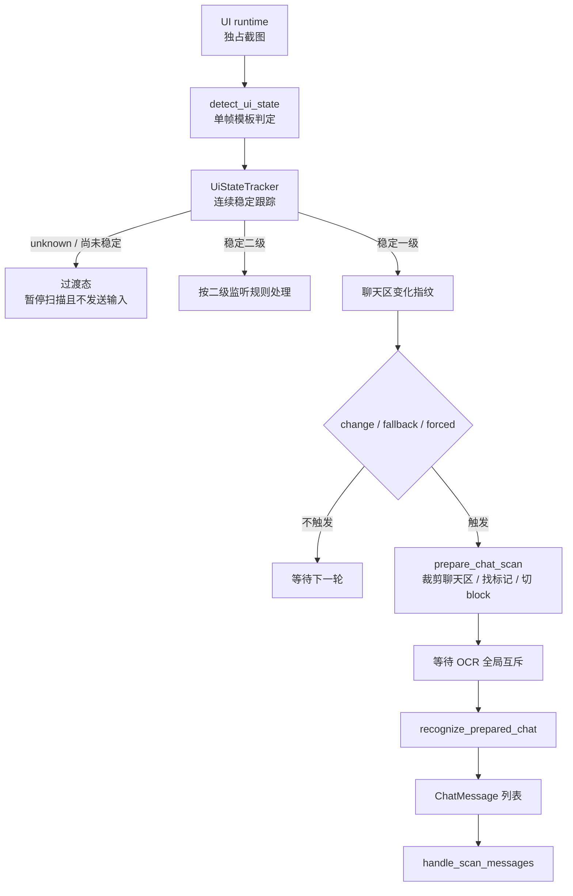

# OCR、聊天扫描与 UI 检测管线

本文从性能和图像处理角度梳理主扫描循环：一帧截图怎样经过 UI 状态检测、聊天区变化检测、聊天标记切块、OCR 识别，最终变成聊天消息。

如果想看“聊天消息怎样变成命令并入队”，见 `docs/chat-command-ingestion.md`。本文只讲截图到 `ChatMessage` 的前半段。

## 核心结论

UI 运行时对每一张截图只做一次模板状态判定，并把结果交给同一个连续稳定跟踪器。空闲聊天观察、UI 例程内部确认和诊断截图都共享这条状态管线；只有连续稳定的一级界面才会进入聊天 OCR。聊天 OCR 不是每帧都跑，而是由聊天区变化指纹和兜底扫描共同触发。

OCR 运行时只在真正调用引擎的阶段占用自己的工作线程。裁剪、聊天标记匹配和消息块计算在提交 OCR 请求之前完成，因此 OCR 排队不会把整条截图/模板检测管线都串行化。

二级当前大厅不使用一级聊天标记切块。它先识别他人深色气泡和圆形头像锚点，再按头像的纵向区间分组；发送者 OCR 固定裁剪头像右上方 `394x36` 区域，其中最大文字宽度按 `18` 个全角字符计算，左右各保留 `8px`。正文 OCR 后先做无副作用命令路由，只有会改变玩家状态、权限、回合归属或好友投递目标的命令以及海龟汤问题才提交发送者 OCR；纯查询、播放器控制和无法路由的聊天不会识别昵称。发送者结果优先取最右侧完整括号对中的内容；身份相关输入识别为空时保留观察基线等待下一轮。



## 相关文件

| 文件 | 职责 |
| --- | --- |
| `src/composition/application/listener.rs` | 主扫描循环、聊天变化触发策略和耗时日志。 |
| `src/ui/frame.rs` | 截图来源、尺寸缩放、截图加载耗时。 |
| `src/ui/state.rs` | 无状态的一级/二级/未知单帧模板判定和诊断证据构造。 |
| `src/runtime/ui.rs` | 独占截图、公共状态稳定跟踪和观察帧发布。 |
| `src/ui/change_detection.rs` | 聊天区变化指纹和像素差统计。 |
| `src/observation/chat/scan.rs` | 聊天标记匹配、消息块切分、OCR 调用和扫描结果日志。 |
| `src/runtime/ocr.rs` | OCR 运行时句柄、引擎初始化、后端选择、文本识别和行合并。 |
| `src/runtime/ocr/batch.rs` | 实验性批量拼接 OCR。 |
| `src/ui/template.rs` | 彩色/灰度 SAD 模板匹配和模板缓存。 |

## 截图加载

常驻模式由 UI 运行时独占游戏窗口截图；调试路径也通过同一个运行时提交截图原子操作。收到画面后，如果尺寸不是配置画布尺寸，会先统一缩放。

从文件加载的离线图片仍可单独用于视觉算法测试，但不会进入常驻聊天观察流。

每次截图都会写性能日志：

```text
截图加载耗时: ... source=... output=... resize=...
```

坐标体系始终按配置画布理解。也就是说，后续模板区域、聊天区域和 OCR 区域都基于缩放后的 `1920x1080` 图。

## UI 状态检测

`TemplateUiStateClassifier::classify()` 对规范化后的截图调用 `detect_ui_state_with_evidence()`，按短路顺序检测：

1. 在 `screen.friend_rect` 里找好友按钮模板。
2. 在 `screen.secondary_back_rect` 里找左上角返回按钮模板。
3. 在 `screen.chat_rect` 里数蓝/黄/粉聊天标记。

返回三类状态：

- `primary:friend`：左下角好友按钮模板可见，认为在一级聊天界面。
- `primary:marker blue=… yellow=… pink=…`：聊天标记可见，也认为在一级聊天界面。
- `secondary:chat`：固定的左上返回按钮可见，认为在二级聊天界面；好友列表滚动不影响它。
- `unknown`（日志诊断中显示为 `transition:unknown`）：本帧没有可靠锚点，只表示动画或尚未确认的中间态。

单帧结果不能直接授权按键。UI 运行时要求同一个具体状态标签连续达到稳定次数；`stability.ui_state_count` 大于 1 时覆盖，否则继承 `stability.default_count`。不同一级标签之间不会共用计数，同一帧也不能被重复累计。`unknown` 会清空当前候选进度，但只用于等待和诊断，不会触发 Enter、Esc、模式回退，也不会把上一稳定状态冒充为当前状态。过渡持续超过具体例程的超时后才返回失败。

检测顺序有性能含义：

- 好友按钮和返回按钮都走小区域灰度 best hit。
- 只有前两者都没命中时，才在聊天区找彩色标记。
- 彩色标记只搜索聊天区左侧窄条，不扫整块聊天区。

每轮都会写：

```text
UI 状态检测耗时: total=... friend=... back=... marker=... state=...
```

这个日志是定位 UI 检测瓶颈的主入口。

最新状态诊断还保留每个模板的路径、搜索区域、最佳分数、阈值、命中区域和判定结果，以及聊天标记计数与最终命中规则。超时错误和 Web UI 状态诊断直接输出这份证据，因此可以区分“模板低于阈值”“区域不可比较”和“处于动画中间态”。

## 模板匹配

`src/ui/template.rs` 里有两类匹配：

### 灰度 best hit

`best_template_candidate()` 用于好友按钮、二级返回按钮等小区域“是否出现”的检测；测试和部分诊断路径使用 `best_template_hit()` 做阈值过滤。

特点：

- 模板转灰度后缓存到 `GRAY_TEMPLATE_CACHE`。
- haystack 每次从当前截图裁剪并转灰度。
- CPU SAD 滑窗，记录最小 SAD。
- 使用 early exit：当前 SAD 超过已知最佳值就提前结束。
- 分数按 `1.0 - sad / (width * height * 255)` 归一化。

它避免了每帧初始化重型模板匹配器，适合小区域高频 UI 检测。

### 彩色多命中

`find_color_template_hits()` 用于聊天标记这类颜色信息很关键的小模板。

特点：

- RGB 模板缓存到 `RGB_TEMPLATE_CACHE`。
- CPU RGB SAD 滑窗。
- 根据阈值计算 `max_allowed_sad` 并 early exit。
- 返回所有超过阈值的命中，再按位置去重。

聊天标记依赖蓝/黄/粉颜色区分，所以这里不用灰度匹配。

## 聊天区变化指纹

`change_detection.rs` 用很小的灰度缩略图判断聊天区有没有变化：

1. 裁剪 `screen.chat_rect`。
2. 缩放到 `104x36`。
3. 转灰度并保存为 `ChangeFingerprint`。
4. 和上一份指纹比较。

比较结果有两个指标：

- `mean_abs_diff`：平均像素差。
- `changed_ratio`：像素差大于等于 12 的像素比例。

超过任一阈值就认为聊天区变化：

- `ocr.change_mean_threshold`
- `ocr.change_pixel_threshold`

主循环不会每帧滚动更新基线。这样做是为了避免慢速聊天动画不断刷新“上一帧”，导致变化还没超过阈值就被吃掉。

## 聊天扫描触发

一级界面下有四类扫描触发：

| reason | 来源 | 行为 |
| --- | --- | --- |
| `enter-primary` | 刚进入一级界面 | 建立变化基线后，延迟 `chat_scan.change_debounce_ms` 扫一次。 |
| `change` | 聊天区变化超过阈值且冷却结束 | 等待 debounce 后重新截图，再 OCR。 |
| `delayed-change` | 变化发生在冷却期或抑制期内 | 安排到可扫描时间点再强制扫。 |
| `poll` | 长时间没有变化 | 按 `chat_scan.fallback_ms` 兜底 OCR。 |

变化触发会重新截图。原因是检测到变化后要等待 `change_debounce_ms`，让聊天动画和文本稳定，再用新的截图做 OCR。

命令执行或大厅到期提醒会设置 `suppress_change_until`，短时间抑制变化触发，避免机器人自己的回复立刻引发无意义复扫。

## OCR 切块

`prepare_chat_scan()` 是 OCR 前的切块阶段，不需要 OCR 引擎：

1. 裁剪聊天区。
2. 在聊天区左侧 `60px` 内找蓝/黄/粉标记。
3. 按得分和位置去重。
4. 每个标记生成一个消息块。

消息块的边界来自：

- 顶部：标记 y 减 `block_top_padding`。
- 底部：下一条标记 y 减 `block_bottom_padding`，但不超过 `max_block_height`。
- 左侧：标记右侧加 `text_left_gap`。
- 右侧：聊天区宽度减 `right_padding`。

这一步的目标是只把真正的文本区域送进 OCR，避免整块聊天区 OCR 带来额外耗时和噪声。

## OCR 识别

`recognize_prepared_chat()` 负责调用 OCR：

- `batch_recognize=false`：逐个消息块裁剪并调用 `merged_ocr_text()`。
- `batch_recognize=true`：把多个消息块用灰色间隔拼成一张图，OCR 一次后按识别框中心和各 block 的 y 偏移归属并拆回各块；中心落在间隔会被丢弃，归属重叠会返回错误。

当前默认关闭 batch。代码保留它是为了实验，但在实际项目经验里，批量拼接不一定更快，尤其在 CPU 后端下可能因为更大的检测图和拆分成本变慢。

识别结果会写三处：

- `chat_scan_result` 日志：完整扫描结果。
- `timing` 日志：crop、marker、block、ocr、total 阶段耗时。
- `MonitorShared.ocr`：TUI/Web 的 OCR 内容区域。

## OCR 引擎和全局互斥

OCR 引擎由 `OcrRuntime` 单一拥有，组合层只保存 `OcrRuntimeHandle`。`listener.rs` 的 `scan_chat_with_shared_ocr()` 顺序是：

1. `prepare_chat_scan()`。
2. 通过 OCR runtime handle 提交识别请求（引擎 runtime 串行处理队列并记录等待时间）。
3. `recognize_prepared_chat()`，按 `ocr.batch_recognize` 选择逐块或批量识别。

因此 OCR 全局互斥只串行化 OCR 识别和引擎状态访问，不串行化截图、UI 检测、聊天标记匹配、消息块计算。

如果 OCR 请求在运行时队列中等待，会写：

```text
OCR runtime queue wait: ...ms
```

OCR 引擎运行超过 1 小时会尝试重建。重建成功或失败都会写常规日志，重建耗时写入性能日志。重建失败时继续使用旧引擎，并在 5 分钟后重试。

## OCR 后端选择

`make_ocr_engine()` 根据 `ocr.backend_priority` 逐个尝试后端。支持配置值：

- `cuda`
- `vulkan`
- `opencl`
- `openvino`
- `cpu`

包含 MNN 后端（`cuda`、`vulkan`、`opencl` 或 `cpu`）时，如果没有显式配置 `cpu`，解析后会追加 CPU 兜底；只配置 `openvino` 时不会隐式追加 MNN/CPU。未知后端会写 warning 并忽略。

`openvino` 不是 `ocr-rs` 的 MNN 枚举值，而是默认 EXE 内置的独立适配层。选择该后端时，适配层使用 `ocr.openvino.det_model`/`det_weights` 和 `rec_model`/`rec_weights` 读取 OpenVINO IR，并在本模块内完成 PP-OCR 兼容的缩放、NCHW 归一化、DB mask 轮廓/unclip、聊天框裁剪和 CTC 字符集解码；运行时不调用 `ocr-rs` 的预处理、后处理或 `TextBox` 类型。模型可以来自 PaddleOCR，但 Paddle/PaddleOCR 只属于模型导出来源，不是 OpenVINO 运行时依赖。设备名由 `ocr.openvino.device` 提供，默认是 `CPU`。OpenVINO runtime DLL 通过 `runtime-linking` 只在创建该后端时加载；缺少 DLL 会变成该后端初始化失败，并按已配置的优先级继续尝试下一个后端。使用 `--no-default-features --features ocr-openvino` 时连 `ocr-rs`/MNN 代码也不会编译；使用 `--no-default-features --features ocr-mnn` 可排除 OpenVINO 适配层。

OpenVINO-only 配置不要求 `ocr.det_model`/`ocr.rec_model`，并且 `backend_priority` 只含 `openvino` 时不会自动追加 CPU。若要保留回退，必须显式加入 `cpu` 或其他 MNN 后端，同时提供对应 MNN 模型。

OpenVINO 运行库通过 runtime linking 只在选择 `openvino` 后端并创建适配器时加载，不随仓库中的 MNN DLL 一起提供。运行机必须安装 OpenVINO >= 2025.1，并让 `runtime/bin/intel64/Release` 与 `runtime/3rdparty/tbb/bin` 都能被 `PATH` 找到；`OPENVINO_INSTALL_DIR` 可用于帮助定位主 DLL，但不能代替 TBB DLL 的搜索路径。不同 OpenVINO 发行包的插件发现文件名可能不同，不应把 `plugins.xml` 作为固定文件名依赖。IR 模型应使用动态的 `[1,3,H,W]` 输入；固定输入尺寸会在请求张量形状不匹配时失败。检测输出必须是单 batch/单 channel 且空间尺寸与输入相同的 F32 DB 概率图，否则后端会拒绝该模型。后端初始化时会对检测和识别图各做一次 warm-up，之后仍由单一 `OcrRuntime` worker 串行创建独立推理请求。`ocr.openvino.cache_dir` 默认写入 `data/openvino-cache`，并使用 `CACHE_MODE=OPTIMIZE_SPEED`；核显首次编译仍可能较慢，但后续启动会复用缓存结果。设置为 `null` 可关闭，目录不可写时只记录 warning，不影响后端继续初始化。

每个后端初始化成功会写：

```text
OCR 后端已启用: ...
```

初始化失败会写：

```text
OCR 后端初始化失败，尝试下一个: ...
```

项目配置默认只使用 CPU。结合当前实测结论，CPU 后端是最稳定的默认路径；OpenCL/Vulkan 在这个场景下不一定更快，CUDA 还受本地 MNN 构建兼容性影响。OpenVINO 虽已随默认 EXE 编译，但仍需要单独准备模型和 runtime；只有在实测完成输出一致性与延迟对比后才应放到 CPU 前面。

## OCR 文本合并

`recognize_lines()` 调用 OCR 后会：

1. 过滤空文本。
2. 按 top-left 排序。
3. 写单次 OCR 识别耗时。

`merge_ocr_lines()` 再把 OCR 行合并成单条消息：

- y 坐标差小于等于 `same_line_y_tolerance` 的框归为同一行。
- 同一行内按 x 排序。
- 中文字符之间的空格会被压掉。
- 闭合标点前、开口标点后的多余空格会被压掉。

这个合并逻辑服务聊天命令识别，优先保留可读文本，而不是保留 OCR 原始框结构。

## 性能日志阅读顺序

定位扫描慢时建议按这个顺序看 timing 日志：

1. `主循环阶段耗时`：先判断慢在 frame、ui 还是 primary。
2. `截图加载耗时`：如果 frame 高，检查窗口截图、缩放和窗口可用性。
3. `UI 状态检测耗时`：如果 ui 高，看 enter、hall、marker 哪段高。
4. `触发聊天扫描`：确认是 change、poll 还是 forced。
5. `聊天扫描耗时`：看 prepare 和 ocr 的比例。
6. `OCR runtime queue wait`：判断 OCR 请求是否在等待共享运行时。
7. `OCR 识别耗时`：判断单块 OCR 或 batch OCR 的实际代价。
8. `变化扫描阶段耗时`：变化触发时额外看重新截图成本。

粗略解释：

- `frame` 高：窗口截图或缩放成本。
- `ui` 高：模板匹配区域或模板算法成本。
- `primary` 高且 `scanned=false`：变化指纹或主循环逻辑成本。
- `primary` 高且 `scanned=true`：聊天扫描/OCR 成本。
- OCR runtime queue 高：多个调用方同时提交了识别请求。
- `ocr` 高：真正 OCR 推理耗时。

## 关键边界

- UI 检测不是 OCR；它用模板和聊天标记判断当前界面。
- 聊天区变化检测不是 OCR；它只看低分辨率灰度指纹。
- OCR 切块不需要等待 OCR runtime；只有真正识别才提交 OCR job。
- `batch_recognize` 是性能实验开关，不是准确性优化开关。
- `chat_scan_result` 不进入 TUI/Web 事件日志栏，因为 OCR 内容有独立展示区。
- 远程控制台命令不经过这条 OCR 管线。
