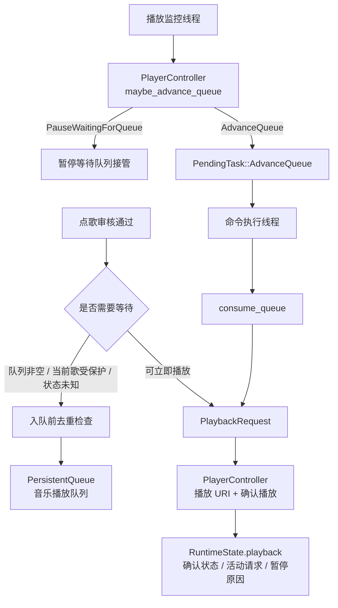

# 播放监控、音乐播放队列与播放器控制器

本文梳理点歌通过审核之后的后半段：什么时候直接播放，什么时候进入音乐播放队列，播放器临近结束时为什么会暂停，以及自动出队怎样回到主业务队列执行。

## 核心结论

音乐播放队列只保存已经确定的歌曲，不保存待执行的游戏操作。真正执行播放、回复游戏聊天、返回一级界面，仍然由命令执行线程完成。

播放器后端状态被当作“不稳定观测”，不会直接作为业务事实。`player_controller` 把播放意图、播放观测、活动播放请求、暂停原因和队列推进决策收敛成一个状态机。主流程只负责候选确认、AI/聊天二次判断、音乐播放队列数据操作和待执行任务编排。

播放监控线程不会直接消费音乐播放队列。它读取播放器状态后调用 `PlayerController::maybe_advance_queue()`，控制器返回结构化决策；只有需要出队时，主流程才提交 `PendingTask::AdvanceQueue`，再由命令执行线程串行处理。临近结束暂停只会因为队列、待执行点歌、播放 URI、播放控制或自动出队这类播放任务触发，不会因为普通控制台发言、启动游戏或管理投票触发。

## 相关文件

| 文件 | 职责 |
| --- | --- |
| `src/app/player_controller.rs` | 播放器后端 trait、播放确认、活动播放请求、暂停原因、队列推进决策和同歌历史写入。 |
| `src/main.rs` | 点歌决策、聊天确认、AI 同曲判断、自动出队任务编排、音乐播放队列消费和游戏内反馈。 |
| `src/app/queue.rs` | 音乐播放队列的持久化、去重、追加、移除、清空。 |
| `src/app/runtime_state.rs` | 运行状态持久化，包括 `playback` 状态和大厅倒计时缓存。 |
| `src/app/feeluown.rs` | FeelUOwn TCP RPC、搜索候选、播放、暂停、状态查询；当前作为播放器后端适配器。 |
| `src/app/playback_format.rs` | 播放状态估算、剩余时间、播放成功文案。 |
| `src/app/song_matcher.rs` | 歌名/歌手匹配、队列去重和当前播放匹配。 |
| `src/app/song_dedup.rs` | 长时间同歌去重历史、同歌判断和播放成功记录。 |

## 三个状态容器

### 待执行任务队列

`PendingTask` 存在于内存里的 `VecDeque`，用于串行执行会影响游戏窗口或业务状态的高层任务。自动出队在这里表现为 `PendingTask::AdvanceQueue`，远程播放 URI 表现为 `PendingTask::PlayerPlayUri`。

它不是音乐播放队列。

### 音乐播放队列

`PersistentQueue` 保存已经确定的歌曲项，落盘为 JSON。每个 `QueueItem` 包含：

- `keyword`：最终候选文本。
- `source`：音源，例如 `qqmusic`、`netease`、`bilibili`，空字符串表示全来源。
- `prefer_accompaniment`：是否伴奏优先。
- `ai_original_text`：AI 点歌的原始意图。
- `uri`：最终候选 URI。
- `friend_username`：好友私聊来源。
- `dedup_bypass`：是否在出队播放时豁免长时间同歌去重，默认由控制台来源写入。

保存时使用临时文件替换。Windows 下用 `MoveFileExW` 搭配 `MOVEFILE_REPLACE_EXISTING | MOVEFILE_WRITE_THROUGH`，减少队列文件半写入的风险。

### 播放器运行状态

`RuntimeState.playback` 是播放器控制器的持久状态：

- `state`：确认播放状态，例如 `idle`、`starting`、`playing_requested`、`paused_by_user`、`paused_waiting_for_queue`、`external_playback`、`unknown`。
- `pauseReason`：暂停原因，区分 `user` 和 `waiting_for_queue`。
- `activeRequest`：本项目已经确认的活动播放请求，保存关键词、来源、请求 URI、确认 URI、歌名歌手和开始时间。
- `lastObservation`：最近一次播放器观测，保存原始状态、URI、歌名歌手、进度、时长、观测时间和可靠性。

大厅倒计时缓存仍在 `RuntimeState` 顶层。旧的点歌播放散字段和两个暂停布尔值已经不再作为业务接口使用。

## 点歌通过审核后的播放决策

`execute_command()` 的点歌分支在 `review_song_candidate()` 通过后才进入播放决策。

第一步是音乐播放队列去重：

- 有 URI 时按 URI 判断重复。
- 没有 URI 时按规范化后的歌名、来源和伴奏标记判断重复。

第二步是长时间同歌去重的入队前检查：

- 如果最终候选近期已经成功播放过，直接拒绝本次点歌并回复 `歌曲名近期已播放过,请稍后再点`。
- 这一步只拒绝确定的近期重复歌曲，不写入历史。
- 控制台来源在 `song_dedup.console_bypass = true` 时仍然豁免。

第三步看音乐播放队列：

- 队列非空时，新请求追加到队尾。
- 队列满时回复 `队列已满，请稍后再试`。

第四步看播放器状态：

- 当前已经在播放同一 URI，或本地匹配认为是同一首，回复 `当前正在播放`。
- 当前歌曲应该受保护时，加入音乐播放队列。
- 播放器状态查询失败时，为了避免误切歌，加入音乐播放队列并回复状态未知。
- 不需要保护时，构造 `PlaybackRequest` 交给播放器控制器立即播放。

当前歌曲保护由 `PlayerController::should_queue_until_current_song_finished()` 判断。配置关闭时可以更积极地直接播放；配置开启时，正在播放或可识别的暂停歌曲会优先保留，新点歌进入音乐播放队列。

## 实际播放确认

直接播放时，主流程先把最终候选转成 `PlaybackRequest`。正常路径要求最终候选有稳定 URI；没有 URI 时会先通过播放器后端搜索候选并补齐 URI。

播放器控制器负责两件事：

1. `play_request_uri()`：写入 `starting` 状态，记录活动请求草稿，并向播放器后端发送播放 URI。
2. `verify_playback_started()`：按配置重试读取播放器观测，直到确认播放成功、确认无音源，或发现候选不匹配。

如果播放 URI 下发失败，或 URI 已下发但后续确认超时、短时长无音源，控制器会恢复下发前的确认播放状态。失败不会把仍在播放的旧活动请求清掉；只有后端接受播放命令并最终确认成功，才提交新的 `playing_requested` 状态。

确认规则：

- 状态必须是 `playing` 或 `paused`。
- 有请求 URI 时优先确认当前 URI。
- URI 缺失或不一致时，普通点歌可用本地歌名歌手匹配兜底。
- 仍不匹配时，控制器返回 `MismatchedCandidate`，由 `main.rs` 调用点歌 AI 或询问聊天确认。
- 进度和时长不能是无效的 `0:00/0:00`。
- 时长过短会视为无音源。

确认成功后，控制器写入 `RuntimeState.playback.activeRequest`，状态变为 `playing_requested`，并写入长时间同歌去重历史。只有这个时刻才算实际播放成功。

## 播放监控线程

`run_playback_monitor_loop()` 按两个节奏工作：

- `monitor_tick_ms`：循环 tick，最低 50ms。
- `monitor_status_ms`：真实查询播放器状态的间隔。

两次真实查询之间，`PlaybackSnapshot` 会用本地时间估算播放进度，避免每个 tick 都请求播放器。

每轮核心判断在 `PlayerController::maybe_advance_queue()`：

1. 如果活动播放请求和播放监控快照不一致，先刷新一次播放器状态。
2. 如果仍处于刚切歌保护窗口，不自动出队。
3. 如果确认当前歌曲已经切到非本项目请求，清理活动请求并标记为外部播放。
4. 如果用户主动暂停，不自动恢复、不自动出队。
5. 如果系统曾为了等待队列暂停，但现在队列和待执行播放都空了，恢复播放。
6. 如果播放器停止且队列非空、没有其他命令执行，提交 `AdvanceQueue`。
7. 如果播放器暂停且队列非空、没有其他命令执行，提交 `AdvanceQueue`。
8. 如果播放器正在播放且接近结束，并且存在队列或待执行播放任务，先暂停等待队列接管。

控制器只返回决策。真正入队 `PendingTask::AdvanceQueue`、更新监控快照和后续消费队列仍由 `main.rs` 执行。

## 临近结束暂停

临近结束暂停是为了防止播放器在当前歌自然结束后自动切到非队列歌曲。

当当前歌剩余时间小于等于 `queue.auto_advance_seconds`，并且存在待播放工作时，控制器会：

- 调用播放器后端暂停。
- 设置 `pauseReason = waiting_for_queue`。
- 设置 `state = paused_waiting_for_queue`。

如果之后队列和待执行播放都空了，控制器只会在暂停原因仍是 `waiting_for_queue` 时恢复播放。用户主动暂停使用 `pauseReason = user`，不会被自动恢复。

## 自动出队任务

自动出队通过 `PendingTask::AdvanceQueue { reason }` 表达。常见 reason：

- `停止`
- `暂停`
- `即将结束`
- `手动下一首`

执行时先走 `prepare_command_ui()`，确保回到一级界面。失败时任务会放回队首，避免在错误 UI 状态下播放和回复。

`consume_queue()` 会循环处理队首：

- 播放成功：移除队首，更新监控快照，结束本次出队。
- 近期已播放过：移除队首，更新监控快照，在大厅回复 `歌曲名近期已播放过,已跳过`，继续尝试下一项。
- 无音源：移除队首，继续尝试下一项。
- 播放错误：保留队首，等待后续重试或人工处理。

如果自动出队成功，且 `queue.protect_auto_played_songs = false`，控制器会清理活动播放请求，让后续新点歌更容易直接替换。手动下一首不走这个清理分支。

## 手动播放控制

`@暂停` / 远程暂停：

- 调用 `PlayerController::pause_by_user()`。
- 播放器后端暂停。
- 状态写成 `paused_by_user`，暂停原因写成 `user`。

`@继续` / `@播放` / 远程继续：

- 调用 `PlayerController::resume_by_user()`。
- 播放器后端恢复。
- 清除暂停原因；如果仍有活动请求，状态回到 `playing_requested`，否则标记为 `external_playback`。

`@下一首` / 远程下一首：

- 音乐播放队列非空时，优先 `consume_queue("手动下一首")`。
- 队列为空时，调用 `PlayerController::next_external()`，并标记为外部播放。

这保证“下一首”会优先执行项目自己的音乐播放队列，而不是让播放器跳到它内部的下一首。

## 关键日志

排查自动出队时重点看：

- `队列推进决策: pause_waiting_for_queue`
- `队列推进决策: resume_waiting_for_queue_idle`
- `队列推进决策: advance reason=...`
- `自动出队(...) 执行前未能回到一级界面，保留任务`
- `消费队列(...): ...`
- `队列项近期已播放过，已跳过`
- `队列项无音源，已丢弃`
- `队列项播放失败，保留在队首`

排查播放确认时重点看：

- `播放器状态转移: Starting keyword=...`
- `播放器观测: raw=... reliability=...`
- `URI 与请求资源不同，继续用歌曲信息确认`
- `歌曲未变化，等待 URI 播放生效`
- `歌曲暂不匹配`
- `AI自动匹配通过`
- `0:00/0:00，等待后重试`
- `歌曲时长过短`
- `播放器状态转移: Starting -> PlayingRequested reason=playback_confirmed`
- `播放成功`

排查当前歌保护时重点看：

- `点歌状态与播放监控快照不一致，已刷新播放状态`
- `点歌刚开始，忽略可能过期的播放状态`
- `点歌刚开始，暂不触发队列自动出队`
- `播放器状态转移: PlayingRequested -> ExternalPlayback reason=track_changed`
