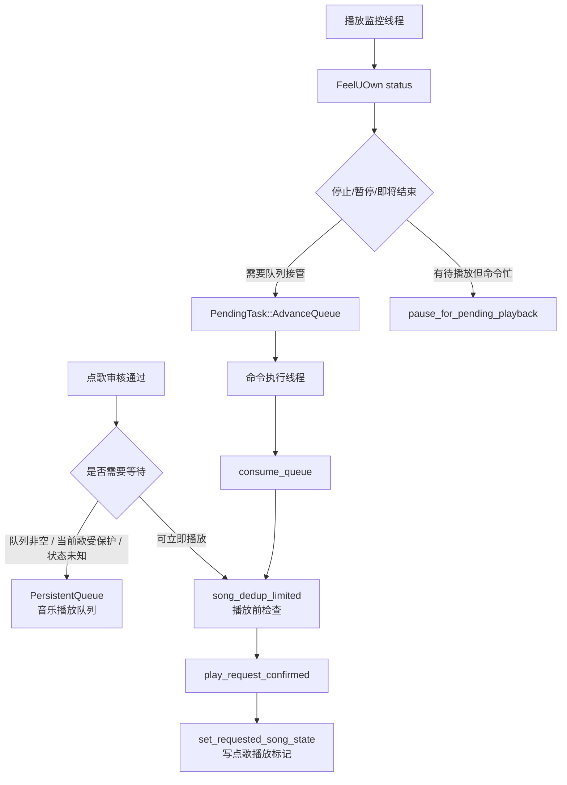

# 播放监控、音乐播放队列与运行状态

本文梳理点歌通过审核之后的后半段：什么时候直接播放，什么时候进入音乐播放队列，播放器临近结束时为什么会暂停，以及自动出队怎样回到主业务队列执行。

## 核心结论

音乐播放队列只保存已经确定的歌曲，不保存待执行的游戏操作。真正执行播放、回复游戏聊天、返回一级界面，仍然由命令执行线程完成。

播放监控线程不会直接消费音乐播放队列。它只观察 FeelUOwn 状态，必要时暂停临近结束的歌曲，然后提交 `PendingTask::AdvanceQueue`。这个任务再由命令执行线程串行执行。

运行状态 `RuntimeState` 是连接两者的保护层：它记录当前播放器里的歌是否来自点歌、用户是否主动暂停、系统是否为了等待队列而暂停。长时间同歌去重历史是另一份持久状态，只在实际播放成功后记录，用于后续播放前拒绝或跳过近期重复歌曲。

## 相关文件

| 文件 | 职责 |
| --- | --- |
| `src/main.rs` | 播放决策、播放监控、自动出队、暂停/恢复命令、点歌播放标记。 |
| `src/app/queue.rs` | 音乐播放队列的持久化、去重、追加、移除、清空。 |
| `src/app/runtime_state.rs` | 运行状态持久化，包括点歌播放标记和暂停标记。 |
| `src/app/feeluown.rs` | FeelUOwn TCP RPC、搜索候选、播放、暂停、状态查询。 |
| `src/app/playback_format.rs` | 播放状态估算、剩余时间、播放成功文案。 |
| `src/app/song_matcher.rs` | 歌名/歌手匹配、队列去重和当前播放匹配。 |
| `src/app/song_dedup.rs` | 长时间同歌去重历史、同歌判断和播放成功记录。 |

## 三个状态容器

### 待执行任务队列

`PendingTask` 存在于内存里的 `VecDeque`，用于串行执行会影响游戏窗口或业务状态的高层任务。自动出队在这里表现为 `PendingTask::AdvanceQueue`。

它不是音乐播放队列。

### 音乐播放队列

`PersistentQueue` 保存已经确定的歌曲项，落盘为 JSON。每个 `QueueItem` 包含：

- `keyword`：最终候选文本。
- `source`：音源，例如 `qqmusic`、`netease`、`bilibili`，空字符串表示全来源。
- `prefer_accompaniment`：是否伴奏优先。
- `ai_original_text`：AI 点歌的原始意图。
- `uri`：最终候选 URI。
- `friend_username`：好友私聊来源。
- `dedup_bypass`：是否在出队播放时豁免长时间同歌去重，默认由控制台来源写入。

保存时使用临时文件替换。Windows 下用 `MoveFileExW` 搭配 `MOVEFILE_REPLACE_EXISTING | MOVEFILE_WRITE_THROUGH`，减少队列文件半写入的风险。

### 运行状态

`RuntimeState` 记录跨轮次需要保留的运行信息：

- `current_song_is_requested`：当前播放器里的歌是否来自点歌。
- `last_requested_uri` / `last_requested_song`：上次点歌播放标识。
- `last_requested_keyword` / `last_requested_source` / `last_requested_prefer_accompaniment`：用于后续匹配和保护。
- `last_requested_updated_at_ms`：刚切歌后的短保护窗口，避免播放监控读到旧状态就自动出队。
- `paused_by_command`：用户或控制台主动暂停。
- `paused_for_pending_playback`：系统为了等待队列或待执行点歌而临近结束暂停。
- 大厅倒计时缓存字段。

## 点歌通过审核后的播放决策

`execute_command()` 的点歌分支在 `review_song_candidate()` 通过后才进入播放决策。

第一步是音乐播放队列去重：

- 有 URI 时按 URI 判断重复。
- 没有 URI 时按规范化后的歌名、来源和伴奏标记判断重复。

这一步只检查当前音乐播放队列里是否已经有同一个候选，不读长时间播放历史，也不会把入队行为写入历史。

第二步看音乐播放队列：

- 队列非空时，新请求追加到队尾。
- 队列满时回复 `队列已满，请稍后再试`。

第三步看播放器状态：

- 正在播放同一 URI，或本地匹配认为是同一首，回复 `当前正在播放`。
- 当前歌曲应该受保护时，加入音乐播放队列。
- 播放器状态查询失败时，为了避免误切歌，加入音乐播放队列并回复状态未知。
- 不需要保护时，先做长时间同歌去重检查，通过后立即执行 `play_request_confirmed()`。

`should_queue_until_current_song_finished()` 是当前歌曲保护的核心判断。只要配置要求保护，并且播放器正在播放、暂停但仍能识别到歌曲，或运行状态表明当前歌仍是点歌歌曲，就倾向于排队。

## 实际播放确认

`play_request_confirmed()` 在调用播放器前会检查长时间同歌去重。它按最终候选歌曲判断近期是否已经播放过：URI 相同一定命中；没有可靠 URI 时，用歌名/歌手相似度兜底；伴奏和原唱默认分开计算。

通过去重检查后，`play_request_confirmed()` 按请求是否有 URI 分两条路：

- 有 URI：`play_uri_confirmed()` 调用 `feeluown.play_uri()`。
- 没 URI：`play_keyword_confirmed_inner()` 调用 `feeluown.play_keyword()`，由 FeelUOwn 搜索并播放。

播放前会先清理旧的点歌播放标记。播放后进入 `confirm_playback_started()`，它会反复查询 FeelUOwn 状态并确认：

1. 状态是 `playing` 或 `paused`。
2. 有请求 URI 时优先确认当前 URI。
3. URI 不一致时，普通点歌会用本地歌曲匹配。
4. 本地匹配失败时，可以用点歌 AI 做同曲判断兜底。
5. 仍不确定时，向游戏聊天发 `匹配失败`，等待用户确认、跳过或换源。
6. 进度和时长不能是无效的 `0:00/0:00`。
7. 时长过短会视为无音源。

确认成功后写入点歌播放标记和长时间同歌去重历史，并回复 `播放: 歌名 - 歌手 (进度/时长) 音量x`。

## 点歌播放标记

`set_requested_song_state()` 在播放确认成功后写入：

- 当前 URI 或请求 URI。
- 当前歌名和歌手拼接值。
- 点歌关键词、来源、伴奏标记。
- 当前时间戳。

它还会清除 `paused_by_command` 和 `paused_for_pending_playback`。

播放监控后续依赖这个标记判断：

- 当前播放是否仍是点歌歌曲。
- 刚切歌后的状态是否可能是旧快照。
- 当前歌曲是否应该继续受保护。

如果监控发现歌曲已经切换，且无法匹配上次点歌标记，会清除点歌播放标记。

## 播放监控线程

`run_playback_monitor_loop()` 按两个节奏工作：

- `monitor_tick_ms`：循环 tick，最低 50ms。
- `monitor_status_ms`：真实查询 FeelUOwn 状态的间隔。

两次真实查询之间，`PlaybackSnapshot` 会用本地时间估算播放进度，避免每个 tick 都请求 FeelUOwn。

每轮核心判断在 `maybe_advance_queue()`：

1. 如果刚写入点歌播放标记，且当前快照不像目标歌曲，先刷新一次状态。
2. 如果仍处于刚切歌保护窗口，不自动出队。
3. 如果用户主动暂停 `paused_by_command = true`，不自动恢复、不自动出队。
4. 如果队列为空、没有待执行任务、没有命令执行中，且存在临近结束暂停，恢复播放。
5. 播放器停止且队列非空、没有其他命令执行时，提交 `AdvanceQueue`。
6. 播放器暂停且接近结束、队列非空、没有其他命令执行时，提交 `AdvanceQueue`。
7. 播放器正在播放且接近结束，如果存在队列、待执行任务或点歌命令执行中，先暂停等待接管。
8. 如果暂停后当前没有其他任务且队列非空，提交 `AdvanceQueue`。

## 临近结束暂停

临近结束暂停是为了防止 FeelUOwn 在当前歌自然结束后自动切到非队列歌曲。

当当前歌剩余时间小于等于 `queue.auto_advance_seconds`，并且存在待播放工作时，播放监控会调用 `pause_for_pending_playback()`：

- 调用 `feeluown.pause()`。
- 设置 `paused_for_pending_playback = true`。
- 清除 `paused_by_command`。

如果之后队列和待执行任务都空了，`resume_pending_playback_pause_if_idle()` 会恢复播放并清除系统暂停标记。

用户主动暂停和系统临近结束暂停是两个不同概念。用户主动暂停会阻止自动出队；系统暂停只是等待队列接管。

## 自动出队任务

自动出队通过 `PendingTask::AdvanceQueue { reason }` 表达。常见 reason：

- `停止`
- `暂停`
- `即将结束`
- `手动下一首`

执行时先走 `prepare_command_ui()`，确保回到一级界面。失败时任务会放回队首，避免在错误 UI 状态下播放和回复。

`consume_queue()` 会循环处理队首：

- 播放成功：移除队首，更新监控快照，结束本次出队。
- 近期已播放过：移除队首，更新监控快照，在大厅回复 `歌曲名近期已播放过,已跳过`，继续尝试下一项。
- 无音源：移除队首，继续尝试下一项。
- 播放错误：保留队首，等待后续重试或人工处理。

如果自动出队成功，且 `queue.protect_auto_played_songs = false`，会清除点歌播放标记，让后续新点歌更容易直接替换。手动下一首不走这个清理分支。

## 手动播放控制

`@暂停` / 远程暂停：

- 调用 `feeluown.pause()`。
- 设置 `paused_by_command = true`。
- 清除 `paused_for_pending_playback`。

`@继续` / `@播放` / 远程继续：

- 调用 `feeluown.play()`。
- 清除两个暂停标记。

`@下一首` / 远程下一首：

- 音乐播放队列非空时，优先 `consume_queue("手动下一首")`。
- 队列为空时，才调用 FeelUOwn 的 `next`。

这保证“下一首”会优先执行项目自己的音乐播放队列，而不是让播放器跳到它内部的下一首。

## 关键日志

排查自动出队时重点看：

- `歌曲即将结束，暂停等待点歌或队列播放`
- `没有待执行点歌或队列，恢复临近结束暂停的播放`
- `自动出队(...) 执行前未能回到一级界面，保留任务`
- `消费队列(...): ...`
- `队列项近期已播放过，已跳过`
- `队列项无音源，已丢弃`
- `队列项播放失败，保留在队首`

排查播放确认时重点看：

- `播放状态: ..., 歌曲: ..., URI: ...`
- `URI 与请求资源不同，继续用歌曲信息确认`
- `歌曲暂不匹配`
- `AI自动匹配通过`
- `0:00/0:00，等待后重试`
- `歌曲时长过短`
- `播放成功`

排查当前歌保护时重点看：

- `点歌刚切换，忽略可能过期的播放状态`
- `点歌刚开始，暂不触发队列自动出队`
- `检测到歌曲已切换，取消点歌标记`
