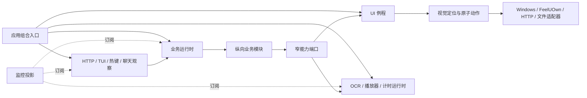

# 当前目标架构

本文汇总当前架构 ADR 的目标结构、依赖边界和收尾清理项。代码已经按该方向迁移，本文不再描述旧配置或旧运行时的兼容路径。

## 目标

- 把 `main.rs` 缩减为 Windows 进程入口和 watchdog。
- 让游戏窗口、OCR、播放器、计时和业务状态各自只有一个明确所有者。
- 让命令语法、状态规则、外部调用和结果处理留在所属纵向业务模块。
- 保留现有 HTTP API 协议，移除内部字符串伪命令和共享全局状态。
- 默认保持业务规则不变；明确批准的行为变化单独提交和验证。

AI 自动化基础客户端暂不纳入主项目架构和 Git，只保留本地使用。

## 目标模块树

```text
src/
|- main.rs                         # Windows 入口与 watchdog
|- lib.rs                          # 库公开入口
|- composition.rs                  # 唯一应用组合入口
|- config/
|  `- mod.rs                       # 根配置组合、加载与启动校验
|- runtime/
|  |- business.rs                  # 单一业务运行时与调度器
|  |- ui.rs                        # 游戏窗口单一所有者
|  |- ocr.rs                       # OCR 引擎单一所有者
|  |- player.rs                    # 观测、控制、搜索三条通道
|  |- timer.rs                     # 单调期限
|  `- monitor.rs                   # 监控投影
|- ui/
|  |- frame.rs                     # 观察帧与帧界面状态
|  |- state.rs                     # 单帧分类与稳定跟踪
|  |- template.rs                  # 纯模板匹配
|  |- locator.rs                   # 模板、OCR 与区域组合定位
|  |- atoms.rs                     # 原子动作
|  `- routines/                    # 独立类型化 UI 例程
|- observation/
|  |- chat.rs                      # 聊天切块、稳定消息与观察标识
|  |- shared.rs                    # 有界共享观察流和缺口
|  `- exclusive.rs                 # 隔离观察会话
|- features/
|  |- playback/                    # 播放器控制器、队列、去重和确认
|  |- song_request/                # 搜索、候选、点歌 AI 与审核
|  |- startup/                     # 启动游戏与进入千星
|  |- invite/                      # 邀请与好友反馈
|  |- moderation/                  # 管理投票与执行
|  |- custom_workflow/             # 唯一原子动作计划解释器
|  |- idiom_chain/
|  |- card_games/                  # 斗地主与跑得快共享牌型能力
|  |- undercover/
|  `- turtle_soup/
|- adapters/
|  |- windows/                     # 窗口、输入、截图、剪贴板
|  |- feeluown.rs                  # 单次原始 RPC
|  |- ai_http.rs                   # 可复用阻塞 HTTP 执行基础设施
|  `- file_store.rs                # 原子文件存储
`- interfaces/
   |- http/                        # 兼容 API 与内嵌页面
   |- tui.rs
   `- hotkeys.rs
```

目录只表达所有权边界。小模块保持深接口，不为每个类型创建独立文件。

## 依赖方向



- 业务模块不能依赖 `AutomationApp`、完整 `AppConfig` 或全局服务容器。
- UI 运行时不理解点歌、娱乐、控制台或 Web 工具。
- OCR 不负责截图、区域选择、稳定策略或业务秘密。
- HTTP 不直接修改业务状态，不伪造聊天命令。
- 监控快照不是业务状态仓库。

## UI 自动化内核深化

- 业务与观察模块只调用完整类型化 UI 契约；打开好友会话、发送当前聊天、返回一级和原子输入只在内核内部复用。
- 每个公开例程在同一次独占事务内观察并归一化起点，完成目标动作、有限收尾恢复和显式驻留目标确认后才完整成功。
- 例程结果分别报告目标动作效果与结束驻留结果；恢复失败不能抹掉已经完成、部分完成或结果未知的输入。
- UI 例程等待目标确认 OCR 时继续持有窗口所有权，OCR 引擎仍由独立 OCR 运行时拥有。
- “建立 UI 驻留”只供监听模式切换和独立恢复任务使用，不能作为其他业务动作的链式前置准备。
- 第一阶段公开 `EstablishResidency`、`SendHallBatch`、`SendFriendDeliveries`、`ExecuteInvite`、`ExecuteModeration`、`ReadHallInfo`、`DetectPublicHall`、`ToggleMicrophone`、`EnterGame`、`EnterWonderland`、`ProcessSecondaryUnread` 和 `CustomActionPlan`。
- 好友投递支持严格区域内受限滚动、昵称与好友行共同稳定、不可插入多收件人批次、精确投递进度和配置化安全重试。
- 邀请确认属于业务等待；确认后的通知、邀请输入和驻留恢复在一个完整 UI 例程中执行。
- 自定义工作流把连续机械步骤编译成独占机械段，高层能力步骤通过所属模块执行并在结果返回后恢复工作流。

## 所有权

| 状态或资源 | 唯一所有者 |
| --- | --- |
| 游戏窗口截图、输入和 UI 例程顺序 | UI 运行时 |
| OCR 引擎、优先级和推理请求 | OCR 运行时 |
| 命令路由、任务调度、娱乐互斥和业务状态 | 业务运行时 |
| FeelUOwn 稳定观测 | 播放器观测通道 |
| 播放器修改命令顺序 | 播放器控制通道 |
| 业务期限 | 计时运行时 |
| 监控快照 | 监控投影 |
| 业务持久文件的语义 | 所属业务仓库 |

## 调度与等待

- 正式任务、延迟发送和诊断请求保留三类调度通道。
- UI 例程默认独占至完成，第一版可让位白名单为空。
- 批量聊天发送不可中断。
- 等待玩家、计时器或外部服务是业务等待，不占 UI。
- 业务运行时不阻塞等待外部结果；挂起的正式任务保留顺位，结果事件到达后恢复。
- 自定义工作流的每个连续机械段独占执行；类型化能力步骤结束当前机械段，并在 UI 运行时之外等待结果。
- 已开始的正式任务不接受 Web 任意中断；退出等终止条件走例程清理边界。

## 明确的行为变化

以下变化不能混入纯移动提交：

1. 当前可中断批量聊天发送改为独占至完成。
2. 连续稳定次数采用“局部值大于 1 > 全局值大于 1 > 内置默认 2”的继承规则。
3. 播放器歌曲身份只认非空 URI，不使用歌名和歌手兜底。
4. 播放器稳定观测分离 URI、播放状态和播放实例，异常时保留最多 5 秒过期观测。
5. HTTP 内部不再伪造聊天文本或直接修改共享状态，但外部协议保持兼容。
6. 好友投递批次不可插入，自动重试只覆盖确认未发送的剩余项，活动娱乐玩法通过 `#重试` 恢复唯一待重试批次。
7. 自定义工作流不再把包含高层能力的整份定义作为一个 UI 例程，高层能力会分隔机械段。

每项行为变化单独提交，并增加针对旧问题和新规则的测试。

## 增量迁移顺序

1. **基线**：固定完整测试、严格 Clippy、Release 构建、当前配置校验和 HTTP 契约结果。
2. **库边界**：机械移动现有 `app` 到库核心，`main.rs` 只保留入口和 watchdog；不改逻辑。
3. **组合与配置**：建立 `composition`、模块配置校验和窄能力端口；配置只按当前 schema 解析。
4. **UI 深接口**：建立例程执行上下文、独立类型化请求与结果、显式驻留目标和脱敏进度事件；以好友投递为第一条完整切片，再迁移邀请、大厅与驻留、二级未读、管理、大厅信息、麦克风、启动和自定义工作流机械段。
5. **OCR 与视觉**：迁移 OCR 运行时、模板匹配、视觉定位、观察帧、公共 UI 状态及证据。
6. **聊天观察**：迁移一级和二级监听、共享观察流、独占观察会话、消息标识和观察缺口。
7. **纵向模块**：在现有业务线程中逐个提取应用服务，顺序建议为成语、牌类、谁是卧底、海龟汤、邀请/管理、自定义工作流、启动、点歌/播放。
8. **业务运行时**：当中央业务分支已经变薄后，把调度器和各应用服务交给单一业务运行时，移除业务状态互斥锁。
9. **播放器运行时**：迁移观测、控制和搜索通道，再单独启用 URI 唯一身份与过期观测新规则。
10. **接口与投影**：HTTP 改用类型化意图和查询端口，监控/TUI 改读监控投影，同时运行 API 契约测试。
11. **显式行为提交**：分别落地批量不可中断和稳定次数继承，避免与结构迁移混杂。
12. **清理**：删除旧门面、过渡调用、无引用模块和经编译证明无用的依赖；更新代码文档。

每个步骤都必须保持可编译、可运行和可回退，不建立长期双写或兼容适配层。

## 验证门槛

- `cargo fmt --check`
- `cargo clippy --all-targets --all-features -- -D warnings`
- `cargo test --all-features`
- Release 构建
- 当前配置解析与默认值校验
- HTTP API 契约测试
- 固定截图上的模板、UI 状态、OCR 图块关联测试
- 固定截图上的稳定好友行、受限列表遍历、标题优先与聊天区域兜底确认测试
- 好友投递部分完成、结果未知、安全重试、待人工恢复和驻留收尾测试
- 手动时钟驱动的娱乐与播放器场景测试
- 真实 Windows 环境的截图、输入归属、焦点和 FeelUOwn 冒烟测试

依赖只在目标模块迁移完成、源码引用审计和全功能编译都通过后删除；不为追求数量提前移除仍承担平台或协议能力的依赖。
