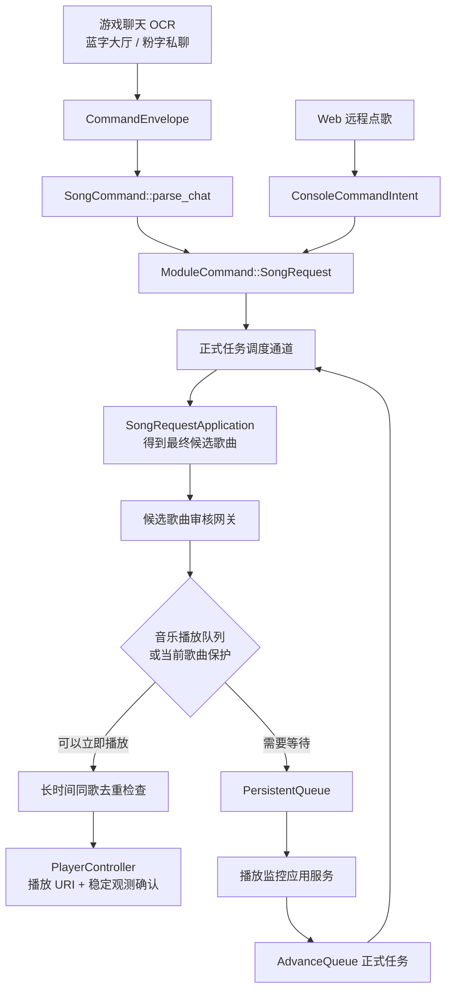
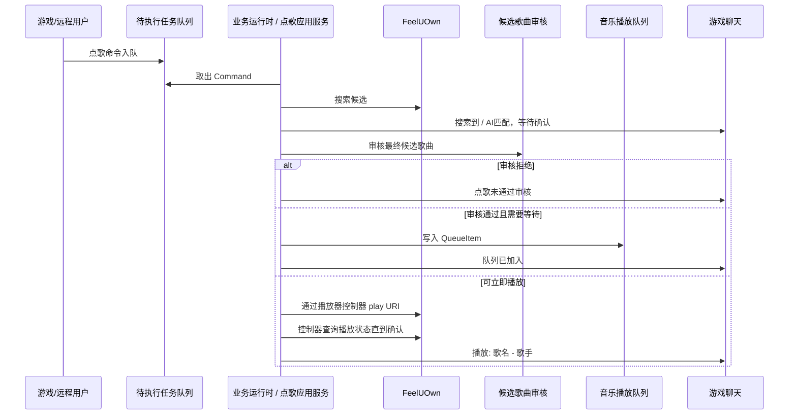

# 点歌流程梳理

本文专门梳理点歌从“被识别成命令”到“播放或进入音乐播放队列”的完整链路。它补充 `docs/executor-flow.md`：执行器文档回答“谁能操作游戏窗口”，本文回答“点歌这条业务命令内部怎么走”。

## 核心结论

点歌不是 HTTP 或 OCR 入口直接播放。聊天入口先生成命令信封，由点歌模块自己解析成 `SongCommand`；HTTP 直接构造同一个 `SongCommand`。两者都包装为 `ModuleCommand::SongRequest` 进入正式任务调度通道，再交给 `SongRequestApplication`。处理过程中会先得到最终候选歌曲，再做候选歌曲审核，然后才决定直接播放还是加入音乐播放队列。长时间同歌去重会在入队前和播放前检查，但只在确认播放成功后记录历史。

控制台来源拥有最高权限，但只体现在“候选歌曲审核免审”。它仍然进入待执行任务队列，仍然参与点歌互斥，也仍然受当前歌曲保护和音乐播放队列规则约束。

## 三个数据形态

点歌链路里有三个容易混淆的对象：

| 对象 | 位置 | 含义 |
| --- | --- | --- |
| `SongCommand` | `src/features/song_request/mod.rs` | 原始点歌命令。保存关键词、来源平台、是否伴奏优先、是否 AI 点歌、是否来自好友私聊。 |
| `ResolvedSongRequest` | `src/features/song_request/application.rs` | 已经解析并确认的最终候选歌曲。此时通常已经有 URI，可以审核、入队或播放。 |
| `QueueItem` | `src/features/playback/queue.rs` | 写入音乐播放队列的持久化歌曲项。字段基本来自 `ResolvedSongRequest`。 |

`ResolvedSongRequest` 同时保留最终候选、URI、原始 AI 文本和好友来源，用于审核、去重、执行日志和播放请求转换。

## 入口来源

### 大厅蓝字命令

聊天入口先构造蓝字 `CommandEnvelope`，静态路由器选中点歌模块后，由 `SongCommand::parse_chat()` 解析。点歌相关前缀包括：

- `@点歌` / `@搜索`：默认 QQ 音乐。
- `@QQ点歌` / `@QQ搜索`：QQ 音乐。
- `@网易点歌` / `@网易搜索`：网易云。
- `@AI点歌` / `@AI搜索`：AI 辅助点歌；解析层默认来源是 QQ 音乐，执行层会实际搜索 QQ 音乐和网易云候选。

关键词里的 `伴奏` 会被移除，同时把 `prefer_accompaniment` 标记为真。

### 好友粉字命令

聊天入口从粉字中提取好友名并写入命令信封，点歌模块再按好友权限解析。私聊比大厅多两个差异：

- `@AI点歌` / `@AI搜索` 的解析来源是 `All`，执行层会让 FeelUOwn 做全来源搜索。
- 支持 `@B站点歌` / `@B站搜索`。

好友名会写入 `SongCommand.friend_username`，后续反馈文案会带上 `好友xxx:` 前缀。

### Web 远程点歌

`/searchPlay`、`/searchSource`、`/ai/search` 最终都会调用 `remote_song_command()`，直接构造：

- 控制台来源的 `ConsoleCommandIntent`
- `ModuleCommand::SongRequest(SongCommand)`

所以远程点歌和游戏内点歌共用主业务队列、点歌互斥、候选解析、播放保护和反馈流程。

## 候选解析与确认

业务运行时从正式任务通道取出 `ModuleCommand::SongRequest` 后，把命令上下文交给 `SongRequestApplication`；应用服务第一步是解析并确认最终候选。

普通点歌路径：

1. `resolve_song_request()` 先把 `SongCommand` 转成没有 URI 的 `ResolvedSongRequest`。
2. 播放器控制器通过当前后端搜索并挑出一个候选。
3. 游戏内回复 `搜索到:候选,@确认@跳过@换源@AI`。
4. `@确认` 或超时表示接受该候选。
5. `@跳过` 取消本次点歌。
6. `@换源` 切到 QQ/网易另一侧重新搜索。
7. `@AI` 切到 AI 点歌路径。

AI 点歌路径：

1. 回复 `AI匹配中`。
2. 播放器控制器通过当前后端获取候选列表。
3. `ai.pick_song_candidate()` 从候选列表里选择最符合原始意图的 URI。
4. 回复 `AI匹配:候选,@确认@跳过`。
5. `@确认` 或超时表示接受；`@跳过` 取消。
6. 返回带 URI 的 `ResolvedSongRequest`，并保留原始 AI 点歌文本用于执行日志。

这里的“超时默认接受”只用于候选确认，不代表审核通过。审核发生在下一步。

候选确认是独占决策读者的等待窗口：它只消费基线之后的 `@确认/@跳过/@换源/@AI`，不会暂停共享聊天命令流。等待期间出现的其他普通命令仍按一级屏幕锁或二级气泡序列基线处理，再经待执行队列去重。

## 候选歌曲审核

候选解析结束后，`review_song_candidate()` 在播放或入队前执行。当前规则是：

1. `song_review.enabled = false` 时直接通过。
2. `message_type == "控制台"` 时直接通过，这是控制台免审。
3. 其他来源会把候选歌曲拆成标题、歌手、URI、消息类型和用户名，提交给候选歌曲审核 Provider。
4. 审核返回 1 到 10 的审核强度，强度小于或等于本地阈值则通过。
5. 审核拒绝是硬拒绝：记录执行日志，回复 `点歌未通过审核: ...`，本次点歌结束，不播放、不入队。

审核失败策略在 `src/features/song_request/review.rs` 内部处理：重试指定次数后，根据配置决定失败放行还是失败拒绝。

## 入队或直接播放

审核通过后，点歌才进入播放决策。

第一层是音乐播放队列去重：

- 如果请求有 URI，用 URI 检查音乐播放队列重复。
- 如果没有 URI，用关键词、来源和伴奏优先检查重复。

这一步只避免同一首候选在音乐播放队列里重复排队，不会写入长时间同歌去重历史。

第二层是长时间同歌去重：

- 如果最终候选近期已经成功播放过，本次点歌直接拒绝，不加入音乐播放队列。
- 这一步只检查最终候选，不按原始点歌文本判断。
- 入队前检查不会写入历史，只有播放确认成功后才会计入后续限制。

第三层是队列状态：

- 音乐播放队列非空时，新请求直接追加到队尾。
- 队列满则回复 `队列已满，请稍后再试`。

第四层是播放器状态：

- 当前已经在播放同一非空 URI 时，回复 `当前正在播放`。
- 当前歌曲应该受保护时，把新请求加入音乐播放队列。
- 播放器状态未知时，为了避免误切歌，把请求加入音乐播放队列并回复状态未知。
- 没有保护条件且可以立即播放时，先检查长时间同歌去重，通过后把最终候选转成 `PlaybackRequest` 交给播放器控制器。

当前歌曲保护由 `PlayerController::should_queue_until_current_song_finished()` 判断。配置关闭时可以更积极地直接播放；机器人确认播放的歌曲会优先保留。非点歌歌曲必须以同一非空 URI 连续正常播放达到 `queue.external_playback_protect_after_seconds`，才会加入保护；URI 缺失时身份未知，切歌、暂停、停止和 URI 变化会重新计时。

## 实际播放确认

直接播放前会先调用 `PlayerController::song_dedup_limited()` 检查近期实际播放历史。历史只比较非空 URI，不使用歌名或歌手兜底。控制台来源在 `song_dedup.console_bypass = true` 时跳过这一步；其他来源超限会回复 `歌曲名近期已播放过,请稍后再点`，本次点歌结束。

通过长时间同歌去重后，主流程确保请求有稳定 URI：

- 已有 URI：直接构造 `PlaybackRequest`。
- 没有 URI：先让播放器控制器通过当前后端搜索候选并补齐 URI。

之后进入控制器播放确认：

1. `PlayerController::play_request_uri()` 写入 `starting` 状态，并向播放器后端发送播放 URI。
2. `PlayerController::verify_playback_started()` 反复读取播放器状态。
3. 播放状态必须是 `playing` 或 `paused`。
4. 有 URI 时优先确认当前 URI 是否等于请求 URI。
5. URI 不一致或缺失时，普通点歌不会使用歌名和歌手兜底。
6. URI 不一致时，控制器返回 `MismatchedCandidate`；主流程只能拒绝当前音源，或在允许时换源重试。
7. 进度和时长不能是无效的 `0:00/0:00`。
8. 时长过短会视为无音源。
9. 成功后控制器写入 `PlaybackRuntimeState.activeRequest`，记录长时间同歌去重历史，并由主流程回复 `播放: 歌名 - 歌手 (进度/时长) 音量x`。

只有确认播放成功后才会写入同歌历史。搜索失败、入队、审核拒绝、候选取消、播放确认失败都不会污染历史。

## 自动出队

播放监控线程只观察播放器状态，不直接播放下一首。它把当前观测和队列上下文交给 `PlayerController::maybe_advance_queue()`，再按控制器决策提交 `PendingTask::AdvanceQueue`：

- 播放器停止，且音乐播放队列非空。
- 播放器暂停并接近结束，且音乐播放队列非空。
- 播放器正在播放并接近结束，且存在待执行播放工作；此时控制器可能先标记 `paused_waiting_for_queue` 并暂停，避免播放器自然跳到非队列歌曲。

`AdvanceQueue` 仍由正式任务执行边界处理，但播放器与队列操作没有页面依赖，因此交给 `PlaybackApplication::consume_queue()` 取队首播放；只有回复和任务结束时才按监听驻留目标提交类型化 UI 事务：

- 播放成功：移除队首。
- 近期已播放过：移除队首，回复 `歌曲名近期已播放过,已跳过`，继续尝试下一项。
- 无音源：移除队首，继续尝试下一项。
- 播放错误：保留队首，等待后续重试或人工处理。

## 手动下一首

`@下一首` 按目标是否已知选择路径：

- 队首存在且已经保存 URI 时，直接把该 URI交给播放确认，不调用播放器原生 `next`；已知 URI 的队列项不允许在确认失败时自动换源。
- 队首存在但 URI 为空时，先搜索并补齐候选 URI；搜索失败会保留队首，不绕过队列调用原生 `next`。
- 队列为空且没有可用的导航目标时，才调用播放器控制器的 `next_external()`，并等待新的播放实例稳定。

已知 URI项不会因为确认中的旧观测而换源；确认成功、明确无音源或去重跳过时按现有队列策略移除，控制错误仍保留队首。

## 手动上一首

每次点歌或确认新的播放目标时，播放器状态会把此前已经确认的 URI压入有限的播放历史。`@上一首` 优先取历史栈顶并直接按 URI播放；历史目标只有在新 URI确认成功后才移除，发送失败、URI为空、超时或不匹配都保留历史。

没有可用历史 URI时，才调用播放器控制器的 `previous_external()`，并通过新的播放实例确认结果。当前正在播放的 URI只是切换 baseline，不能直接当成上一首；歌曲自然停止也不会把当前歌曲重新压入上一曲历史。

## 关键边界

- 待执行任务队列和音乐播放队列是两个队列：前者排业务任务，后者排歌曲。
- 点歌互斥发生在进入待执行任务队列前后，目标是避免不同入口的点歌互相抢执行边界。
- 候选歌曲审核只审核最终候选歌曲，不审核原始点歌意图。
- 控制台免审不等于控制台直连播放。
- 长时间同歌去重会拒绝确定的近期重复候选入队；只有播放成功才写历史。
- `/queue/add` 是例外接口：它直接写音乐播放队列，不进入候选歌曲审核。
- 播放器后端状态只是观测；确认播放状态、暂停原因和活动播放请求由播放器控制器维护。

## 典型时序

