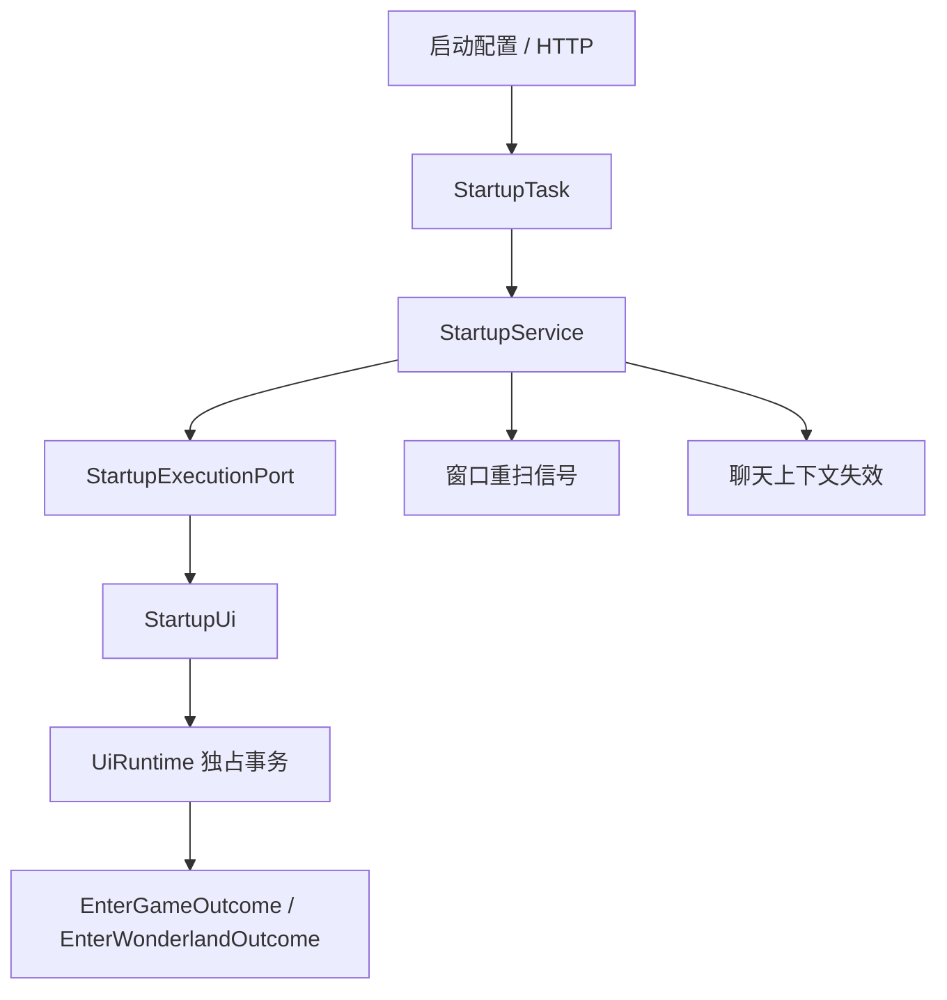

# 启动游戏与进入千星

启动能力拆成两个独立正式任务：

- 启动游戏任务：找到或启动游戏，完成“点击进入”，以派蒙菜单模板稳定出现作为进入游戏的唯一完成信号。
- 进入千星任务：从一级界面进入千星大厅，并在同一个 UI 事务内确认最终一级驻留。

远程“启动并进入千星”只是按顺序提交这两个任务，不存在第三个把全部逻辑揉在一起的启动流程。

## 模块边界

| 文件 | 职责 |
| --- | --- |
| `src/features/startup.rs` | 启动配置校验、任务类型、业务执行顺序和窄执行端口。 |
| `src/ui/routines/startup.rs` | 启动游戏与进入千星的完整 UI 例程契约。 |
| `src/composition/application/startup.rs` | 把业务端口接到 `StartupUi` 和窗口重扫信号。 |
| `src/adapters/windows/device.rs` | 查找/启动游戏进程以及实际窗口输入。 |

应用启动前会先解析并校验完整启动配置；进程名、模板路径、区域、阈值、重试次数和超时无效时，任何运行时线程都不会启动。

## 启动游戏任务

`StartupService` 的业务顺序是：

1. 使当前聊天与娱乐上下文失效。
2. 请求窗口扫描立即重试。
3. 提交一个 `EnterGame` UI 事务。
4. UI 事务完成后再次请求窗口扫描。

`EnterGame` UI 事务内部执行：

1. 检查目标窗口是否存在。
2. 如果窗口不存在且 `startup.launch_game=true`，解析游戏路径和参数并启动进程。
3. 按 `startup.launch_retries` 和 `startup.launch_wait_ms` 有界等待窗口出现。
4. 聚焦游戏窗口。
5. 如果 `startup.enter_game=false`，只返回 `WindowReady`。
6. 否则循环截图：
   - 在 `startup.main_ui_region` 检测 `startup.templates.paimon_menu`。
   - 派蒙模板连续稳定命中两次时返回 `Entered`。
   - 未进入主界面时，在 `startup.enter_game_text_region` OCR“点击进入”并点击识别框中心。
7. 超过 `startup.enter_game_timeout_ms` 仍未稳定看到派蒙模板时失败。

“点击进入”只是动作线索，不是完成依据。派蒙模板稳定出现才证明游戏主界面可用。

## 游戏路径

当 `startup.exe_path` 指向文件时直接使用；指向目录时按配置的目标进程名和官服/国际服候选查找可执行文件。路径为空时再尝试启动器注册表路径。

当前通用候选覆盖：

- `YuanShen.exe`
- `GenshinImpact.exe`

不处理 B 服登录窗口。解析不到路径、文件不存在或启动参数引号未闭合都会在输入前失败。

## 进入千星任务

`StartupService` 的业务顺序是：

1. 使当前聊天与娱乐上下文失效。
2. 请求窗口扫描立即重试。
3. 提交一个 `EnterWonderland` UI 事务。
4. 目标效果与一级驻留都确认后，再请求一次完成重扫。

`EnterWonderland` UI 事务独占完成以下机械事务：

1. 确认窗口存在并聚焦。
2. 在 `startup.main_ui_region` 连续稳定确认 `startup.templates.paimon_menu`，确保当前是主游戏大厅；这里不使用聊天界面的好友/返回模板。
3. 按 `F6` 打开千星主页。
4. 在 `startup.wonderland_close_region` 连续稳定确认 `startup.templates.wonderland_close`。
5. 点击 `startup.wonderland_card_point`。
6. 在 `startup.wonderland_enter_button_region` 查找 `startup.templates.wonderland_enter_button`。
7. 命中后点击模板中心，并把目标动作标记为已经尝试。
8. 等待确认按钮消失。
9. 按像素均值差和变化比例等待同一区域稳定。
10. 在 `startup.final_primary_timeout_ms` 内连续稳定确认一级界面。

步骤 2 到步骤 10 都属于一个 UI 例程，其他键鼠输入不能插入。业务层不会先调用独立“界面准备”任务，也不会在例程外盲按 `Esc`。

## 最终驻留与失败语义

`EnterWonderlandOutcome` 分别包含：

- `effect`：进入千星目标是否确认。
- `residency`：最终一级界面是否稳定确认。

只有两者都成功，进入千星任务才成功。目标已确认但一级驻留失败会作为任务失败返回，不再沿用旧的“只记日志、仍算成功”行为。

点击确认按钮以后，失败确定性是 `AfterInputUnknown`；程序不会自动重放整次进入流程。若目标输入尚未发生，例程可以从明确的二级状态有限按 `Esc` 收敛到一级，但未知画面不会盲目输入。

## HTTP 入口

| 路径 | 提交内容 |
| --- | --- |
| `POST /startup/game` | 一个启动游戏任务。 |
| `POST /startup/enter-wonderland` | 一个进入千星任务。 |
| `POST /startup/wonderland` | 按顺序提交启动游戏和进入千星两个任务。 |

HTTP 只返回排队回执和任务 ID，不直接操作窗口。任务进入正式调度通道，与其他游戏输入共享同一个 UI 所有者。

## 关键配置

- `startup.launch_game`：窗口不存在时是否允许启动进程。
- `startup.enter_game`：是否继续执行“点击进入”。
- `startup.exe_path` / `startup.game_args`：可执行文件与启动参数。
- `startup.main_ui_region` / `startup.templates.paimon_menu`：游戏启动完成检测。
- `startup.enter_game_text_region`：OCR“点击进入”的区域。
- `startup.wonderland_close_region`：千星主页稳定确认区域。
- `startup.wonderland_card_point`：千星卡片点击点。
- `startup.wonderland_enter_button_region`：确认按钮匹配和过渡稳定区域。
- `startup.final_primary_timeout_ms`：最终一级驻留确认期限。

## 关键不变量

- 启动游戏和进入千星是两个可独立观察、取消排队的正式任务。
- 派蒙菜单模板是启动游戏完成的唯一视觉指标。
- 进入千星的目标动作与最终驻留必须分别确认。
- 所有机械输入都在一个 UI 运行时中串行执行。
- 请求窗口重扫只影响观察退避，不代替 UI 成功确认。
