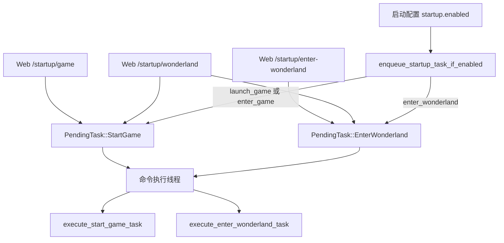
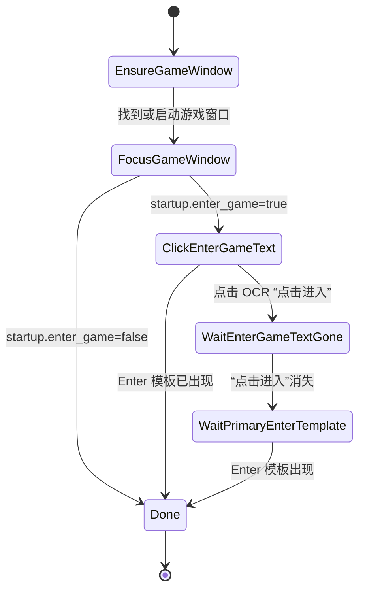
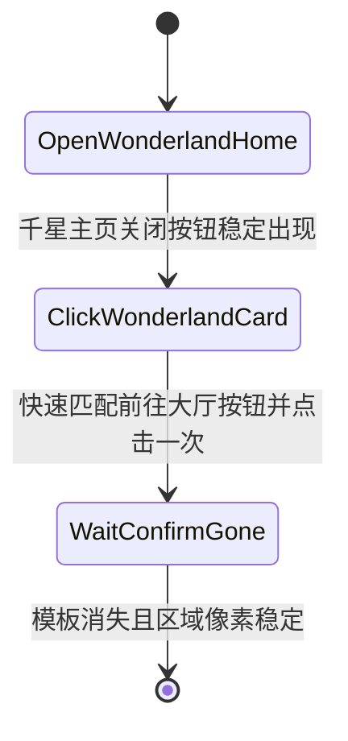

# 启动游戏与进入千星流程梳理

本文专门梳理“启动游戏任务”和“进入千星任务”。当前实现已经删除 BGI 复刻式大流程，改成两个独立状态机：

- `StartGame`：确保游戏进程和窗口存在，完成开门，直到左下角 Enter 模板出现。
- `EnterWonderland`：在已有游戏主界面中打开千星奇域，进入大厅后返回一级界面。

`/startup/wonderland` 和启动配置里的“启动并进入千星”都只是把这两个任务按顺序放入待执行任务队列，不是一个绕过主执行器的同步流程。

## 总体入口

任务来源：

| 来源 | 入队内容 |
| --- | --- |
| 程序启动配置 | `startup.launch_game || startup.enter_game` 时入队 `StartGame`；`startup.enter_wonderland` 时入队 `EnterWonderland`。 |
| `/startup/game` | 只入队 `StartGame`。 |
| `/startup/enter-wonderland` | 只入队 `EnterWonderland`。 |
| `/startup/wonderland` | 依次入队 `StartGame` 和 `EnterWonderland`。 |

HTTP 层只入队并返回队列位置，不等待任务执行完成。

## StartGame 状态机

实现位置：`src/app/game_startup.rs`。

### 确保游戏窗口（EnsureGameWindow）

这一步负责确保游戏窗口存在：

1. 先用 `window.target_process` 查找游戏窗口。
2. 如果已找到，跳过启动。
3. 如果没找到且 `startup.launch_game=false`，直接失败。
4. 如果允许启动，解析启动路径。
5. 启动 exe 后按 `startup.launch_wait_ms` 间隔等待窗口出现，最多 `startup.launch_retries` 次。

启动路径解析顺序：

1. `startup.exe_path` 非空且是文件：直接启动该文件。
2. `startup.exe_path` 非空且是目录：在目录下按目标进程候选查找 exe。
3. `startup.exe_path` 为空：从官服/国际服启动器注册表查找安装路径。

候选 exe 会同时考虑配置里的目标进程，以及 `YuanShen.exe`、`GenshinImpact.exe`。

### 聚焦游戏窗口（FocusGameWindow）

找到窗口后调用 `workflow_actions::focus()`：

1. 激活游戏窗口。
2. 点击 `window.focus_point`。
3. 确认前台窗口属于游戏进程。

这是启动任务里唯一主动使用 `focus_point` 的阶段。

### 点击进入文字（ClickEnterGameText）

如果 `startup.enter_game=true`，进入开门流程：

1. 每轮先在 `screen.enter_rect` 匹配全局 `templates.enter`。
2. 若命中左下角 Enter 模板，直接认为已经进入一级界面并完成任务。
3. 未命中时，才在 `startup.enter_game_text_region` 中 OCR 固定文本 `点击进入`。
4. 找到后点击 OCR 文本框中心。
5. 最长等待 `startup.enter_game_timeout_ms`。

当前默认区域是 `900,1000,130,40`，默认超时 60 秒。

### 等待进入文字消失（WaitEnterGameTextGone）

点击后并不立即认为成功，而是继续 OCR 同一区域：

- 如果仍识别到 `点击进入`，继续点击文本框中心。
- 如果不再识别到 `点击进入`，进入下一步。
- 如果一直存在直到开门超时，任务失败。

这个设计对应“先识别到文字，点击后文字消失，才说明点击进入动作被接受”。

### 等待一级回车模板（WaitPrimaryEnterTemplate）

文字消失后继续等待全局 `templates.enter` 在 `screen.enter_rect` 出现。检测到左下角 Enter 模板后，认为启动游戏任务完成。

启动时若游戏已跳过“点击进入”阶段并直接进入一级界面，`ClickEnterGameText` 里的模板检测会先命中，任务不会等待 OCR 超时。

这里不判断白屏本身。白屏只是加载过程中的中间状态；成功条件是最终回到可聊天的一级界面信号。

## EnterWonderland 状态机

实现位置：`src/app/startup_flow.rs`。

进入千星任务前置条件更严格：

1. 必须已经能找到游戏窗口。
2. 找不到窗口会直接失败，并提示先执行启动游戏任务。
3. 任务开始时会激活并聚焦游戏窗口。

### 打开千星主页（OpenWonderlandHome）

循环执行：

1. 按 `F6`。
2. 等待 `startup.wonderland_home_retry_ms`。
3. 在 `startup.wonderland_close_region` 检测 `startup.templates.wonderland_close`。
4. 连续稳定命中 2 次后，认为千星奇域主页已打开。
5. 未命中则继续按 F6，直到达到 `startup.wonderland_home_retries`，同时受 `startup.enter_wonderland_timeout_ms` 兜底限制。

默认关闭按钮区域是右上角 `1780,0,140,90`。

### 点击千星卡片（ClickWonderlandCard）

打开主页后循环点击 `startup.wonderland_card_point`，默认是第一个奇域卡片坐标 `680,310`。

点击后在 `startup.wonderland_enter_button_region` 检测 `startup.templates.wonderland_enter_button`。首次命中后立刻点击一次。

默认匹配区域是 `1400,850,360,150`，复用缓存灰度 SAD 匹配，阈值严格使用 `startup.wonderland_enter_button_threshold`，默认 `0.9`。

该阶段按 `startup.wonderland_card_retries` 重试，每次点击卡片后最多等待 `startup.wonderland_card_retry_ms`。模板检测仍使用 `timing.input.click_ms`（默认 `150ms`）作为内部快速轮询间隔。

### 等待确认按钮消失（WaitConfirmGone）

点击“前往大厅”按钮后，不固定等待；改为按 `timing.input.click_ms`（默认 `150ms`）轮询同一区域：

- 模板消失后，继续等待该区域像素稳定。
- 模板消失且区域稳定后，直接认为已进入千星内部。
- 模板消失超过 `startup.wonderland_confirm_absent_timeout_ms`，或区域稳定超过 `startup.wonderland_confirm_stable_timeout_ms` 时，任务失败。

这里是进入千星任务的最终成功条件。后续不再继续 BGI 原流程，也不会自动退出千星。

## 进入千星后的返回一级

`startup_flow::enter_wonderland()` 成功返回后，调用方 `execute_enter_wonderland_task()` 会执行：

1. 记录“进入千星完成信号已确认”。
2. 调用 `return_to_primary_fixed()`。
3. 记录返回结果。
4. 请求重置窗口检测退避。
5. 任务完成，待执行任务队列继续执行后续任务。

返回一级失败不会清空后续任务，也不会把进入千星任务改成失败。它只记录返回结果，让后续业务仍按队列继续推进。

## 窗口检测退避重置

主扫描线程在游戏窗口不可用时会进入退避等待。启动相关任务会通过 `WindowDetectionSignal` 通知扫描线程尽快重试：

- 启动游戏任务开始。
- 发现已有游戏窗口。
- 已创建游戏进程。
- 检测到游戏窗口。
- 已聚焦游戏窗口。
- 进入游戏完成。
- 进入千星任务开始。
- 进入千星任务完成。

这样通过命令启动游戏后，主扫描线程不必等完整退避时间才重新截图。

## 失败处理

启动和进入千星任务都由命令执行线程消费。如果任务返回错误：

- 目标窗口不可用类错误：记录错误并跳过返回一级界面。
- 其他错误：调用 `return_to_primary_after_command_failure()`，尝试用 ESC 回到一级界面。

准备界面阶段不同：`StartGame` 和 `EnterWonderland` 是直接任务，不走普通命令的 `prepare_command_ui()`。它们自己负责窗口检查、聚焦和流程状态机。

## 配置面

关键配置：

| 配置 | 作用 |
| --- | --- |
| `startup.enabled` | 程序启动后是否自动入队启动相关任务。 |
| `startup.launch_game` | 找不到窗口时是否启动游戏。 |
| `startup.enter_game` | 是否执行 OCR “点击进入”开门。 |
| `startup.enter_wonderland` | 是否自动入队进入千星任务。 |
| `startup.exe_path` | 启动 exe 文件或所在目录。 |
| `startup.enter_game_text_region` | OCR “点击进入”的区域。 |
| `screen.enter_rect` / `templates.enter` | 启动游戏完成信号。 |
| `startup.wonderland_close_region` | 千星主页右上角关闭按钮搜索区域。 |
| `startup.templates.wonderland_enter_button` | “前往大厅”按钮模板。 |
| `startup.wonderland_enter_button_region` | “前往大厅”按钮搜索区域。 |
| `startup.wonderland_enter_button_threshold` | “前往大厅”按钮模板匹配阈值。 |
| `startup.wonderland_home_retries` / `startup.wonderland_home_retry_ms` | 打开千星主页阶段的 F6 重试次数和每次等待时间。 |
| `startup.wonderland_card_retries` / `startup.wonderland_card_retry_ms` | 点击奇域卡片阶段的重试次数和每次等待“前往大厅”按钮时间。 |
| `startup.wonderland_confirm_absent_timeout_ms` | 点击“前往大厅”后等待按钮模板消失的最长时间。 |
| `startup.wonderland_confirm_stable_timeout_ms` | 按钮消失后等待原区域像素稳定的最长时间。 |
| `startup.template_threshold` | 启动流程和千星主页关闭按钮模板匹配阈值。 |

## 关键边界

- 启动游戏任务不负责进入千星。
- 进入千星任务不负责启动游戏；找不到窗口时直接失败。
- `/startup/wonderland` 只是顺序入队两个任务。
- 开门成功条件不是白屏结束，而是左下角 Enter 模板出现。
- 进入千星成功条件是点击“前往大厅”按钮后，该按钮消失且原区域像素稳定。
- 进入千星完成后只返回千星内一级界面，不自动退出千星，不清空后续待执行任务。
