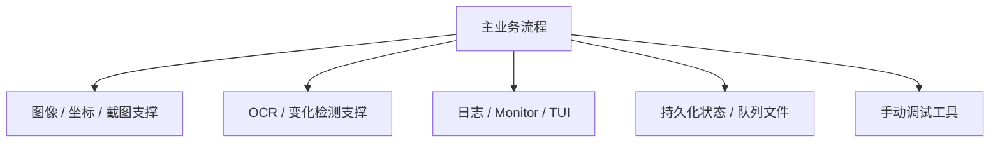

# 支撑运行模块梳理

本文梳理不适合单独拆成业务流程文档的小模块。它们大多提供调试入口、图像坐标支撑、日志监控、持久化和格式化能力。

## 核心结论

这些模块不应该承载高层业务决策。它们的边界是“让主流程可观察、可调试、可持久化、可安全读取图像”，而不是决定点歌、邀请、审核或进入千星的业务规则。

## 手动调试工具

`src/app/manual_tools.rs` 提供 CLI 子命令背后的实现，主要用于定位坐标、验证 OCR、验证模板、验证聊天扫描和调试输入动作。

常见能力：

- 截图保存。
- OCR 单图或窗口区域。
- 扫描聊天区并打印识别结果。
- 测试 UI 状态检测。
- 测试模板匹配和点击模板。
- 发送按键、点击点、发送聊天。
- 运行聊天变化监控。
- 运行面板响应延迟 benchmark。
- 探测 OCR 后端可用性。

这些工具会直接触达游戏窗口或 OCR 引擎，但它们是人工调试入口，不参与常驻主循环的业务调度。

## 热键

`src/app/hotkeys.rs` 启动 Windows 全局热键监听线程。

它只做两件事：

- 把暂停热键映射到共享暂停状态。
- 把退出热键映射到共享退出状态。

热键配置只支持可解析的虚拟键名。热键线程不执行游戏输入，也不直接修改音乐播放队列。

## 图像与坐标支撑

| 文件 | 职责 |
| --- | --- |
| `src/app/geometry.rs` | `Point`、`Rect`、区域裁剪、矩形解析和坐标 clamp。 |
| `src/app/frame_source.rs` | 从窗口截图或本地图片加载统一 `Frame`，并按画布配置调整尺寸。 |
| `src/app/dpi.rs` | 启动时设置 Windows DPI 感知，减少截图和点击坐标偏移。 |
| `src/app/change_detection.rs` | 生成低分辨率灰度指纹，并计算区域变化均值和变化比例。 |

图像支撑层的一个重要约定是：配置坐标使用游戏内容坐标，窗口层负责映射到实际客户区。调试工具和业务流程都复用同一套坐标结构，避免出现两套坐标解释。

## OCR 支撑

`src/app/ocr.rs` 封装 OCR 引擎初始化、后端选择、文字识别和 OCR 行合并。

它负责：

- 从配置解析 OCR 模型路径、线程数和后端优先级。
- 按优先级尝试创建 OCR 引擎。
- 探测 CPU、OpenCL、Vulkan、CUDA 等后端可用性。
- 把 OCR 行按位置合并成更接近聊天文本的字符串。
- 归一化中英文间距和标点附近空格。

`src/app/ocr_batch.rs` 是批量识别包装。它只负责把多个聊天切块送入 OCR，并把结果按原 block 顺序放回。是否开启 batch 是性能策略，不改变聊天语义。

当前项目里 OCR 引擎是共享资源；识别阶段通过全局互斥串行化推理。这个互斥只包住 OCR 推理，不包住截图、聊天切块或模板匹配。

## 大厅信息

`src/app/hall_info.rs` 负责大厅名称和剩余时间的 OCR 结果整理。

它提供：

- `parse_hall_remaining_minutes()`：从 OCR 文本里容错提取剩余分钟数。
- `merge_hall_info_samples()`：把多次采样结果合并成稳定大厅信息。
- `format_hall_remaining_suffix()`：把大厅剩余时间格式化成反馈文本。

大厅信息是“观察到的状态”，不是命令触发条件。它会写入运行状态缓存，用于后续提醒或反馈。

## 日志与监控

| 文件 | 职责 |
| --- | --- |
| `src/app/logger.rs` | 初始化文件日志，把普通日志和 timing 日志分流。 |
| `src/app/monitor.rs` | TUI 和 Web 共用的内存监控快照。 |
| `src/app/tui.rs` | 本地终端面板渲染。 |

日志分流规则：

- 普通日志记录业务事件、扫描结果、错误和用户可读状态。
- `target="timing"` 的日志单独写入性能日志，不进入实时事件日志。
- Monitor 会隐藏不适合挤占 TUI/Web 空间的高频日志。

`MonitorShared` 是内存快照，不是持久化存储。TUI 和 Web 面板都只读取它，不应该反向驱动业务逻辑。

TUI 的布局目标是默认窗口大小下也能显示核心信息：事件日志、最新 OCR、音乐队列、最近命令和状态栏。它不展示完整日志文件，也不替代 Web 远程面板。

## 持久化状态

`src/app/runtime_state.rs` 保存程序运行状态：

- 当前播放器歌曲是否来自点歌。
- 最近一次点歌的 URI、歌名、关键词和音源。
- 用户主动暂停状态。
- 临近结束暂停状态。
- 大厅剩余时间缓存和提醒标记。

运行状态的意义是跨进程重启保留必要判断，不是完整事件溯源。

`src/app/queue.rs` 保存音乐播放队列：

- `PersistentQueue` 负责读取、追加、出队、删除、清空和保存。
- 队列文件支持当前包装格式，也兼容旧数组格式读取。
- 保存时先写临时文件，再替换目标文件，降低写入中断导致队列损坏的概率。

音乐播放队列只保存已经解析出的歌曲候选，不保存待执行游戏任务。

## 播放状态格式化

`src/app/playback_format.rs` 只负责播放器状态的纯函数处理：

- 判断是否正在播放。
- 根据快照时间估算播放进度。
- 计算剩余秒数。
- 判断播放进度是否重启。
- 格式化“正在播放”类反馈文本。

它不访问 FeelUOwn，也不决定是否自动出队。

## 设计边界

- 手动调试工具可以直接触达窗口，但常驻业务仍必须走主队列。
- Monitor 是观察面，不是命令总线。
- 运行状态和音乐播放队列是两个持久化文件，不互相替代。
- OCR batch 只影响吞吐和耗时，不改变识别结果的业务解释。
- 图像、坐标、DPI 支撑层应该保持无业务含义，业务含义由上层流程命名。
