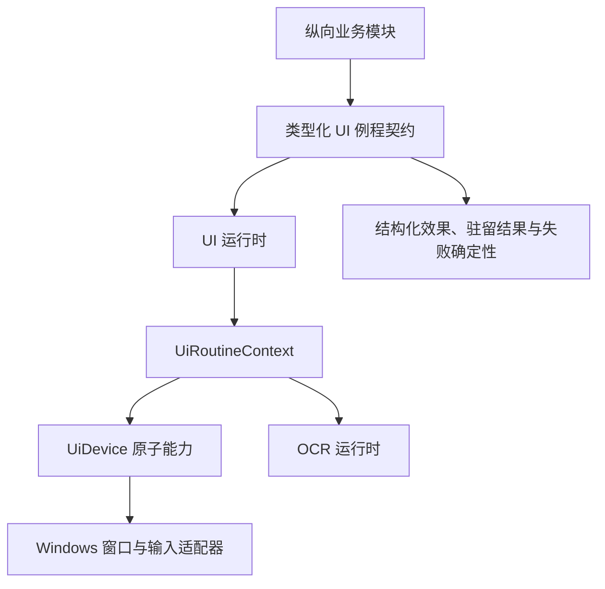

# UI 自动化内核与原子动作

本文说明项目如何安全、串行地操作游戏窗口。这里严格区分三层：

- 原子动作：截图、点击、按键、滚动、粘贴、等待等不可再拆的机械操作。
- UI 例程契约：从已声明的稳定界面出发，完成一个完整机械事务并确认最终驻留界面。
- 业务流程：邀请、好友投递、管理、启动、娱乐玩法等纵向业务。

业务模块不能直接拼装原子动作。只有自定义工作流可以把连续机械步骤编译为一个 `CustomActionPlan`；内置业务必须调用类型化 UI 例程契约。

## 当前边界

`UiRuntime` 是游戏窗口访问的唯一运行时所有者。截图和输入在同一线程串行执行；OCR 推理由独立 `OcrRuntime` 拥有，但 UI 例程等待 OCR 结果时仍保持当前 UI 所有权，其他输入不能插入。

## 文件职责

| 文件 | 职责 |
| --- | --- |
| `src/runtime/ui.rs` | UI 运行时、类型化请求通道、例程执行上下文、操作标识、进度和失败确定性。 |
| `src/runtime/ocr.rs` | OCR 运行时及优先级队列，不暴露生产识别引擎。 |
| `src/ui/atoms.rs` | 少量共享机械能力的适配边界；业务不能通过它绕过完整 UI 契约。 |
| `src/ui/routines/*.rs` | 好友投递、驻留、邀请、管理、启动、大厅和二级未读等完整 UI 事务。 |
| `src/ui/routines/custom_action.rs` | 自定义工作流唯一允许组合原子动作的机械段解释器。 |
| `src/ui/state.rs` | 对单帧进行一级、二级或未知界面分类，并保留模板证据。 |
| `src/ui/template.rs` | 模板缓存和区域模板匹配。 |
| `src/ui/frame.rs` | 把截图统一到配置画布；默认画布为 1920×1080。 |
| `src/adapters/windows/device.rs` | 把 `UiDevice` 落到 Windows 截图、窗口和输入实现。 |
| `src/adapters/windows/input.rs` | 前台校验、点击归属、键鼠和剪贴板输入。 |
| `src/adapters/windows/window.rs` | 游戏进程、窗口、客户区、激活和截图。 |

## 原子能力

`UiDevice` 提供以下机械能力：

- 获取客户区截图。
- 校验窗口存在、激活、聚焦和确认前台归属。
- 点击、滚动、按键和限时按住按键。
- 粘贴或输入文本。
- 关闭窗口或启动游戏进程。

这些能力不包含“邀请谁”“给谁发消息”或“最终驻留哪里”等业务语义。模板等待、OCR 确认、像素稳定和有限重试由具体 UI 例程在同一次独占事务内组合。

## 类型化 UI 例程

公开给业务模块的主要契约包括：

| 契约 | 完整事务 |
| --- | --- |
| `SendFriendDeliveries` | 按顺序定位好友、确认会话、发送一批消息，最后只恢复一次指定驻留。 |
| `SendHallBatch` | 在当前大厅不可插入地批量发送，并返回已发送条数和最终驻留。 |
| `EstablishResidency` | 仅为监听模式切换或明确恢复任务建立一级/二级当前大厅驻留。 |
| `ExecuteInvite` | 在一个事务内完成好友确认、尽力通知、邀请动作和驻留恢复。 |
| `ExecuteModeration` | 从支持的稳定界面归一化后执行拉黑或屏蔽，并确认结果。 |
| `EnterGame` / `EnterWonderland` | 完成启动阶段目标，并确认一级驻留后返回。 |
| `ReadHallInfo` / `ToggleMicrophone` | 完成大厅读取或麦克风切换，并返回类型化效果。 |
| `ProcessSecondaryUnread` | 处理一个可见好友未读会话并恢复二级当前大厅。 |

每个结果分别表达目标动作效果和最终驻留结果。失败同时携带阶段与输入确定性：

- `BeforeInput`：尚未产生目标输入，可以由具体例程按规则机械重试。
- `AfterInputUnknown`：输入可能已经生效，不能自动重放。
- `ConfirmedFailure`：已确认目标没有成功。
- `Cancelled`：例程被明确取消。

业务模块不能从错误字符串猜测是否可重试。

## UI 起点归一化与驻留

公开 UI 例程在自身事务内观察起点：

1. 已在支持的稳定界面时直接继续。
2. 在另一种可确认稳定界面时执行有限导航。
3. 未知或过渡画面只进行有限复检；仍无法确认时在输入前失败。
4. 目标动作结束后重新观察，并有限收敛到请求中的 `UiResidencyTarget`。

驻留目标是封闭集合，目前主要为：

- `Primary`：一级游戏界面。
- `SecondaryCurrentHall`：二级聊天中的当前大厅。

UI 内核不读取聊天监听模式，也不恢复“任意调用前画面”。调度方必须显式选择该契约允许的驻留目标。

## 好友列表可靠定位

好友投递只在 `invite.friend_list_region` 内识别完整规范化昵称，并遵守以下约束：

- 同一昵称和同一列表行位置必须连续稳定达到配置次数。
- 多个完整命中、命中消失或行位置越界都会重置或失败。
- 列表翻页后先等待像素稳定，再重新 OCR；不会沿用上一页坐标。
- 页面指纹重复或达到翻页上限时停止。
- 点击后先识别顶部标题；标题不能完整确认时，再 OCR 整个聊天内容区确认完整备注。

固定截图 `tests/fixtures/ui/secondary-chat-scrolled-1920x1080.jpg` 同时回归：左上返回模板、真实 OCR 标题、严格好友列表 OCR、精确好友行连续稳定定位、标题优先与聊天内容区兜底、标识图块关联，以及不存在目标时按页面指纹和滚动上限有界停止。

## 模板、OCR 与稳定确认

- 模板匹配始终限制在配置区域内，`best_template_hit()` 使用缓存灰度 SAD 选择最佳命中。
- 二级界面以左上返回模板为公共状态锚点，不依赖可能因列表滚动而消失的“当前大厅”行。
- OCR 请求只提交给 `OcrRuntime`；批量图块携带调用方标识，跨边界或无法唯一归属的识别框会显式失败。
- 连续确认默认继承全局稳定次数；局部值大于 1 时覆盖，否则使用全局值，最终内置默认是 2。
- 像素稳定只用于确认界面过渡完成，不替代目标模板或 OCR 语义。

## 自定义工作流

自定义工作流把连续机械步骤解析成单个 `CustomActionPlan`，整段在 UI 运行时内不可插入。遇到好友投递、邀请等类型化能力步骤时，必须结束当前机械段，保存工作流进度，在 UI 运行时之外等待能力结果，再恢复下一段。

这保证了高可自定义性，同时不让内置业务退回到“逐原子动作排队”的浅接口。

## 输入安全

Windows 适配器有三条硬约束：

1. 只接受配置中明确列出的游戏进程名。
2. 点击前确认屏幕点的根窗口属于目标游戏窗口。
3. 按键、滚动和粘贴前确认前台窗口属于游戏进程。

文本粘贴会临时占用系统文本剪贴板，发送后尽量恢复原文本；日志只记录长度或脱敏摘要，不记录秘密正文。

## 关键不变量

- 所有游戏窗口输入只由一个 UI 运行时串行执行。
- 内置业务只调用完整类型化 UI 契约。
- 自定义工作流是唯一原子动作组合入口。
- UI 例程默认独占至完整结束；可让位能力只能由源码白名单定义。
- 结果未知的目标动作不能自动重放。
- 业务等待、娱乐计时和 AI 等待不能占用 UI 运行时。
