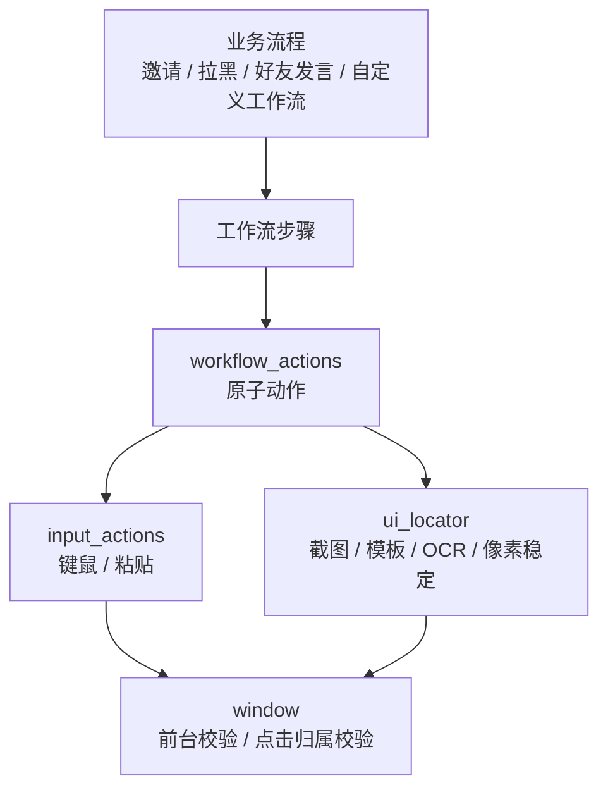

# UI 自动化与原子动作梳理

本文梳理项目里“怎样操作游戏窗口”。它重点区分三层概念：

- 原子动作：不可再拆的机械输入或等待。
- 工作流步骤：配置文件里的步骤，可能映射到一个或多个原子动作。
- 业务流程：邀请、拉黑、发送好友消息、返回一级界面等高层流程。

自定义工作流、邀请确认、好友反馈和管理投票的业务组合方式见 `docs/custom-workflow-moderation-flow.md`。

## 核心结论

UI 自动化层的边界已经比较清楚：`workflow_actions.rs` 提供原子动作，`custom_workflow.rs` 把配置步骤翻译成原子动作，`window.rs` 和 `input_actions.rs` 负责 Windows 窗口、前台、点击归属和剪贴板安全。

所有会真正发送键盘或鼠标输入的路径都要满足一个前提：目标游戏窗口可用，并且输入不会落到错误窗口。点击类动作校验点击点归属；按键和粘贴类动作校验前台进程。

## 文件职责

| 文件 | 职责 |
| --- | --- |
| `src/ui/atoms.rs` | 原子动作集合：等待、按键、按住按键、激活、聚焦、点击点、粘贴、模板等待/点击、文字等待/点击、像素稳定。 |
| `src/ui/locator.rs` | 截图和区域定位封装。负责在指定区域里找模板、找 OCR 文本、等待像素稳定。 |
| `src/adapters/windows/input.rs` | 把原子输入落到 Enigo：点击、激活、聚焦、粘贴、按键。 |
| `src/adapters/windows/window.rs` | Windows 窗口查找、激活、客户区坐标换算、前台校验、点击归属校验、截图。 |
| `src/features/custom_workflow.rs` | 把配置里的工作流步骤执行成原子动作，也为内置邀请/管理流程提供 `*_atom` 封装。 |
| `src/ui/chat_output.rs` | 游戏聊天发送组合动作，内部使用点击、按键、粘贴和发送等待。 |
| `src/ui/state.rs` | 一级/二级/未知界面检测，供命令前准备和返回一级界面使用。 |
| `src/ui/template.rs` | 模板匹配实现和模板缓存。小区域最佳命中走 CPU 灰度 SAD。 |

## 原子动作清单

真正的原子动作集中在 `workflow_actions.rs`：

| 原子动作 | 代码入口 | 语义 |
| --- | --- | --- |
| 等待 | `wait()` | 固定 sleep，并记录耗时。 |
| 按键 | `press_key_text()` | 解析按键名，校验前台后发送按键。 |
| 按住按键 | `hold_key_text()` | 按下指定按键，在限定时长后松开；流程停止或异常展开时也会尝试松开。 |
| 激活游戏 | `activate()` | 找到游戏窗口并尝试设为前台。 |
| 聚焦游戏 | `focus()` | 激活游戏后点击 `focus_point`，让游戏接收输入。 |
| 点击坐标 | `click_point()` | 把游戏内容坐标换算到屏幕坐标，校验点击点属于游戏窗口后点击。 |
| 粘贴文本 | `paste()` | 临时占用文本剪贴板、Ctrl+V、等待、恢复或清空文本剪贴板。 |
| 等待模板 | `wait_or_click_template(..., Wait)` | 在区域内循环匹配模板，直到命中或超时。 |
| 点击模板 | `wait_or_click_template(..., Click)` | 先等待模板命中，再点击模板中心加可选偏移。 |
| 等待模板消失 | `locate_template(..., Absent)` | 循环直到模板不再可见，可选继续等待区域像素稳定。 |
| 等待像素稳定 | `wait_pixels_stable()` | 比较连续截图的区域指纹，满足均值差和变化比例阈值即稳定。 |
| 等待文字 | `wait_or_click_text(..., Wait)` | 在区域内 OCR，找到指定文本或近似包含关系。 |
| 点击文字 | `wait_or_click_text(..., Click)` | OCR 找到文字后点击文本框中心加可选偏移。 |
| 等待最新消息发送者 | `wait_latest_incoming_sender_match()` | 动态定位最新他人消息标题，连续 OCR 到指定昵称达到稳定次数。 |

这些动作只表达机械操作，不包含“邀请谁”“拉黑谁”“给谁发消息”之类业务语义。

## 工作流步骤映射

`CustomWorkflowStep.type` 是配置层的步骤名，不等同于原子动作。当前映射如下：

| 步骤类型 | 落地动作 |
| --- | --- |
| `sleep` / `wait` | `wait()` |
| `key` / `press_key` | `press_key_text()` |
| `hold_key` | `hold_key_text()`；时长从 `hold_seconds_arg` 指定的命令参数读取，并受 `custom_workflows.max_hold_key_seconds` 限制。 |
| `activate_game` | `activate()` |
| `focus_game` | `focus()` |
| `click` | `click_point()` |
| `wait_template` | 等待模板 |
| `click_template` | 等待并点击模板 |
| `wait_template_absent` | 等待模板消失，可选像素稳定 |
| `wait_stable` / `wait_pixels_stable` | 等待区域像素稳定 |
| `wait_text` | OCR 等待文字 |
| `click_text` | OCR 点击文字中心 |
| `paste` / `paste_text` | 粘贴文本 |
| `send_chat` / `reply` | 发送游戏内回复，是组合动作 |
| `send_current_chat` | 在当前聊天框发送，是组合动作 |
| `send_friend_message` / `friend_reply` | 打开好友聊天并发送，是业务流程 |
| `invite_user` / `invite_current_user` | 执行邀请，是业务流程 |
| `ensure_primary` / `return_primary` | 确保一级界面，是业务流程 |
| `ensure_current_hall` | 确保二级当前大厅，是业务流程 |

配置字段的含义：

- `template`：模板名，映射到 `custom_workflows.templates`。
- `region`：模板、OCR 或像素稳定的搜索区域。
- `point`：直接点击坐标。
- `click_offset`：模板或文字命中后的点击偏移，默认 `(0, 0)`。
- `threshold`：模板匹配阈值，默认 `custom_workflows.default_threshold`。
- `timeout_ms` / `poll_ms` / `wait_ms`：覆盖默认超时、轮询和等待。
- `hold_seconds_arg`：`hold_key` 读取时长的参数位置，从 `1` 开始，默认是第一个参数。

默认配置提供仅限粉色好友私聊的 `@W [秒数]`、`@S [秒数]`、`@A [秒数]`、`@D [秒数]`。它们先用 `ensure_primary` 关闭聊天层，再分别按住移动键；省略秒数时默认按住 `1` 秒，指定秒数必须是 `1` 到 `custom_workflows.max_hold_key_seconds` 的正整数。二级监听模式下，命令结束后仍会恢复二级当前大厅。

默认配置还提供仅限粉色好友私聊的 `@F`。它先确保一级界面，再发送一次 `F`，随后确认一级状态；任务结束时仍按当前监听模式恢复驻留界面，不接受参数。

`@X` 同样仅限粉色好友私聊且不接受参数。它先确保一级界面，再单击一次 `X`；没有额外的 `return_primary` 步骤，统一任务收尾会按当前监听模式恢复驻留界面。
- `stable_after_absent`：模板消失后是否继续等待像素稳定；默认由 `wait_template_absent_stable_default` 控制。

## 窗口与输入安全

窗口层有三条保护线：

1. `GameWindow::find()` 只接受配置中的目标进程名，支持多个进程名候选。
2. 点击前调用 `WindowFromPoint`，确认屏幕点击点的根窗口就是游戏窗口。
3. 按键和粘贴前调用 `ensure_foreground()`，确认当前前台窗口属于游戏进程。

这意味着原子动作不会因为另一个窗口盖在游戏上就盲目点击，也不会在游戏失焦时继续向别的窗口发按键或粘贴。

`focus_point` 只在显式 `focus_game`，或游戏窗口确实需要从后台重新激活时使用。游戏已经是前台进程时，重复的界面状态校验只验证前台归属，不再次点击聚焦点。普通原子动作不自动点击 `focus_point`。

## 坐标体系

配置里的点和区域使用游戏内容坐标。`window.rs` 会读取当前客户区尺寸，并把内容坐标按比例换算到实际屏幕坐标。

如果实际客户区尺寸和配置的 `content_width/content_height` 不一致，会记录警告，但仍按比例换算。这让窗口缩放时点击大概率仍能落到正确位置。

## 模板、OCR 与像素稳定

`UiLocator` 是截图定位入口：

1. `capture()` 获取游戏窗口客户区截图。
2. `region(rect)` 绑定一个搜索区域。
3. `wait_template_while()` 和 `wait_template_absent_while()` 循环模板匹配。
4. `find_text()` / `find_any_text()` 在区域内 OCR，并用标准化文本匹配。
5. `wait_pixels_stable_while()` 对同一区域连续截图，比较变化指纹。

模板匹配有两类：

- `best_template_hit()`：小区域最佳命中，使用 CPU 灰度 SAD，并缓存灰度模板。
- `find_color_template_hits()`：颜色模板多命中，使用 RGB SAD，并缓存 RGB 模板。

UI 状态检测优先检查好友按钮模板，再检查大厅二级界面模板，最后才数聊天标记。这个顺序能让返回一级界面在看到好友按钮时尽早成功。

## 文本剪贴板临时占用

粘贴文本时会使用 `TextRestoreGuard`：

1. 读取当前文本剪贴板。
2. 写入要发送的文本。
3. 执行 Ctrl+V。
4. 等待 `timing.input.text_ms`。
5. guard 释放时恢复原文本；如果原先没有文本，则清空临时文本。

日志只记录文本长度和 hash，不记录完整剪贴板内容，避免把日志或用户复制的文本继续扩散。

## 聊天发送组合动作

`ChatOutput::send()` 是“游戏内回复”：

1. 把消息裁剪到游戏聊天可显示宽度。
2. 如果发送关闭，只写日志。
3. 按 Enter 打开聊天。
4. 点击聊天输入区域。
5. 粘贴消息。
6. 回车发送。
7. ESC 关闭聊天。

`ChatOutput::send_current_chat()` 是“当前聊天回复”：它假设当前已经打开目标聊天窗口，只点击当前聊天输入区、粘贴并发送，不负责打开或关闭目标会话。

## 返回一级界面

返回一级界面不是原子动作，而是业务组合流程。`return_to_primary_by_escape()` 的状态机是：

1. 先确认游戏窗口存在。
2. 循环截图并调用 `detect_ui_state()`。
3. 如果是 `primary:friend` 或 `primary:marker`，认为已经回到一级界面。
4. 如果明确是大厅二级界面，立即按 ESC 返回上一级。
5. 如果是未知界面，先按 `timing.command.post_settle_ms` 等待一次过渡并重新检测；仍未知才按 ESC。
6. 连续按 ESC 后仍未返回时增加等待时间；超过 5 次后固定 2000ms。
7. 如果目标窗口不可用，立即停止并返回失败。

所有返回一级界面的入口，包括 `return_to_primary_from_transient_ui()` 和 `return_to_primary_fixed()`，都会先检测当前 UI。已在一级时直接成功；明确在二级时才立即按 ESC；首次遇到未知过渡帧时先等待并复检。自定义工作流的 `return_primary` 同样遵循这一规则。

## 动作阶段界面准备

普通命令开始时只调用 `ensure_game_ready_for_input()` 保证游戏可接收输入，不再统一调用 `prepare_command_ui()`。具体动作按需求选择目标：

1. `Primary`：调用一级界面状态机，已在一级时不按 `Esc`。
2. `SecondaryCurrentHall`：已在当前大厅时直接继续；在其他二级会话时点击当前大厅；在一级时按 `Enter` 后点击当前大厅。
3. 无页面依赖：播放器查询、队列修改等动作直接执行，直到需要回复或进入后续 UI 阶段。
4. 命令结束：恢复监听模式的有效驻留目标；管理投票的临时一级阶段会覆盖二级驻留，直到最后一个投票结束。

## 错误边界

- 模板或文字没找到通常返回 `Ok(None)`，由调用者转成业务错误或重试。
- 像素稳定超时会返回错误，因为后续动作依赖界面过渡完成。
- 目标窗口不可用会被识别成专门错误，命令执行器会中止当前准备流程并保留任务。
- 点击归属或前台校验失败会直接中止输入，避免误操作其他窗口。

## 关键约定

- 原子动作默认游戏已经聚焦；聚焦由任务入口或显式 `focus_game` 完成。
- 模板点击默认点击中心，`click_offset` 只用于确实需要偏移的位置。
- OCR 点击文本时也是点击文本框中心。
- 模板消失后默认可以继续等像素稳定，以减少“界面还在变化就执行下一步”的失败。
- 聊天发送优先粘贴；粘贴失败才回退到逐字输入。
