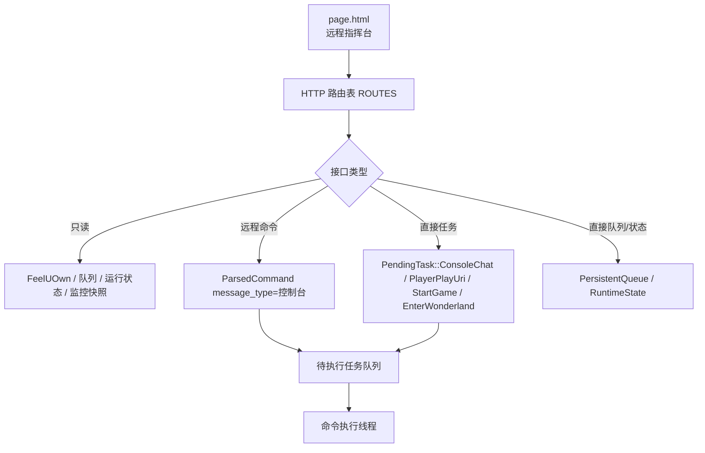

# Web 面板、HTTP API 与监控状态梳理

本文梳理远程指挥台的代码边界：Web 页面怎样加载，HTTP API 怎样分发，哪些接口只读，哪些接口入队，哪些接口会直接修改队列或播放器，以及监控快照从哪里来。

## 核心结论

Web 面板不是远程鼠标键盘面板。它只提交高层意图、查看监控快照、读取或修改少量持久状态。大多数会影响游戏窗口的操作都会进入待执行任务队列，由命令执行线程串行处理。

少数接口是例外：`/queue/add` 直接写音乐播放队列，`/state/save` 只允许 patch 大厅倒计时等非播放器字段。`/player/play-uri` 不再直连 FeelUOwn，而是进入待执行任务队列，由播放器控制器统一处理。



## 文件职责

| 文件 | 职责 |
| --- | --- |
| `src/app/http_server.rs` | HTTP 服务、路由表、请求分发、参数校验、远程任务入队、队列/状态/截图接口。 |
| `src/app/page.html` | 内嵌 Web 面板页面，负责调用 API 并渲染监控、点歌、队列、日志和截图。 |
| `src/app/monitor.rs` | 内存态监控快照，供 TUI 和 Web 面板读取。 |
| `src/main.rs` | 创建 `MonitorShared`，启动 HTTP 服务，并在业务流程中更新监控快照。 |

## 服务启动

`AutomationApp::start_http_server()` 在 `http.enabled=true` 时调用 `http_server::start()`。

启动流程：

1. 用 `http.host` 和 `http.port` 绑定监听地址。
2. 启动一个后台线程。
3. 在线程里创建 tokio runtime。
4. 用 axum fallback 统一接收请求。
5. 每个请求通过 `spawn_blocking()` 进入同步 handler。

同时限制最大活跃连接数为 32，超过时返回 `503 服务繁忙`。

## 路由表

所有普通 API 都在 `ROUTES` 表里声明：

| 字段 | 含义 |
| --- | --- |
| `path` | 路径。 |
| `json` | 响应是否按 JSON content-type 返回。 |
| `mutating` | 是否会改变状态。为真时必须使用 POST。 |
| `handler` | 同步处理函数。 |

`/screenshot` 是特殊路由，不在 `ROUTES` 表里，因为它直接返回 JPEG bytes。

`/` 返回内嵌的 `page.html`。

## 方法约束

HTTP 层只接受 `GET`、`POST`、`OPTIONS`。

- mutating 路由必须用 `POST`。
- 非 mutating 路由可以用 `GET`。
- `OPTIONS` 用于 CORS 预检。

这也是前端按钮显式写 `call('/xxx','POST')` 的原因。刷新按钮走只读接口，播放、点歌、启动和队列修改都走 POST。

## 接口分类

### 只读接口

| 接口 | 行为 |
| --- | --- |
| `/status` | 直接查询 FeelUOwn 当前状态。 |
| `/search` | 直接调用 FeelUOwn 搜索，只返回搜索结果，不入队。 |
| `/queue` | 读取音乐播放队列。 |
| `/state` | 读取运行状态，并补充当前大厅剩余分钟估算。 |
| `/history` | 读取 Web 请求历史。 |
| `/monitor` | 读取监控快照，并补充待执行任务标签。 |
| `/health` | 返回 `OK`。 |

这些接口不操作游戏窗口。

### 远程命令入队

这些接口会构造 `message_type = "控制台"` 的 `ParsedCommand`，再入队为 `PendingTask::Command`：

| 接口 | 映射命令 |
| --- | --- |
| `/play` | `继续` |
| `/pause` | `暂停` |
| `/skip-next` | `下一首` |
| `/skip-prev` | `上一首` |
| `/volume` | `音量 n` |
| `/searchPlay` | 普通远程点歌 |
| `/searchSource` | 普通远程点歌 |
| `/ai/search` | 远程 AI 点歌 |

入队前会检查待执行任务队列里是否已有同语义命令。已有则返回 `queued=false` 和 `duplicate=true`。

控制台来源的点歌免候选歌曲审核，但不免待执行任务队列、点歌互斥、播放保护和游戏内反馈。

### 直接任务入队

这些接口直接入队 `PendingTask`，不是构造 `ParsedCommand`：

| 接口 | 入队任务 |
| --- | --- |
| `/chat/send` | `PendingTask::ConsoleChat`，执行时发送 `[控制台]: 文本`。 |
| `/player/play-uri` | `PendingTask::PlayerPlayUri`，执行时交给播放器控制器播放 URI；后端接受播放命令后才标记为外部播放。 |
| `/startup/game` | `PendingTask::StartGame`。 |
| `/startup/enter-wonderland` | `PendingTask::EnterWonderland`。 |
| `/startup/wonderland` | 依次入队 `StartGame` 和 `EnterWonderland`。 |

`/startup/wonderland` 只保证入队顺序，不同步等待两个任务完成。

### 直接队列和状态修改

这些接口不经过主业务命令：

| 接口 | 行为 |
| --- | --- |
| `/queue/add` | 直接写音乐播放队列，并同步监控队列快照。 |
| `/queue/remove` | 直接删除音乐播放队列项，并同步监控队列快照。 |
| `/queue/clear` | 直接清空音乐播放队列，并同步监控队列快照。 |
| `/state/save` | 对运行状态里的大厅倒计时缓存做有限字段 patch 并保存。 |

`/queue/add` 是控制台最高权限入口，不做候选歌曲审核。它适合人工明确知道要塞什么队列项的场景。

播放器状态、暂停原因、活动播放请求和最近播放观测由播放器控制器维护，不能通过 `/state/save` 直接改写。

### AI 调试接口

| 接口 | 行为 |
| --- | --- |
| `/ai/recognize` | 调用点歌 AI 识别接口。 |
| `/ai/match` | 调用点歌 AI 同曲判断接口。 |
| `/ai/pick` | 调用点歌 AI 候选选择接口。 |

这些是 Provider 调试能力，不进入游戏任务队列。

## 监控快照

`MonitorShared` 是内存态监控对象，字段包括：

| 字段 | 来源 |
| --- | --- |
| `logs` | 日志 sink 推入的最近日志行。 |
| `ocr` | 最近一次聊天 OCR 扫描结果和耗时。 |
| `queue` | 最近同步的音乐播放队列摘要。 |
| `commands` | 最近执行命令摘要，最多 20 条。 |
| `status` | 服务状态，例如启动中、运行中、已退出。 |
| `playbackController` | 播放器控制器快照，包括确认状态、暂停原因、活动请求和最近观测可靠性。 |

`/monitor` 会把 `MonitorShared.snapshot()` 序列化，并额外加入：

```text
pendingTasks
```

`pendingTasks` 是当前待执行任务队列的标签列表，用于 Web 面板展示“待执行任务”。

监控快照不是持久化状态。程序重启后会重新从运行过程填充。

## 监控数据更新点

主要更新来源：

- 聊天 OCR 完成时：`monitor.set_ocr()`。
- 音乐播放队列变化时：`monitor.set_queue()`。
- 命令执行记录时：`monitor.push_command()`。
- 程序启动/退出时：`monitor.set_status()`。
- 日志输出时：`MonitorLogSink` 把日志行推入 `logs`。

HTTP 直接修改队列时会调用 `sync_monitor_queue()`，避免 Web 面板要等下一轮业务流程才看到队列变化。

## Web 面板布局

`page.html` 由后端 `include_str!()` 内嵌。页面主要区域：

| 区域 | 数据来源/接口 |
| --- | --- |
| 顶部服务/播放/歌曲/队列状态 | `/monitor` 和 `/status`。 |
| OCR 聊天 | `/monitor.ocr`。 |
| OCR 发送框 | `/chat/send`。 |
| 待播队列 | `/monitor.queue`。 |
| 待执行任务 | `/monitor.pendingTasks`。 |
| 事件日志 | `/monitor.logs`。 |
| 命令记录 | `/monitor.commands`。 |
| 播放控制 | `/play`、`/pause`、`/skip-next`、`/skip-prev`、`/volume`。 |
| 点歌 | `/searchPlay`、`/ai/search`、`/queue/add`、`/search`、`/player/play-uri`。 |
| 启动控制 | `/startup/game`、`/startup/enter-wonderland`、`/startup/wonderland`。 |
| 截图 | `/screenshot?quality=88`。 |

页面默认每秒刷新一次 `/monitor`。用户可以暂停刷新，避免复制日志或查看内容时界面跳动。

“刷新”按钮会同时刷新监控、历史和播放器状态。

## 按需游戏截图

`/screenshot` 手动截取一次游戏窗口客户区：

1. 调用 `window::capture_game()`。
2. 转为 RGB。
3. 用 JPEG 编码返回。
4. `quality` 参数限制在 80 到 95，默认 88。

截图保持原始尺寸，不进入常驻监控刷新。前端会创建临时 object URL，关闭弹窗时释放。

## 请求历史

Web 请求历史保存在 `HttpSharedState.history` 内存里，最多 30 条。

不会记录：

- `/history`
- `/clear-history`
- `/monitor`
- `/screenshot`
- `/favicon.ico`

query 里名为 `apiKey`、`api_key`、`token` 的值会被替换成 `***`。

## 输入校验

HTTP 层做基础参数校验：

- `keyword` 不能为空，且不能包含控制字符。
- `source` 只允许 `qqmusic`、`netease`，只读搜索允许空 source。
- `volume` 只允许 `0` 到 `100`。
- `/player/play-uri` 的 `url` / `uri` 只允许 `fuo://`。
- `quality` 只允许 `80` 到 `95`。
- 文本参数不能包含控制字符。

这些校验只保证 API 输入形状，不替代业务层的播放保护、候选确认和候选歌曲审核。

## 同源限制

HTTP 服务会检查 `Host`、`Origin` 和 `Sec-Fetch-Site`：

- 请求 Host 必须匹配配置的 `http.host/http.port`。
- 配置为 loopback 时，`localhost`、`127.0.0.1`、`::1` 互相视为可接受。
- 配置为 `0.0.0.0` 或 `::` 时，允许任意 Host。
- 有 `Origin` 时必须同源。
- 没有 `Origin` 但有 `Sec-Fetch-Site` 时，只接受 `same-origin` 或 `none`。

这不是登录认证。把 `http.host` 改成公网或局域网监听时，应放在可信网络或额外反向代理认证之后。

## 关键边界

- Web 面板提交的是高层意图，不暴露底层点击、按键或粘贴。
- 远程播放控制和远程点歌默认走待执行任务队列。
- 控制台来源免候选歌曲审核，但不免队列和播放保护。
- `/queue/add` 和 `/state/save` 是直接修改接口，需要谨慎使用。
- `/player/play-uri` 是播放 URI 的高层任务入口，会进入待执行任务队列并交给播放器控制器处理；播放失败时保留原播放器确认状态。
- `/monitor` 是内存快照，不是持久化状态文件。
- `/screenshot` 是按需截图，不是实时视频流。
