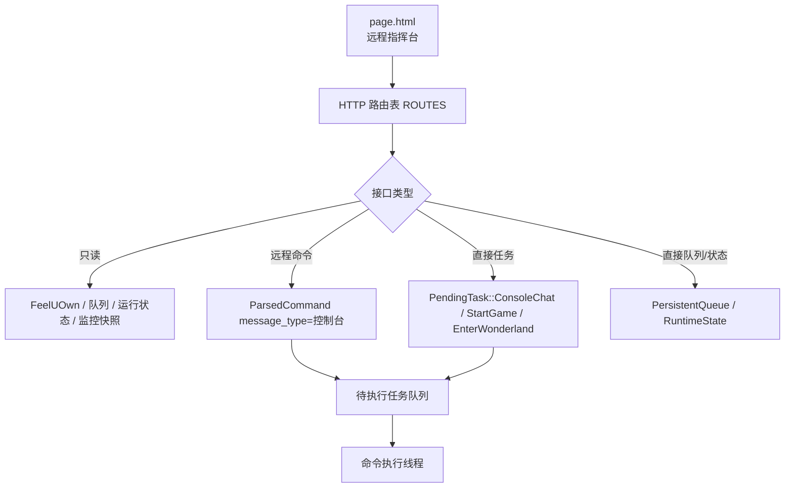

# Web 面板、HTTP API 与监控状态梳理

本文梳理远程指挥台的代码边界：Web 页面怎样加载，HTTP API 怎样分发，哪些接口只读，哪些接口入队，哪些接口会直接修改队列或播放器，以及监控快照从哪里来。

## 核心结论

主 Web 面板只提交高层意图、查看监控快照、读取或修改少量持久状态。正式业务操作进入串行任务队列并返回任务 ID，面板可以观察完整生命周期，也可以撤销尚未开始的任务。底层 OCR、模板、坐标和按键控制放在独立的 `/tools` 高级页；工具任务由后台线程执行，只会在正式待处理队列为空时领取，失败只记录任务结果。

少数接口是例外：`/queue/add` 和 `/player/play-uri` 直接写音乐播放队列，`/state/save` 只允许 patch 大厅倒计时等非播放器字段。`/player/play-uri` 不再直连 FeelUOwn，也不再把播放器标记为外部播放。



## 文件职责

| 文件 | 职责 |
| --- | --- |
| `src/app/http_server.rs` | HTTP 服务、路由表、请求分发、参数校验、远程任务入队、队列/状态/截图接口。 |
| `src/app/page.html` | 内嵌 Web 面板页面，负责调用 API 并渲染监控、点歌、队列、日志、截图和聊天监听状态。 |
| `src/app/tools.html` | 内嵌高级控制页，提交诊断和人工输入工具任务并轮询结果。 |
| `src/app/web_tools.rs` | 工具任务队列、状态记录、任务上限与输入独占分类。 |
| `src/app/task_tracker.rs` | 正式业务任务 ID、生命周期、耗时和结果摘要。 |
| `src/app/decision_control.rs` | 把 Web 候选决策送回正在等待的点歌确认流程。 |
| `src/app/queue.rs` | 持久播放队列、稳定队列项 ID、旧文件补 ID 和原子保存。 |
| `src/app/monitor.rs` | 内存态监控快照，供 TUI 和 Web 面板读取。 |
| `src/main.rs` | 创建 `MonitorShared`，启动 HTTP 服务，并在业务流程中更新监控快照。 |

## 服务启动

`AutomationApp::start_http_server()` 在 `http.enabled=true` 时调用 `http_server::start()`。

启动流程：

1. 用 `http.host` 和 `http.port` 绑定监听地址。
2. 启动一个后台线程。
3. 在线程里创建 tokio runtime。
4. 用 axum fallback 统一接收请求。
5. 每个请求通过 `spawn_blocking()` 进入同步 handler。

同时限制最大活跃连接数为 32，超过时返回 `503 服务繁忙`。

## 路由表

普通查询 API 在 `ROUTES` 表里声明；需要 JSON 请求体的接口放在独立的 `BODY_ROUTES` 表中，避免所有查询 handler 都承担无关的正文参数：

| 字段 | 含义 |
| --- | --- |
| `path` | 路径。 |
| `json` | 响应是否按 JSON content-type 返回。 |
| `mutating` | 是否会改变状态。为真时必须使用 POST。 |
| `handler` | 同步处理函数。 |

`/turtle-soup/questions` 是当前唯一的正文路由，正文上限 64 KiB。`/screenshot` 是特殊路由，因为它直接返回 JPEG bytes。`/tools` 是内嵌高级页；工具 API 仍在 `ROUTES` 表中。

`/` 返回内嵌的 `page.html`。

## 方法约束

HTTP 层只接受 `GET`、`POST`、`OPTIONS`。

- mutating 路由必须用 `POST`。
- 非 mutating 路由可以用 `GET`。
- 页面、截图和图标仅接受 `GET`。
- `OPTIONS` 用于 CORS 预检。

这也是前端按钮显式写 `call('/xxx','POST')` 的原因。刷新按钮走只读接口，播放、点歌、启动和队列修改都走 POST。

## 接口分类

### 只读接口

| 接口 | 行为 |
| --- | --- |
| `/status` | 查询播放器运行时最近的稳定观测。 |
| `/search` | 直接调用 FeelUOwn 搜索，只返回搜索结果，不入队。 |
| `/search/candidates` | 返回结构化候选歌曲和 URI，不入队。 |
| `/queue` | 读取音乐播放队列。 |
| `/state` | 读取运行状态，并补充当前大厅剩余分钟估算。 |
| `/history` | 读取 Web 请求历史。 |
| `/monitor` | 读取监控快照，并补充待执行任务标签。 |
| `/turtle-soup` | 读取海龟汤会话、题目管理信息和最近裁决，不返回进行中的汤底。 |
| `/undercover` | 读取脱敏的谁是卧底状态，不返回词语、身份、描述或投票。 |
| `/operator/workflows` | 返回已启用的自定义工作流。 |
| `/tools/task?id=...` | 读取一个高级控制任务的状态和结果。 |
| `/health` | 返回 `OK`。 |

这些接口不操作游戏窗口。

### 远程命令入队

这些接口会构造 `message_type = "控制台"` 的 `ParsedCommand`，再入队为 `PendingTask::Command`：

| 接口 | 映射命令 |
| --- | --- |
| `/play` | `继续` |
| `/pause` | `暂停` |
| `/skip-next` | `下一首` |
| `/skip-prev` | `上一首` |
| `/volume` | `音量 n` |
| `/searchPlay` | 普通远程点歌 |
| `/searchSource` | 普通远程点歌 |
| `/ai/search` | 远程 AI 点歌 |
| `/operator/lyrics` | `歌词` |
| `/operator/hall-detect` | `大厅检测` |
| `/operator/hall-time` | `大厅时间` |
| `/operator/microphone` | `麦克风` |
| `/operator/commands` | `启用`或`禁用`命令识别 |
| `/operator/idle-exit?minutes=...` | `闲置退出 n` |
| `/operator/workflows/run` | 指定自定义工作流 |

入队前会检查待执行任务队列里是否已有同语义命令。已有则返回 `queued=false` 和 `duplicate=true`。

控制台来源的点歌免候选歌曲审核，但不免待执行任务队列、点歌互斥、播放保护和游戏内反馈。

### 直接任务入队

这些接口直接入队 `PendingTask`，不是构造 `ParsedCommand`：

| 接口 | 入队任务 |
| --- | --- |
| `/chat/send` | `PendingTask::ConsoleChat`，执行时发送文本；默认前缀是 `[控制台]: `，可用 `usePrefix=0` 关闭，或用 `prefix=...` 自定义。 |
| `/startup/game` | `PendingTask::StartGame`。 |
| `/startup/enter-wonderland` | `PendingTask::EnterWonderland`。 |
| `/startup/wonderland` | 依次入队 `StartGame` 和 `EnterWonderland`。 |
| `/chat-listener/mode?mode=primary` / `secondary` | `PendingTask::SetChatListenerMode`。 |
| `/operator/idle-exit?enabled=0` | `PendingTask::ClearIdleExit`。 |

`/startup/wonderland` 只保证入队顺序，不同步等待两个任务完成。

### 海龟汤控制

海龟汤控制向业务运行时提交类型化意图，不构造 `ParsedCommand`，也不直接操作游戏输入。业务运行时更新会话、题库使用记录和 AI 队列；汤面、裁决与结算仍进入低优先级延迟聊天队列，并等待正式任务空闲后发送。

| 接口 | 行为 |
| --- | --- |
| `GET /turtle-soup` | 读取当前快照。 |
| `POST /turtle-soup/start` | 从启用且未使用的题目中随机开局。 |
| `POST /turtle-soup/start?id=...` | 按启用且未使用的题目 ID 开局。 |
| `POST /turtle-soup/end` | 主动结束并在当前大厅分段公布结算和汤底。 |
| `POST /turtle-soup/questions` | 接收一条已经整理好的 JSON 题目，串行分配 ID 并原子追加到本地题库。 |

题目提交正文包含 `title`、`surface`、`bottom`，可选 `adjudicationNotes` 和 `enabled`。主程序不调用 AI 优化题目；调用方负责提交最终结构。接口沿用 Web 访问令牌，历史记录不会保存请求正文或汤底。Web 不提供在线编辑、汤底预览或已使用记录重置。

### 谁是卧底控制

谁是卧底控制与游戏内命令进入同一正式任务队列，实际好友私聊和大厅公告由主执行器串行发送。

| 接口 | 行为 |
| --- | --- |
| `GET /undercover` | 读取模式、阶段、轮次、进度、剩余秒数和公开玩家状态。 |
| `POST /undercover/start` | 开始当前已达到最低人数的报名房间。 |
| `POST /undercover/end` | 结束当前报名房间或对局。 |

Web 不能创建或加入房间，也不能代替玩家描述或投票。状态和日志不会暴露词语、身份、描述、选票或原始私聊内容。

### 正式任务生命周期

每个正式业务任务在入队时取得仅属于本次程序运行的递增任务 ID。单任务接口返回 `taskId`，组合启动接口返回 `taskIds`。

`/monitor.tasks` 返回最近任务，状态如下：

| 状态 | 含义 |
| --- | --- |
| `queued` | 仍在正式任务队列中等待。 |
| `running` | 已被主业务线程取出，正在执行。 |
| `completed` | 正常完成。 |
| `failed` | 执行返回错误或发生未捕获异常。 |
| `canceled` | 在开始前被 Web 控制台撤销。 |

任务记录同时包含入队、开始、结束时间、执行耗时和结果摘要。`POST /tasks/cancel?id=...` 只能移除 `queued` 任务；任务一旦被主业务线程取出就返回 `409`，不会尝试中断正在操作游戏窗口的流程。

撤销不是单纯删除队列元素。聊天监听切换、二级未读处理、二级大厅恢复和管理投票结果等任务会同步释放它们在入队前占用的监听状态或流程锁。

### Web 候选决策

点歌流程等待大厅内的确认、跳过、换源或 AI 指令时，会同时在 `/monitor.decision` 暴露一个短期决策会话。Web 面板通过 `POST /decisions/submit?id=...&action=...` 提交选择，并唤醒原有等待循环。

支持的 `action` 为 `confirm`、`skip`、`switch_source` 和 `ai`。接口会校验当前流程是否允许换源或 AI；决策过期、已经提交或 ID 不匹配时返回 `409`。Web 决策不会新建另一条播放路径，也不会绕过候选匹配、播放保护或后续反馈。

### 直接队列和状态修改

这些接口不经过主业务命令：

| 接口 | 行为 |
| --- | --- |
| `/queue/add` | 直接写音乐播放队列，并同步监控队列快照。 |
| `/player/play-uri` | 把 `fuo://` URI 作为控制台高权限队列项写入音乐播放队列，并同步监控队列快照。 |
| `/queue/remove` | 直接删除音乐播放队列项，并同步监控队列快照。 |
| `/queue/clear` | 直接清空音乐播放队列，并同步监控队列快照。 |
| `/state/save` | 对运行状态里的大厅倒计时缓存做有限字段 patch 并保存。 |

`/queue/add` 和 `/player/play-uri` 是控制台最高权限入口，不做候选歌曲审核。它们适合人工明确知道要塞什么队列项的场景。

每个播放队列项都有持久 `id`。队列文件保存 `nextId`，旧队列文件第一次加载时会自动补 ID 并立即写回，因此自动播放移除队首后，其他歌曲的 ID 不会改变。Web 面板删除歌曲使用 `/queue/remove?id=...`；旧的 `index` 参数仅保留给既有调用方，不建议用于会并发自动出队的界面。

播放器状态、暂停原因、活动播放请求和最近播放观测由播放器控制器维护，不能通过 `/state/save` 直接改写。

### AI 调试接口

| 接口 | 行为 |
| --- | --- |
| `/ai/recognize` | 调用点歌 AI 识别接口。 |
| `/ai/match` | 调用点歌 AI 同曲判断接口。 |
| `/ai/pick` | 调用点歌 AI 候选选择接口。 |

这些是 Provider 调试能力，不进入游戏任务队列。

## 监控快照

`MonitorShared` 是内存态监控对象，字段包括：

| 字段 | 来源 |
| --- | --- |
| `logs` | 日志 sink 推入的最近日志行。 |
| `ocr` | 最近一次聊天 OCR 扫描结果和耗时。 |
| `queue` | 最近同步的音乐播放队列摘要。 |
| `commands` | 最近执行命令摘要，最多 20 条。 |
| `status` | 服务状态，例如启动中、运行中、已退出。 |
| `playbackController` | 播放器控制器快照，包括确认状态、暂停原因、活动请求和最近观测可靠性。 |
| `chatListener` | 聊天监听当前模式、等待切换目标、首次未读清场和二级红点任务状态。 |
| `operational` | 当前 UI、扫描暂停、命令开关、闲置退出倒计时和大厅剩余时间。 |

`/monitor` 会把 `MonitorShared.snapshot()` 序列化，并额外加入：

```text
pendingTasks
chatListener
webTools
tasks
decision
turtleSoup
undercover
```

`pendingTasks` 是兼容用的当前等待任务标签；`tasks` 是正式任务生命周期；`webTools` 是独立高级工具任务；`decision` 是当前点歌候选决策，没有等待决策时为 `null`；`turtleSoup` 是不含汤底的海龟汤状态；`undercover` 是不含秘密内容的谁是卧底状态。

监控快照不是持久化状态。程序重启后会重新从运行过程填充。

## 监控数据更新点

主要更新来源：

- 聊天 OCR 完成时提交 `MonitorEvent::Ocr`。
- 音乐播放队列变化时提交 `MonitorEvent::Queue`。
- 命令执行记录时提交 `MonitorEvent::Command`。
- 程序启动/退出时提交 `MonitorEvent::Status`。
- 日志输出时由 `MonitorLogSink` 提交 `MonitorEvent::Log`。

所有事件由 `MonitorProjection` 单一投影入口应用，生产模块不直接修改快照。

HTTP 直接修改队列时会调用 `sync_monitor_queue()`，避免 Web 面板要等下一轮业务流程才看到队列变化。

## Web 面板布局

`page.html` 由后端 `include_str!()` 内嵌。页面主要区域：

| 区域 | 数据来源/接口 |
| --- | --- |
| 顶部服务/播放/歌曲/队列状态 | `/monitor` 和 `/status`。 |
| OCR 聊天 | `/monitor.ocr`。 |
| OCR 发送框 | `/chat/send`。 |
| 待播队列 | `/monitor.queue`，按持久 ID 删除。 |
| 任务状态 | `/monitor.tasks`，可撤销等待任务。 |
| 海龟汤 | `/monitor.turtleSoup`，以及随机开局、按 ID 开局和结束接口。 |
| 谁是卧底 | `/monitor.undercover`，以及开始当前房间和结束接口。 |
| 事件日志 | `/monitor.logs`。 |
| 命令记录 | `/monitor.commands`。 |
| 播放控制 | `/play`、`/pause`、`/skip-next`、`/skip-prev`、`/volume`。 |
| 点歌 | `/searchPlay`、`/ai/search`、`/queue/add`、`/search/candidates`、`/player/play-uri`。 |
| 候选决策 | `/monitor.decision` 和 `/decisions/submit`。 |
| 启动控制 | `/startup/game`、`/startup/enter-wonderland`、`/startup/wonderland`。 |
| 聊天监听 | `/monitor.chatListener`，以及 `/chat-listener/mode` 的一级、二级切换按钮。 |
| 机器人操作 | 歌词、麦克风、大厅检测、大厅时间、命令开关、闲置退出和自定义工作流。 |
| 截图 | `/screenshot?quality=88`。 |

页面默认每秒刷新一次 `/monitor`。用户可以暂停刷新，避免复制日志或查看内容时界面跳动。

“刷新”按钮会同时刷新监控、历史和播放器状态。

## 按需游戏截图

`/screenshot` 将主扫描最近一次成功捕获的游戏客户区画面编码为 JPEG：

1. 读取主扫描帧缓存，不为 HTTP 请求额外调用窗口截图。
2. 转为 RGB。
3. 用 JPEG 编码返回。
4. `quality` 参数限制在 80 到 95，默认 88。

截图保持原始尺寸，不进入常驻监控刷新。主扫描尚未取得首帧时返回 `503`。前端会创建临时 object URL，关闭弹窗时释放。

## 请求历史

Web 请求历史保存在 `HttpSharedState.history` 内存里，最多 30 条。

不会记录：

- `/history`
- `/clear-history`
- `/monitor`
- `/screenshot`
- `/favicon.ico`
- 所有 `/tools/*` 路由

query 里名为 `apiKey`、`api_key`、`token`、`access_token`、`authorization`、`password` 的值会被替换成 `***`。

## 输入校验

HTTP 层做基础参数校验：

- `keyword` 不能为空，且不能包含控制字符。
- `source` 只允许 `qqmusic`、`netease`、`bilibili`，只读搜索允许空 source。
- `volume` 只允许 `0` 到 `100`。
- `/player/play-uri` 的 `url` / `uri` 只允许 `fuo://`。
- `quality` 只允许 `80` 到 `95`。
- 文本参数不能包含控制字符。

这些校验只保证 API 输入形状，不替代业务层的播放保护、候选确认和候选歌曲审核。

## 同源限制

HTTP 服务会检查 `Host`、`Origin` 和 `Sec-Fetch-Site`：

- 请求 Host 必须匹配配置的 `http.host/http.port`。
- 配置为 loopback 时，`localhost`、`127.0.0.1`、`::1` 互相视为可接受。
- 配置为 `0.0.0.0` 或 `::` 时，允许任意 Host。
- 有 `Origin` 时必须同源。
- 没有 `Origin` 但有 `Sec-Fetch-Site` 时，只接受 `same-origin` 或 `none`。

当 `http.host` 为 loopback 时，默认不需要令牌。当监听非本机地址时，`http.access_token` 必须为非空值，否则 HTTP 服务拒绝启动；除 `/`、`/tools`、`/health` 外的接口必须在 `X-Miliastra-Token` 请求头提供该令牌。页面只把令牌保存于当前浏览器会话，不会写入 URL 或接口历史。

## 关键边界

- 主 Web 面板提交的是高层意图；高级页只允许配置中已命名的模板，不允许传入任意本地路径。
- 高级工具任务不进入正式业务队列。它们只在正式队列为空时开始；输入类工具会短暂声明屏幕独占，工具异常只写入结果，不触发业务恢复或程序退出。
- 远程播放控制和远程点歌默认走待执行任务队列；`/player/play-uri` 直接进入音乐播放队列。
- 正式业务任务用 `taskId` 跟踪，只允许撤销仍在等待的任务，不中断已经开始的游戏操作。
- 播放队列项用持久 `id` 定位；远程界面不得依赖会随自动出队变化的数组索引。
- Web 候选决策复用原点歌等待流程，不创建旁路播放器控制。
- 控制台来源免候选歌曲审核，但不免队列和播放保护。
- `/queue/add` 和 `/state/save` 是直接修改接口，需要谨慎使用。
- `/player/play-uri` 是播放 URI 的队列入口，不会直接改变播放器状态；真正播放时仍由音乐播放队列和播放器控制器处理。
- `/monitor` 是内存快照，不是持久化状态文件。
- `/screenshot` 是按需截图，不是实时视频流。
